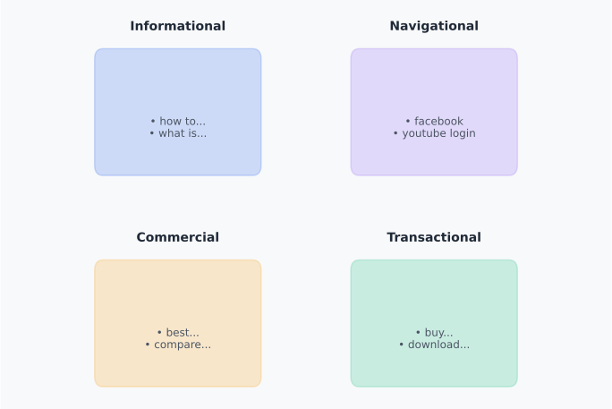

# Day 2, Chapter 3 — Search Intent Categories Deep Dive

When you search for "how to make coffee," you get articles and guides. When you search for "buy coffee maker," you get product pages and ecommerce sites. When you search for "best coffee maker," you get comparison articles and reviews. Same topic—coffee—but completely different results. Why? Because each search has different intent, and search engines show content that matches what users actually want.

Understanding search intent is the foundation of effective SEO. Without understanding intent, you'll create the wrong content types, target the wrong keywords, and waste effort on strategies that can't succeed. This chapter provides a deep dive into the four primary search intent categories, showing you how to identify intent for any query and why intent alignment is essential for SEO success.

---

**Search Intent Categories**

*Four primary intent types with examples and matching content types*

The four primary search intent categories classify what users actually want when they search. Informational intent needs articles and guides. Navigational intent needs brand pages. Commercial intent needs comparison content. Transactional intent needs product/service pages. Understanding these categories enables strategic content creation and keyword targeting.

> Which intent category do your target keywords represent? Does your content match that intent?

---

> **Explore This:** Search for the same topic with different intent (e.g., "how to make coffee" vs "buy coffee maker"). Notice how the results differ. What types of pages appear for each? This shows how intent shapes results.

---

## The Intent Classification Challenge

Every search query has intent—what the user actually wants when they search. Understanding intent categories is essential because intent determines what content types rank in search results. Without understanding intent, you're guessing what content to create and which keywords to target.

Think about searching for "laptop." This single word could represent different intents:
- **Informational:** "What is a laptop?" → Articles, definitions
- **Navigational:** "laptop" (seeking a specific brand's laptop page) → Brand page
- **Commercial:** "best laptop 2025" → Comparison articles, reviews
- **Transactional:** "buy laptop online" → Product pages, ecommerce sites

**The same keyword can have different intents, and search engines show different results based on what users actually want.** **This is why understanding intent categories is essential**—it enables you to create the right content types and target keywords strategically.

> **💡 Key Concept**  
> **Intent Classification Framework:** The four primary intent categories (informational, navigational, commercial, transactional) provide a framework for classifying any query. Understanding which intent category applies enables strategic decision-making—you know what content type to create, what keywords to target, and why certain content ranks while other content doesn't.

The four primary intent categories provide a framework for classifying any query:
1. **Informational Intent** — Users want information, answers, or knowledge
2. **Navigational Intent** — Users want to reach a specific website or page
3. **Commercial Intent** — Users want to research products or services before buying
4. **Transaction Intent** — Users want to complete a purchase or action

This framework enables strategic decision-making. When you understand which intent category applies to a query, you know what content type to create, what keywords to target, and why certain content ranks while other content doesn't.

---

## Informational Intent: Learning and Understanding

Informational intent is when users want information, answers, or knowledge. They're seeking to learn, understand, or solve a problem. This is the most common intent type for many queries.

**Characteristics of informational queries:**
- Question formats: "how to", "what is", "why does", "guide to"
- Educational language: "learn", "understand", "explain", "tutorial"
- Problem-solving: "how to fix", "how to solve", "how to make"
- Definition-seeking: "what is", "definition of", "meaning of"

**Content types that rank for informational intent:**
- Articles and blog posts
- Comprehensive guides and tutorials
- Wikipedia pages
- How-to content
- Educational resources

**SERP signals for informational intent:**
- Featured snippets (direct answers)
- People Also Ask (related questions)
- Article results dominate
- Educational content appears

When someone searches "how to fix a leaky faucet," they want instructions. Search engines show articles, guides, and tutorials that provide step-by-step instructions. When someone searches "what is SEO," they want a definition or explanation. Search engines show Wikipedia pages, articles, and guides that explain SEO.

**Wikipedia** consistently ranks highly for informational queries because it provides comprehensive, factual information—exactly what users with informational intent want. Wikipedia's content matches informational intent perfectly, which is why it dominates search results for definition and explanation queries.

The key insight is that **informational intent requires informational content**. **Articles, guides, and educational resources match informational intent.** **Product pages, landing pages, and sales content don't match informational intent**, which is why they don't rank for informational queries.

> **📊 Real-World Example**  
> **Wikipedia's Informational Dominance:** Wikipedia consistently ranks highly for informational queries because it provides comprehensive, factual information—exactly what users with informational intent want. Wikipedia's content matches informational intent perfectly, which is why it dominates search results for definition and explanation queries.

> **Explore This:** Search for an informational query (e.g., "how to [do something]"). What types of pages appear? Articles? Guides? Wikipedia? Notice the pattern.

---

## Navigational Intent: Finding Specific Destinations

Navigational intent is when users want to reach a specific website or page. They know where they want to go and use search to get there quickly.

**Characteristics of navigational queries:**
- Brand names: "facebook", "youtube", "twitter"
- Website names: "amazon", "netflix", "spotify"
- Specific pages: "youtube login", "gmail sign in", "twitter settings"
- Direct destination seeking: Users know the destination

**Content types that rank for navigational intent:**
- Homepage of the target website
- Login pages
- Brand pages
- Official website pages

**SERP signals for navigational intent:**
- Brand homepage typically ranks #1
- Official website appears prominently
- Knowledge panels for brands
- Direct links to specific pages

When someone searches "facebook," they want to go to Facebook's website. Search engines show Facebook's homepage as the #1 result. When someone searches "youtube login," they want to go to YouTube's login page. Search engines show YouTube's login page as the top result.

Navigational intent is straightforward—users know their destination, and search engines show it. This is why brand websites rank #1 for their own brand name searches. The intent is clear: users want the brand's website.

The key insight is that **navigational intent requires brand/website pages**. Official websites match navigational intent. Articles about brands don't match navigational intent, which is why they don't rank for brand name searches.

> **Explore This:** Search for a brand name (e.g., "facebook", "youtube"). What appears? The brand's homepage typically ranks #1. This is navigational intent.

---

## Commercial Intent: Researching Before Buying

Commercial intent is when users want to research products or services before making a purchase. They're evaluating options, comparing features, reading reviews, and gathering information to make informed decisions.

**Characteristics of commercial queries:**
- Comparison language: "best", "compare", "vs", "top", "review"
- Evaluation language: "which", "should I", "recommendations"
- Research-focused: Users are in research phase, not ready to buy yet
- Decision-supporting: Queries help users make purchase decisions

**Content types that rank for commercial intent:**
- Comparison articles ("best laptops 2025")
- Product review pages
- Buying guides
- Comparison charts and tables
- Review sites

**SERP signals for commercial intent:**
- Product carousels (if applicable)
- Comparison articles dominate
- Review sites appear
- "Best of" lists
- Comparison tables

When someone searches "best laptops 2025," they want to compare options. Search engines show comparison articles, review sites, and buying guides that help users evaluate different laptops. When someone searches "compare project management tools," they want to see how different tools compare. Search engines show comparison articles and review sites.

**Comparison sites** like Wirecutter, CNET, and TechRadar rank highly for commercial queries because they provide detailed comparisons and reviews—exactly what users with commercial intent want. Their content matches commercial intent perfectly, which is why they dominate search results for "best" and "compare" queries.

The key insight is that **commercial intent requires comparison and review content**. **Comparison articles, review pages, and buying guides match commercial intent.** **Product pages don't match commercial intent** (they match transactional intent), which is why they don't rank for "best" or "compare" queries.

> **📊 Real-World Example**  
> **Comparison Sites' Commercial Dominance:** Comparison sites like Wirecutter, CNET, and TechRadar rank highly for commercial queries because they provide detailed comparisons and reviews—exactly what users with commercial intent want. Their content matches commercial intent perfectly, which is why they dominate search results for "best" and "compare" queries.

> **Explore This:** Search for a commercial query (e.g., "best [product]"). What types of pages appear? Comparison articles? Review sites? Notice the pattern.

---

## Transactional Intent: Ready to Buy or Act

Transactional intent is when users want to complete a purchase or action. They're ready to buy, sign up, download, hire, or take action—not just researching.

**Characteristics of transactional queries:**
- Action language: "buy", "purchase", "order", "sign up", "hire", "download"
- Purchase-ready: Users are ready to complete transactions
- Direct action seeking: Queries indicate readiness to act
- Conversion-focused: Queries lead to purchases or actions

**Content types that rank for transactional intent:**
- Product pages
- Service pages
- Signup pages
- Booking pages
- Ecommerce category pages

**SERP signals for transactional intent:**
- Product pages dominate
- Ecommerce sites appear
- Shopping results (if applicable)
- "Buy now" buttons
- Purchase options

When someone searches "buy laptop online," they want to purchase a laptop. Search engines show product pages, ecommerce sites, and shopping results that enable purchases. When someone searches "sign up for newsletter," they want to subscribe. Search engines show signup pages and subscription forms.

**Amazon** dominates search results for transactional product queries because their product pages enable immediate purchases—exactly what users with transactional intent want. Amazon's content matches transactional intent perfectly, which is why they rank highly for "buy [product]" queries.

The key insight is that **transactional intent requires product/service pages**. **Product pages, service pages, and action pages match transactional intent.** **Articles don't match transactional intent**, which is why they don't rank for "buy" or "purchase" queries.

> **📊 Real-World Example**  
> **Amazon's Transactional Dominance:** Amazon dominates search results for transactional product queries because their product pages enable immediate purchases—exactly what users with transactional intent want. Amazon's content matches transactional intent perfectly, which is why they rank highly for "buy [product]" queries.

> **Explore This:** Search for a transactional query (e.g., "buy [product]"). What types of pages appear? Product pages? Ecommerce sites? Notice the pattern.

---

## How to Identify Intent: The Decision Framework

Identifying intent for any query follows a systematic process. **The most reliable method is SERP analysis**—looking at what actually appears in search results reveals intent because search engines show what users want.

> **💡 Tip**  
> **Use SERP Analysis for Intent Identification:** SERP analysis is the most reliable method for identifying intent because it shows what search engines actually prioritize for that query. Query patterns provide clues, but they're not always reliable—some queries are ambiguous. Always validate intent assumptions through SERP analysis.

**Step 1: Analyze the Query**

Look for intent signals in the query itself:
- **Informational signals:** "how to", "what is", "guide to", "learn"
- **Navigational signals:** Brand names, website names, "login", "sign in"
- **Commercial signals:** "best", "compare", "review", "vs", "top"
- **Transactional signals:** "buy", "purchase", "order", "sign up", "hire"

Query patterns provide clues, but they're not always reliable. Some queries are ambiguous—"coffee maker" could be informational (how it works) or transactional (buy one). This is why SERP analysis is essential.

**Step 2: Check the SERP**

Look at what actually appears in search results:
- **Informational SERPs:** Featured snippets, People Also Ask, articles dominate
- **Navigational SERPs:** Brand homepage ranks #1, official pages appear
- **Commercial SERPs:** Product carousels, comparison articles, review sites
- **Transactional SERPs:** Product pages, ecommerce sites, shopping results

SERP analysis is the most reliable method because it shows what search engines actually prioritize for that query. If articles appear, the intent is likely informational. If product pages appear, the intent is likely transactional.

**Step 3: Identify Content Types**

Look at what types of content rank:
- Articles and guides → Informational intent
- Brand pages → Navigational intent
- Comparison articles → Commercial intent
- Product pages → Transactional intent

The content types that rank reveal intent because search engines show content that matches user needs.

**Step 4: Classify Intent**

Based on query analysis, SERP analysis, and content types, classify the intent:
- Informational: Articles, guides, educational content rank
- Navigational: Brand pages, official websites rank
- Commercial: Comparison articles, review sites rank
- Transactional: Product pages, service pages rank

This systematic process enables accurate intent identification for any query.

---

**Intent Identification Process**

*Systematic framework for identifying search intent*

Identifying search intent follows a systematic process: analyze the query for patterns, check the SERP for components, identify what content types rank, and classify intent based on these signals. SERP analysis is the most reliable method because it shows what search engines actually prioritize for that query.

> Try this process with a keyword you're interested in. Does the SERP analysis confirm your initial intent assumption?

---

> **Explore This:** Pick three keywords and identify their intent using the framework. Then check the SERPs—do your identifications match what appears?

---

## Why Intent Alignment Matters: What Happens When It Breaks

**Intent alignment is non-negotiable for SEO success.** **When content matches intent, it can rank.** **When content doesn't match intent, it fails regardless of optimization quality.**

> **⚠️ Warning**  
> **Intent Mismatch Prevents Ranking:** Intent mismatch causes wasted effort. You can optimize content perfectly, use all the right keywords, build links, and still fail to rank if the content doesn't match intent. Understanding intent is essential—it prevents wasted effort on content that can't succeed.

**What happens with intent alignment:**

When content matches intent, search engines show it because it serves user needs. An article about "how to make coffee" matches informational intent—users get instructions, search engines show the article. A product page for "buy coffee maker" matches transactional intent—users can purchase, search engines show the product page.

**What happens with intent mismatch:**

When content doesn't match intent, it doesn't rank effectively. An article about "how to make coffee" won't rank for "buy coffee maker" because it doesn't match transactional intent—users want to buy, not learn. A product page won't rank for "how to make coffee" because it doesn't match informational intent—users want instructions, not products.

**Real-world examples of intent mismatch:**

- Informational query → Product page: "how to fix leaky faucet" → Product page for faucets (mismatch, doesn't rank)
- Transactional query → Article: "buy coffee maker" → Article about coffee makers (mismatch, doesn't rank)
- Commercial query → Product page: "best laptops 2025" → Single product page (mismatch, comparison articles rank instead)

Intent mismatch causes wasted effort. You can optimize content perfectly, use all the right keywords, build links, and still fail to rank if the content doesn't match intent. This is why understanding intent is essential—it prevents wasted effort on content that can't succeed.

---

**Intent-Content Alignment**

*How different intents match to different content types*

Different search intents require different content types. Informational queries match to articles. Transactional queries match to product pages. When content matches intent, it can rank. When content doesn't match intent, it fails regardless of optimization quality. This is why intent alignment is non-negotiable for SEO success.

> Does your content match the intent of your target keywords? What would happen if it didn't?

---

> **Explore This:** Find an example of intent mismatch. Search for a query and look at a result that doesn't seem to match the intent. What's wrong? What content type would be better?

---

## Common Misunderstandings About Search Intent

Several common misunderstandings about search intent lead to poor SEO strategies and wasted effort. Understanding these misconceptions helps prevent costly mistakes.

**Misunderstanding 1: "Intent is obvious from keywords alone"**

Many people think they can identify intent just by looking at keywords. While keywords provide clues, they can be ambiguous. "Coffee maker" could be informational (how it works), commercial (best coffee maker), or transactional (buy coffee maker). SERP analysis is needed to validate intent assumptions.

**Misunderstanding 2: "All queries have clear intent"**

Some queries have mixed or ambiguous intent. "Laptop" could be informational, commercial, or transactional depending on context. Understanding that intent isn't always clear helps you use SERP analysis to identify the dominant intent.

**Misunderstanding 3: "Intent doesn't matter if keywords match"**

Some people think that using the right keywords is enough, regardless of intent. **This is wrong—intent mismatch prevents ranking regardless of keyword optimization.** **Content that doesn't match intent won't rank, even with perfect keyword usage.**

> **⚠️ Common Mistake**  
> **Ignoring Intent for Keywords:** Many people think using the right keywords is enough, regardless of intent. This is a costly mistake. Intent mismatch prevents ranking regardless of keyword optimization. Always ensure content type matches intent, not just keywords.

**Misunderstanding 4: "One content type works for all intents"**

Some people try to use one content type (like articles) for all queries. This doesn't work—different intents require different content types. Articles work for informational intent, product pages work for transactional intent, comparison articles work for commercial intent.

Understanding these misconceptions prevents creating wrong content types, targeting keywords without understanding intent, and wasting effort on strategies that can't succeed.

---

## Key Takeaways

As you move forward in this program, remember these key ideas about search intent categories:

1. **Four primary intent categories exist: informational, navigational, commercial, transactional.** **Each category represents what users actually want when they search.**

2. **Intent determines what content types rank.** **Search engines show content that matches intent** because their success depends on user satisfaction. **Content that doesn't match intent won't rank effectively.**

3. **SERP analysis is the most reliable method for identifying intent.** **Looking at what actually appears in search results reveals intent** because search engines show what users want.

4. **Intent mismatch prevents ranking regardless of optimization quality.** **No amount of keyword optimization, link building, or technical SEO can overcome intent mismatch.** Understanding intent is prerequisite for effective SEO.

5. **Understanding intent enables strategic content creation and keyword targeting decisions.** **When you know which intent category applies to a query, you know what content type to create and which keywords to target.**

> **📌 Remember**  
> **Intent Alignment is Non-Negotiable:** Intent alignment is the foundation of effective SEO. When content matches intent, it can rank. When content doesn't match intent, it fails regardless of optimization quality. Always validate intent through SERP analysis and create content types that match user intent.

These ideas form the foundation for effective keyword research and content strategy. When you understand search intent categories, you can create content that matches user needs, target keywords strategically, and avoid wasted effort on content that can't rank.

---

**Next:** In the next day, you'll learn how to perform keyword research, using your understanding of search intent to identify and expand keywords strategically.

