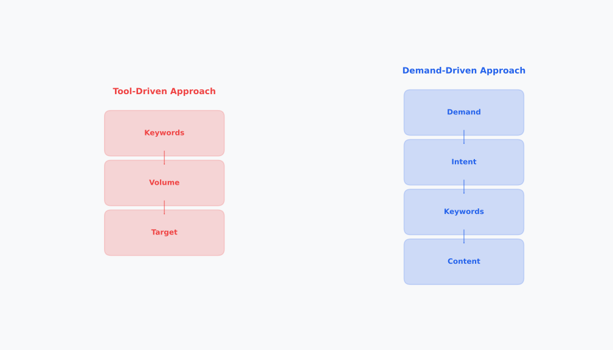

# Day 3, Chapter 1 — Keyword Research Foundations & Opportunity Discovery

Most people think keyword research is simple: open a tool, find keywords with high search volume, target those keywords. Done. But this approach misses the point entirely. Keyword research isn't about finding high-volume keywords—it's about understanding what people actually search for, why they search, and how to align your content with that demand. This is demand discovery, not tool usage.

This chapter will reframe how you think about keyword research. You'll learn to see it as a strategic process for understanding user demand, identifying the right starting points (seed keywords), expanding them systematically, and making decisions based on demand understanding rather than just volume metrics. This foundation will prevent wasted effort on irrelevant keywords and enable strategic content creation that aligns with what users actually want.

---

**Keyword Research as Demand Discovery**

*Reframing from tool-driven to demand-driven thinking*

Keyword research reframes from tool-driven task (finding high-volume keywords) to demand discovery (understanding what people search for and why). This shift enables strategic content alignment and prevents wasted effort on irrelevant keywords. Notice how demand discovery focuses on understanding users, while tool-driven focuses only on metrics.

> Which approach have you been using? How would shifting to demand discovery change your keyword research?

---

> **Explore This:** Think about your business or niche. What keywords do you assume people search for? Search for those keywords and see what appears. Then think about what people might actually be searching for instead.

---

## Keyword Research as Demand Discovery

Keyword research is **demand discovery**—understanding what people actually search for, why they search, and how to align your content with that demand. **This reframing changes everything about how you approach keyword research.**

> **💡 Key Concept**  
> **Keyword Research as Demand Discovery:** Keyword research isn't about finding high-volume keywords—it's about understanding what people actually search for, why they search, and how to align your content with that demand. This shift from tool-driven to demand-driven thinking enables strategic content alignment and prevents wasted effort on irrelevant keywords.

**What demand discovery means:**

When you approach keyword research as demand discovery, you're asking: What do people actually want? What problems are they trying to solve? What information do they need? What products or services are they looking for? You're understanding user demand, not just finding keywords with high volume.

This is fundamentally different from tool-driven keyword research, which focuses on finding keywords with high search volume, low competition, and good metrics. Tool-driven research asks: Which keywords have good numbers? Demand discovery asks: What do users actually want, and how can we meet that demand?

**Why demand discovery matters:**

Understanding demand enables strategic content creation. When you know what people actually search for, you can create content that matches those searches. When you understand why people search (intent), you can create the right content types. When you understand demand patterns, you can identify opportunities that volume metrics alone might miss.

**Two approaches compared:**

Consider a local plumber doing keyword research. The tool-driven approach: search "plumber keywords" in a tool, find high-volume terms like "plumber" (10,000 monthly searches), target that keyword. The demand discovery approach: understand what people actually search for ("plumber near me", "emergency plumber", "how to fix leaky faucet"), why they search (need immediate service, have a problem, want to learn), and create content that matches that demand.

The tool-driven approach might lead to targeting "plumber" with a generic homepage. **The demand discovery approach leads to targeting "plumber near me" with location-optimized pages, "emergency plumber" with emergency service pages, and "how to fix leaky faucet" with helpful guides that build trust.** **The second approach aligns with actual demand and creates better results.**

> **💡 Tip**  
> **Apply Demand Discovery:** When doing keyword research, ask: What do people actually want? What problems are they trying to solve? What information do they need? Understanding user demand enables strategic content creation that aligns with what users actually search for, not just what tools suggest.

> **Explore This:** Pick a niche you know well. What do you think people search for in that niche? Now search for those terms and see what appears. What does this tell you about actual demand?

---

## Seed Keywords: Finding Your Starting Points

Seed keywords are the core terms that represent your niche, topic area, or business offering. They're your starting points—the foundation for all keyword expansion. Identifying seed keywords correctly is essential because they anchor all subsequent research.

**What seed keywords are:**

Seed keywords are broad terms that represent your core focus. For a local plumber, seed keywords might be "plumbing", "plumber", "plumbing services". For a coffee blog, seed keywords might be "coffee", "coffee brewing", "coffee beans". For an ecommerce site selling laptops, seed keywords might be "laptops", "laptop reviews", "buy laptop".

Seed keywords aren't necessarily the keywords you'll target directly—they're your starting points for expansion. They represent the core topics you want to be found for, and all expansion builds from them.

**How to identify seed keywords:**

**Method 1: Core business/topic terms** — What are the fundamental terms that describe your business or topic? For a plumber: "plumbing", "plumber". For a coffee blog: "coffee". These are often obvious but shouldn't be assumed—validate them.

**Method 2: Competitor analysis** — What keywords do competitors target? What terms appear in their content? Competitor analysis reveals industry-standard seed keywords, but don't copy blindly—ensure they align with your focus.

**Method 3: Brainstorming** — Think about your business or topic from different angles. What terms describe what you do? What terms would someone use to find you? Brainstorm broadly, then validate.

**Method 4: Validation** — Once you have candidate seed keywords, validate them. Do they represent your core focus? Do people actually search for these terms? Do the search results align with your business goals? Validation ensures seed keywords are correct.

**Why starting correctly matters:**

**Correct seed keywords ensure all expansion aligns with your business goals.** **If your seed keywords represent your core focus, expansion will reveal relevant opportunities.** **If your seed keywords are wrong, expansion will reveal irrelevant keywords**, wasting effort on targeting that doesn't serve your goals.

> **⚠️ Common Mistake**  
> **Incorrect Seed Keywords:** Many people assume seed keywords are obvious and skip systematic identification. But incorrect seed keywords lead to wrong expansion. If your seed keywords don't represent your core focus, all expansion will be misaligned. Always validate seed keywords before expanding.

For example, if a local plumber incorrectly uses "home improvement" as a seed keyword, expansion might reveal keywords like "kitchen renovation" or "bathroom remodeling"—relevant to home improvement but not to plumbing services. Correct seed keywords ("plumbing", "plumber") ensure expansion reveals plumbing-related opportunities.

---

**Seed Keyword Identification Process**

*Systematic approach to finding correct starting points*

Identifying seed keywords follows a systematic process: define your niche or business focus, brainstorm core terms that represent it, validate those terms with search and business alignment, and select the seed keywords that best anchor your research. Starting correctly ensures all expansion aligns with your goals.

> What seed keywords would you identify for your business or niche? Do they represent your core focus?

---

> **Explore This:** For your business or niche, identify 3-5 seed keywords. Why did you choose these? What do they represent about your business?

---

## Keyword Expansion: Building Your Keyword Universe

Once you have seed keywords, expansion reveals the full opportunity universe. Multiple expansion methods work together to build comprehensive keyword sets that capture all relevant opportunities.

**Expansion Method 1: Autocomplete**

Google Autocomplete suggests queries as you type. Type your seed keyword and see what suggestions appear. For "coffee", autocomplete might suggest "coffee shops near me", "coffee maker", "coffee recipes", "coffee beans". Each suggestion is a related keyword opportunity.

Autocomplete reveals what people actually search for—it's based on real search behavior. This makes it valuable for discovering actual demand, not assumptions. Use autocomplete for each seed keyword to discover related queries.

**Expansion Method 2: People Also Ask**

People Also Ask (PAA) boxes on SERPs show related questions. Search for your seed keyword and expand PAA questions to see what related queries appear. For "coffee", PAA might show "how to make coffee", "what is coffee", "how much caffeine in coffee". Each question represents a keyword opportunity.

PAA reveals question-based queries, which are valuable for informational intent keywords. Questions often indicate informational demand, helping you identify content opportunities that answer user questions.

**Expansion Method 3: Related Searches**

Related searches appear at the bottom of SERPs. Search for your seed keyword and scroll to see related searches. For "coffee", related searches might show "coffee brands", "coffee types", "coffee history". These reveal alternative terms and related topics.

Related searches provide additional query variations and topic expansions. They often reveal terms you might not have considered, expanding your keyword universe beyond obvious variations.

**Expansion Method 4: Competitor Analysis**

Look at what keywords competitors target. Analyze their content, titles, and headings to identify keyword opportunities. Competitor analysis reveals industry-standard keywords and gaps where you might find opportunities.

Competitor analysis should inform, not dictate. Use it to discover keywords, but validate them against your goals and demand understanding.

**Expansion Method 5: Question-Based Expansion**

Think about questions users might ask about your topic. "How to", "what is", "why does", "when should"—these question formats reveal informational keyword opportunities. Question-based expansion helps identify content opportunities that answer user questions.

**Expansion Method 6: Tool-Based Expansion**

Keyword research tools provide related keyword suggestions. Use free tools (Google Keyword Planner, Ubersuggest free tier) or limited paid access to discover additional keywords. Tools provide volume data and related keyword suggestions.

**Combining methods:**

**The most effective approach combines multiple methods.** Use autocomplete to discover immediate suggestions, PAA to find questions, related searches to find variations, competitor analysis to find industry keywords, question-based thinking to find content opportunities, and tools to find additional data. **Each method reveals different opportunities, and combining them ensures comprehensive discovery.**

> **💡 Tip**  
> **Combine Expansion Methods:** Don't rely on a single expansion method. Use autocomplete, People Also Ask, related searches, competitor analysis, question-based thinking, and tools together. Each method reveals different opportunities, and combining them ensures comprehensive keyword discovery.

---

**Keyword Expansion Methods**

*Multiple methods reveal comprehensive opportunities*

Seed keywords expand into comprehensive keyword universes through multiple methods: autocomplete reveals related queries, People Also Ask reveals questions, related searches reveals alternative terms, and tools provide additional data. Each method reveals different opportunities, and using multiple methods ensures comprehensive discovery.

> Which expansion methods have you used? How does using multiple methods reveal more opportunities?

---

> **Explore This:** Take one of your seed keywords and expand it using autocomplete and People Also Ask. How many related keywords can you find? What patterns do you notice?

---

## Understanding Demand vs Assumptions

We often assume what people search for based on our own thinking, industry jargon, or business terminology. But actual search behavior often differs from our assumptions. Understanding this difference is essential for effective keyword research.

**The assumption problem:**

Businesses often assume users search using business terminology. A company selling "enterprise project management software" might assume users search "enterprise project management software". But users might search "project management tool", "team collaboration software", or "how to manage projects". The assumption doesn't match demand.

This mismatch leads to poor SEO results. Content optimized for assumed keywords won't rank because users don't search those terms. Understanding actual demand requires validation.

**How to validate demand:**

**SERP analysis** — Search for your assumed keywords and see what appears. Do the results match your expectations? Do relevant results appear? SERP analysis reveals whether assumed keywords match actual demand.

**Tool data** — Check keyword research tools for search volume. Low or zero volume suggests the term isn't searched. But remember: tools have limitations, and low volume doesn't always mean no opportunity.

**User research** — Talk to customers. Ask how they found you, what terms they use, what they search for. User research provides direct insight into actual search behavior.

**Pattern recognition** — Look for patterns in search suggestions, related searches, and PAA. Patterns reveal actual demand—if multiple sources suggest similar terms, those terms likely represent demand.

**Real-world example:**

A business assumed users search "affordable laptops" but validation revealed users actually search "best budget laptops" and "cheap laptops for students". The assumption ("affordable") didn't match actual demand ("budget", "cheap"). Creating content for "affordable laptops" wouldn't reach users searching "budget laptops" because the terms differ.

This is why demand validation matters—it ensures keyword targeting aligns with actual search behavior, not assumptions.

> **Explore This:** List 5 keywords you assume people search for in your niche. Then search for each and analyze the SERPs. Do your assumptions match actual demand?

---

## Keyword Metrics: Understanding the Numbers (Introduction)

Keyword research tools provide metrics: search volume, difficulty, CPC, CTR potential. These metrics provide data, but they need interpretation. Understanding metrics and their limitations prevents over-reliance on tool outputs.

**Common metrics:**

**Search volume** — Estimated number of monthly searches for a keyword. High volume suggests many people search the term, but volume alone doesn't determine value.

**Difficulty** — Estimated competition level for ranking. High difficulty suggests many competitors, but difficulty estimates can be inaccurate.

**CPC (Cost Per Click)** — Average cost for paid ads. Higher CPC suggests commercial value, but doesn't directly indicate organic opportunity.

**CTR potential** — Estimated click-through rate for ranking positions. Higher CTR suggests more traffic potential, but estimates vary.

**Metric limitations:**

Metrics are estimates, not exact numbers. Google Keyword Planner provides ranges, not exact volumes. Tool difficulty scores are estimates based on competitor analysis, not guarantees. Metrics don't capture all opportunity—low-volume keywords can be valuable if they match intent and have low competition.

**Using metrics strategically:**

**Metrics support logic, they don't replace it.** Use metrics to inform decisions: high volume suggests demand exists, low difficulty suggests opportunity, high CPC suggests commercial value. **But combine metrics with demand understanding, intent alignment, and strategic thinking.** **Don't target keywords solely based on metrics**—target keywords that align with demand and intent, using metrics to inform prioritization.

> **⚠️ Common Mistake**  
> **Metric-Only Decisions:** Many people target keywords solely based on metrics (high volume, low difficulty) without considering demand understanding, intent alignment, or strategic relevance. This leads to targeting wrong keywords. Always combine metrics with strategic thinking—metrics support logic, they don't replace it.

**Real-world example:**

A keyword with 100 monthly searches and low competition might be more valuable than a keyword with 10,000 monthly searches and high competition, if the low-volume keyword perfectly matches your business and the high-volume keyword doesn't. Volume alone doesn't determine value—relevance, intent alignment, and opportunity matter more.

> **Explore This:** Find a keyword with high volume and one with low volume in your niche. Which one seems more valuable? Why? What other factors matter beyond volume?

---

## Common Misunderstandings About Keyword Research

Several common misunderstandings about keyword research lead to poor strategies and wasted effort. Understanding these misconceptions helps prevent costly mistakes.

**Misunderstanding 1: "High volume = good keyword"**

Many people think high search volume automatically means a keyword is valuable. But volume alone doesn't determine value. A keyword with high volume but poor relevance to your business isn't valuable. A keyword with high volume but high competition might be harder to rank for than a lower-volume keyword with less competition. Volume is one factor, not the only factor.

**Misunderstanding 2: "Tools are all you need"**

Keyword research tools provide valuable data, but they don't replace strategic thinking. Tools show metrics, but they don't show demand understanding, intent alignment, or strategic relevance. Using tools without strategic thinking leads to targeting wrong keywords based on metrics alone.

**Misunderstanding 3: "More keywords = better"**

Some people think collecting hundreds of keywords is better than focusing on relevant keywords. But quantity doesn't equal quality. A focused set of relevant, intent-aligned keywords is more valuable than hundreds of irrelevant keywords. Quality and relevance matter more than quantity.

**Misunderstanding 4: "Seed keywords are obvious"**

Many people assume seed keywords are obvious and skip systematic identification. But incorrect seed keywords lead to wrong expansion. Taking time to identify seed keywords correctly ensures all research aligns with business goals.

Understanding these misconceptions prevents tool-dependent thinking, metric-only decisions, and wasted effort on irrelevant keywords. **Strategic keyword research requires demand understanding, intent awareness, and logical thinking**—tools support this, they don't replace it.

> **📌 Remember**  
> **Demand Discovery Foundation:** Keyword research is demand discovery—understanding what people search for and why, not just finding high-volume keywords. Strategic keyword research requires demand understanding, intent awareness, and logical thinking. Tools support strategy, they don't replace it.

---

## Key Takeaways

As you move forward in this program, remember these key ideas about keyword research foundations:

1. **Keyword research is demand discovery** — **It's about understanding what people search for and why, not just finding high-volume keywords.** This reframing enables strategic content alignment.

2. **Seed keywords are starting points** — **Identifying seed keywords correctly anchors all research.** Starting correctly ensures expansion aligns with business goals.

3. **Multiple expansion methods reveal comprehensive opportunities** — **Autocomplete, People Also Ask, related searches, competitor analysis, and tools each reveal different opportunities.** Combining methods ensures comprehensive discovery.

4. **Demand understanding requires validation** — **Assumptions about what people search for often differ from reality.** Validating demand ensures keyword targeting aligns with actual search behavior.

5. **Metrics support logic but don't replace strategic thinking** — **Keyword metrics provide data, but strategic decisions require demand understanding, intent alignment, and logical thinking.** Tools support strategy, they don't replace it.

These ideas form the foundation for effective keyword research. When you understand keyword research as demand discovery, you can identify relevant opportunities, expand systematically, and make strategic decisions about which keywords to target based on demand understanding rather than just volume metrics.

---

**Next:** In the next chapter, you'll learn advanced keyword expansion techniques and how to work effectively with free and limited-access paid tools to build comprehensive keyword sets even with tool constraints.

