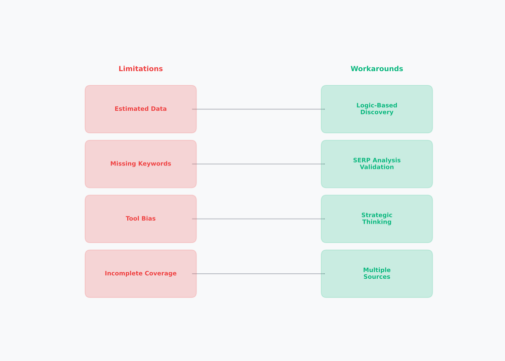

# Day 3, Chapter 2 — Keyword Expansion & Tools

Many people assume you need expensive SEO tools to do effective keyword research. They think free tools are insufficient, limited access means poor results, and comprehensive keyword discovery requires premium subscriptions. **But this assumption is wrong**—**free and limited-access paid tools, when combined with strategic thinking, enable comprehensive keyword research** that works within real-world constraints.

> **💡 Key Concept**  
> **Strategic Thinking Beats Expensive Tools:** Free and limited-access paid tools, when combined with strategic thinking, enable comprehensive keyword research. Constraint-based research actually improves research quality by forcing reliance on logic and demand understanding rather than tool outputs alone.

This chapter will show you how to maximize free keyword research tools, work effectively with limited paid tool access, overcome tool limitations through workarounds, and perform practical keyword research that doesn't require expensive subscriptions. You'll learn that strategic thinking beats expensive tool access, and that constraint-based research actually improves research quality by forcing reliance on logic and demand understanding rather than tool outputs alone.

---

**Free Tool Workflow**

*Systematic combination of free tools for comprehensive keyword discovery*

Free keyword research tools work together systematically: start with seed keywords, use autocomplete for suggestions, use People Also Ask for questions, use related searches for variations, use Google Keyword Planner for data, then combine results for comprehensive keyword lists. Each tool reveals different opportunities, and combining them ensures comprehensive discovery.

> Which free tools have you used? How could you combine them systematically?

---

> **Explore This:** Try building a keyword list for a niche using only free tools (autocomplete, PAA, related searches). How many keywords can you find? Notice how free tools reveal substantial opportunities.

---

## Free Keyword Research Tools: Maximum Value Strategies

Free keyword research tools provide substantial data when used strategically. The key is systematic usage—understanding what each tool reveals and combining them for comprehensive coverage.

**Google Autocomplete: Systematic Expansion**

Google Autocomplete suggests queries as you type, revealing what people actually search for. To use autocomplete systematically, type your seed keyword and explore all suggestions. Then add modifiers (location, questions, comparisons) and explore those suggestions. Autocomplete reveals immediate query patterns and related searches.

For example, typing "coffee" reveals "coffee shops near me", "coffee maker", "coffee recipes", "coffee beans". Adding "best" reveals "best coffee maker", "best coffee beans", "best coffee shops". Each suggestion represents a keyword opportunity, and systematic exploration reveals comprehensive keyword sets.

**People Also Ask: Question Discovery**

People Also Ask (PAA) boxes on SERPs show related questions that users search for. To extract keywords from PAA, search for your seed keyword, expand PAA questions, and note the questions that appear. Each question represents an informational keyword opportunity.

PAA reveals question-based queries, which are valuable for informational content. Questions like "how to make coffee", "what is the best coffee", "why does coffee taste bitter" represent keyword opportunities that might not appear in autocomplete. Expanding multiple PAA questions reveals comprehensive question-based keyword sets.

**Related Searches: Variation Discovery**

Related searches appear at the bottom of SERPs, showing alternative terms and related topics. To use related searches systematically, search for your seed keyword, scroll to related searches, and explore the variations. Related searches reveal alternative terminology, related topics, and query variations.

Related searches complement autocomplete and PAA by revealing terms you might not have considered. They often show industry-specific terminology, geographic variations, and topic expansions that other methods might miss.

**Google Keyword Planner: Free Data Access**

Google Keyword Planner provides free keyword data when you have a Google Ads account (free to create). Keyword Planner shows search volume estimates, competition levels, and related keyword suggestions. While data is aggregated and estimated, it provides valuable volume and competition insights.

To use Keyword Planner effectively, enter seed keywords and explore related keyword suggestions. Keyword Planner reveals keyword opportunities with volume data, helping prioritize keywords based on search volume estimates. While estimates aren't exact, they provide useful guidance for keyword prioritization.

**Combining Free Tools Systematically**

**The most effective approach combines all free tools systematically.** Start with seed keywords, use autocomplete for immediate suggestions, use PAA for questions, use related searches for variations, use Keyword Planner for volume data, then combine all results into comprehensive keyword lists. **Each tool reveals different opportunities, and systematic combination ensures nothing is missed.**

> **💡 Tip**  
> **Combine Free Tools Systematically:** Don't rely on a single free tool. Use autocomplete, People Also Ask, related searches, and Keyword Planner together. Each tool reveals different opportunities—autocomplete shows immediate suggestions, PAA shows questions, related searches show variations, Keyword Planner shows volume data. Systematic combination ensures comprehensive discovery.

> **Explore This:** Pick a seed keyword and use autocomplete, PAA, and related searches to expand it. How many keywords did you discover? What patterns do you notice?

---

## Limited-Access Paid Tools: Maximizing Value

Free tiers and trial periods provide limited access to paid SEO tools, but strategic use maximizes value from these constraints.

**Free Tiers: Strategic Data Extraction**

Many SEO tools offer free tiers with limited features. Ahrefs free tier provides limited keyword suggestions and basic data. Ubersuggest free tier provides limited daily searches. While limited, these tiers still provide valuable keyword data when used strategically.

To maximize free tiers, focus on extracting maximum value from available features. Use free tiers for seed keyword expansion, prioritize data extraction during limited access windows, and combine free tier data with free tools for comprehensive coverage.

**Trial Periods: Strategic Usage**

Trial periods provide temporary full access to paid tools. To maximize trial periods, prepare keyword lists in advance, extract data systematically during the trial, and focus on data that can't be obtained from free tools. Trial periods are valuable for one-time data extraction, not ongoing research.

Strategic trial usage involves identifying what data is most valuable, preparing research questions in advance, and extracting data efficiently during the trial period. Don't use trials for ongoing research—extract valuable data once, then use free tools for ongoing work.

**Understanding Limitations**

Limited-access paid tools have constraints: daily limits, feature restrictions, data limitations. Understanding these limitations helps set realistic expectations and prioritize data extraction. Don't expect full access functionality—focus on extracting maximum value from available features.

> **Explore This:** If you have access to a free tier or trial, try extracting keyword data systematically. What data is most valuable? How can you maximize limited access?

---

## Understanding Tool Limitations and Workarounds

**All keyword research tools have limitations.** **Understanding these limitations and using workarounds enables comprehensive research** despite tool constraints.

> **⚠️ Warning**  
> **Tool Limitations:** All keyword research tools have limitations—estimated data, missing keywords, tool bias, incomplete coverage. Don't rely solely on tool outputs. Use workarounds: validate with SERP analysis, use logic-based discovery, combine multiple tools and methods. Strategic thinking overcomes tool limitations.

**Common Tool Limitations:**

**Estimated data, not exact numbers** — Tools provide estimates based on sampling, not exact search volumes. Estimates can be inaccurate, especially for low-volume keywords. Workaround: Use estimates as guidance, not absolute truth. Validate with SERP analysis.

**Missing keywords** — Tools don't capture every keyword. Some keywords never appear in tool databases. Workaround: Use logic-based discovery. Think about what users might search for, beyond tool suggestions.

**Tool bias** — Tools favor certain types of keywords (commercial, high-volume). They may miss long-tail, niche, or emerging keywords. Workaround: Combine tool data with logic and SERP analysis. Don't rely solely on tool suggestions.

**Incomplete coverage** — No tool covers all keywords perfectly. Different tools have different databases, and keywords may appear in one tool but not another. Workaround: Use multiple tools and methods. Combine tool data with free methods.

**How Workarounds Enable Comprehensive Research:**

**Logic-based discovery** compensates for missing keywords. Think about what users might search for based on your understanding of demand, intent, and user behavior. Logic-based discovery reveals keywords tools might miss.

**SERP analysis** validates tool data and reveals opportunities. Search for keywords and analyze SERPs—do they match tool data? Do SERPs reveal additional opportunities? SERP analysis compensates for tool inaccuracies.

**Strategic thinking** prioritizes keywords beyond tool metrics. Tools show volume and difficulty, but strategic thinking considers relevance, intent alignment, and business goals. Strategic thinking compensates for tool limitations.

---

**Tool Limitations and Workarounds**

*How strategic thinking compensates for tool constraints*

Keyword research tools have limitations: estimated data, missing keywords, tool bias, incomplete coverage. But strategic workarounds compensate: logic-based discovery, SERP analysis for validation, strategic thinking for prioritization. Understanding limitations and workarounds enables comprehensive research despite tool constraints.

> What tool limitations have you encountered? How could you work around them?

---

> **Explore This:** Find a keyword that tools suggest has low opportunity, but SERP analysis shows differently. What does this tell you about tool limitations?

---

## Practical Keyword Research Workflow Within Constraints

A systematic workflow combines free tools, limited paid access, logic, and SERP analysis for comprehensive keyword research within constraints.

**Step 1: Identify Seed Keywords**

Start with seed keywords representing your core focus. Use methods from Day 3 Chapter 1: brainstorm core terms, validate with search, select seed keywords that anchor your research.

**Step 2: Expand Using Free Tools**

Systematically expand seed keywords using free tools:
- Autocomplete: Type seed keywords and explore suggestions
- People Also Ask: Search seed keywords and extract questions
- Related searches: Explore variations and alternatives
- Keyword Planner: Get volume estimates and related suggestions

**Step 3: Extract Data from Limited Paid Access (if available)**

If you have free tier or trial access, extract valuable data:
- Focus on data not available from free tools
- Prioritize seed keyword expansion
- Extract systematically during limited access windows

**Step 4: Apply Logic-Based Discovery**

Think beyond tool suggestions. What keywords might users search for? What questions might they have? Logic-based discovery reveals opportunities tools might miss.

**Step 5: Validate with SERP Analysis**

Search for keywords and analyze SERPs. Do SERPs match tool data? Do SERPs reveal additional opportunities? SERP analysis validates tool data and compensates for tool limitations.

**Step 6: Prioritize Strategically**

Prioritize keywords based on strategic thinking, not just tool metrics. Consider relevance, intent alignment, business goals, and opportunity beyond volume alone.

**Step 7: Combine and Organize**

Combine all keyword sources (free tools, paid tools, logic, SERP analysis) into organized keyword lists. Group by intent, topic, or priority for strategic use.

**This workflow enables comprehensive keyword research within constraints, proving that strategic thinking beats expensive tool access.**

> **📌 Remember**  
> **Strategic Thinking Overcomes Constraints:** Free tools, limited paid access, logic-based discovery, and SERP analysis enable comprehensive keyword research within constraints. Strategic thinking beats expensive tool access—better research comes from demand understanding and systematic methodology, not expensive subscriptions.

> **Explore This:** Try the complete workflow for a niche you know. How does combining free tools with logic compare to relying on expensive tools?

---

## Common Misunderstandings About Keyword Research Tools

Several common misunderstandings about keyword research tools lead to poor strategies and wasted resources.

**Misunderstanding 1: "Expensive tools are necessary"**

Many people assume expensive SEO tools are required for keyword research. But free tools enable comprehensive research when used strategically. Expensive tools provide convenience and additional data, but they don't replace strategic thinking.

**Misunderstanding 2: "Tool data is always accurate"**

Tools provide estimates based on sampling, not exact data. Estimates can be inaccurate, especially for low-volume or niche keywords. Treating tool data as absolute truth leads to poor decisions.

**Misunderstanding 3: "More tool features = better research"**

Having more tool features doesn't guarantee better research. Better research comes from strategic thinking, demand understanding, and systematic methodology. Tool features support research, they don't replace thinking.

**Misunderstanding 4: "Limited access means poor results"**

Limited tool access (free tiers, trials) doesn't mean poor results. Strategic use of limited access, combined with free tools and logic, enables comprehensive research. Constraints actually improve research quality by forcing strategic thinking.

Understanding these misconceptions prevents tool dependency, wasted resources on unnecessary subscriptions, and poor research practices. Strategic keyword research requires logic, demand understanding, and systematic methodology—tools support this, they don't replace it.

---

## Key Takeaways

As you move forward in this program, remember these key ideas about keyword expansion and tools:

1. **Free tools enable comprehensive research** — **Google autocomplete, People Also Ask, related searches, and Google Keyword Planner provide substantial keyword data when used systematically.** Strategic use of free tools reveals most opportunities.

2. **Limited paid tool access can be maximized** — **Free tiers and trial periods provide valuable data when used strategically.** Understanding how to extract maximum value from limited access enables research without full subscriptions.

3. **Tool limitations can be worked around** — **Tools have limitations (estimated data, missing keywords, tool bias), but logic, SERP analysis, and strategic thinking compensate for these gaps.** Workarounds enable comprehensive research despite constraints.

4. **Strategic thinking beats expensive tool access** — **Better keyword research comes from demand understanding and strategic thinking, not expensive tools.** Tool constraints actually improve research quality by forcing logic-based decisions.

5. **Practical workflows work within constraints** — **Systematic workflows combining free tools, limited paid access, logic, and SERP analysis enable comprehensive keyword research** that works in real-world scenarios without expensive subscriptions.

These ideas form the foundation for practical keyword research skills. When you understand how to work effectively with free and limited-access tools, you can perform comprehensive keyword research within constraints, proving that strategic thinking beats expensive tool access.

---

**Next:** In the next chapter, you'll learn how to evaluate keyword opportunities and prioritize keywords strategically, building on your keyword research foundation.

