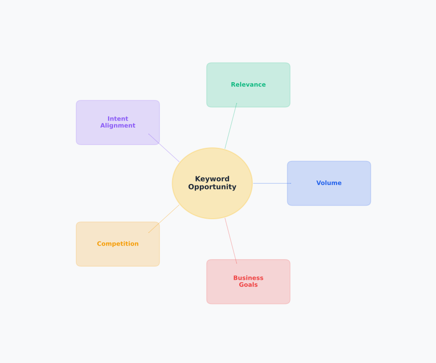

# Day 3, Chapter 3 — Keyword Opportunity Evaluation & Prioritization

When most people evaluate keyword opportunities, they look at search volume. High volume? Good keyword. Low volume? Skip it. This volume-only thinking seems logical, but it's fundamentally flawed. A keyword with high search volume but zero relevance to your business isn't an opportunity—it's a distraction. A keyword with high volume but impossible competition isn't achievable. Volume is just one factor, not the only factor.

This chapter will teach you how to evaluate keyword opportunities holistically, considering multiple factors beyond search volume. You'll learn that opportunity is multi-dimensional—requiring evaluation across volume, relevance, intent alignment, competition, and business goals—and how to prioritize keywords strategically using frameworks that balance these factors. This understanding prevents wasted effort on irrelevant keywords and enables strategic targeting decisions that serve your business objectives.

---

**Keyword Opportunity Evaluation Framework**

*Multi-factor framework for evaluating keyword opportunities*

Keyword opportunity evaluation requires balancing multiple factors: search volume, relevance to business, intent alignment, competition level, and alignment with business goals. No single factor determines opportunity—strategic evaluation considers all factors holistically to identify true opportunities that serve strategic objectives.

> Which factors matter most for your business? How would you evaluate keywords across all factors?

---

> **Explore This:** Find a keyword with high volume in your niche. Evaluate it beyond volume—is it relevant? Does it align with intent? Is competition realistic? This shows why volume alone isn't enough.

---

## The Volume-Only Fallacy

**Prioritizing keywords based solely on search volume is common, but it's a fallacy.** **Volume alone doesn't determine opportunity**—it's just one piece of information in a larger evaluation puzzle.

> **⚠️ Common Mistake**  
> **Volume-Only Thinking:** Many people prioritize keywords based solely on search volume. This is a fallacy—volume alone doesn't determine opportunity. A keyword with high volume but zero relevance isn't an opportunity. A keyword with high volume but impossible competition isn't achievable. Always evaluate multiple factors.

**Why volume-only thinking fails:**

Consider a local plumbing business evaluating keywords. "Plumbing" has high search volume (millions of searches monthly), so volume-only thinking says: target this keyword. But "plumbing" is too broad—it includes everything from "how to fix a leak" (informational, not service-seeking) to "plumbing companies in [city]" (local, competitive). The high volume doesn't mean it's a good opportunity for a local plumber.

Now consider "emergency plumber near me" with lower volume but high relevance. This keyword has lower volume but perfect alignment with the business (local service, emergency intent, actionable). Volume-only thinking would skip this, but it's actually a better opportunity because it aligns with business goals and user intent.

**The real cost of volume-only thinking:**

Volume-only prioritization leads to three costly mistakes:

1. **Targeting irrelevant keywords** — High volume doesn't guarantee relevance. Targeting irrelevant keywords wastes effort and doesn't serve business goals.

2. **Ignoring intent alignment** — Volume doesn't reveal intent. Keywords with high volume but mismatched intent won't convert, regardless of ranking.

3. **Unrealistic competition** — High volume often means high competition. Targeting impossible competition wastes resources on unachievable goals.

**Opportunity evaluation requires considering multiple factors, not just volume.** **Volume is information, not a decision.**

> **💡 Key Concept**  
> **Multi-Factor Evaluation:** Keyword opportunity is multi-dimensional. Strategic evaluation considers five key factors: volume, relevance, intent alignment, competition, and business goals. No single factor determines opportunity—strategic evaluation considers all factors holistically to identify true opportunities.

---

## Keyword Opportunity Evaluation Framework

Keyword opportunity is multi-dimensional. Strategic evaluation considers five key factors: volume, relevance, intent alignment, competition, and business goals.

**Factor 1: Search Volume**

Search volume estimates how many people search for a keyword monthly. High volume suggests demand exists, but volume alone doesn't determine value. Use volume as one data point, not the only decision factor.

Volume considerations: Is there enough search volume to justify targeting? Too low might mean insufficient demand. Too high might mean unrealistic competition. Volume should be considered alongside other factors.

**Factor 2: Relevance**

Relevance measures how well a keyword aligns with your business, products, or services. A keyword can have high volume but zero relevance—that's not an opportunity, it's a distraction.

Relevance evaluation: Does this keyword relate to what you offer? Does it align with your business model? Does it serve your target audience? Relevance ensures keywords serve strategic goals.

**Factor 3: Intent Alignment**

Intent alignment measures whether a keyword's intent matches the content or page type you'd create. Informational keywords need articles. Transactional keywords need product pages. Intent mismatch prevents conversion regardless of ranking.

Intent evaluation: What intent does this keyword represent? Does your planned content match that intent? Intent alignment ensures content serves user needs and converts appropriately.

**Factor 4: Competition**

Competition assesses how difficult it is to rank for a keyword. High competition means many established competitors targeting the keyword, making ranking difficult. Low competition means fewer competitors, making ranking more achievable.

Competition evaluation: How many competitors target this keyword? What's their authority level? Is competition realistic given your resources? Competition assessment ensures achievable targets.

**Factor 5: Business Goals**

Business goals measure how well a keyword serves your strategic objectives. A keyword might have good volume, relevance, intent, and competition, but if it doesn't serve business goals, it's not a strategic opportunity.

Goal evaluation: Does this keyword serve your business objectives? Does it align with your target audience? Does it support your revenue model? Goal alignment ensures keywords contribute to business success.

**Holistic Evaluation:**

**Strategic opportunity evaluation considers all five factors together.** **A keyword with high volume but low relevance is a poor opportunity.** **A keyword with low volume but high relevance, perfect intent alignment, low competition, and strong goal alignment might be an excellent opportunity.** **Evaluation requires balancing factors, not prioritizing single metrics.**

> **💡 Tip**  
> **Holistic Evaluation:** Don't prioritize keywords based on a single factor. A keyword with low volume but high relevance, perfect intent alignment, low competition, and strong goal alignment might be more valuable than a high-volume keyword with poor alignment. Always evaluate all factors together.

> **Explore This:** Pick three keywords and evaluate each across volume, relevance, intent, and competition. Which factors matter most? How does multi-factor evaluation change your prioritization?

---

## Understanding Keyword Metrics

Keyword research tools provide metrics: search volume, difficulty scores, CPC estimates, relevance indicators. These metrics provide data, but they need strategic interpretation.

**Common Metrics:**

**Search Volume** — Estimated monthly searches for a keyword. Tools provide ranges (e.g., 1,000-10,000) because data is aggregated and estimated. Volume estimates help understand demand scale but aren't exact numbers.

**Difficulty/Domain Rating** — Estimated competition level for ranking. Difficulty scores consider competitor authority, backlinks, and content quality. Higher scores mean more difficult ranking. But difficulty estimates can be inaccurate—niche-specific analysis often reveals different reality.

**CPC (Cost Per Click)** — Average cost for paid ads targeting the keyword. Higher CPC suggests commercial value but doesn't directly indicate organic opportunity. CPC reflects paid competition, not organic difficulty.

**Relevance Indicators** — Some tools provide relevance scores based on keyword matching. These are automated estimates and should be validated with business-specific evaluation.

**Metric Limitations:**

All keyword metrics have limitations. Volume estimates are based on sampling—they're not exact counts. Difficulty scores use algorithms that may not capture niche-specific factors. Metrics are estimates, not absolutes.

**Using Metrics Strategically:**

Metrics provide guidance, not decisions. Use volume estimates to understand demand scale, difficulty scores to assess competition trends, CPC to gauge commercial value. But combine metrics with business evaluation, SERP analysis, and strategic thinking. Metrics inform decisions, they don't make decisions.

**Real-World Example:**

A keyword shows "low volume" in tools (10-100 monthly searches), but SERP analysis reveals active discussion, recent content, and engaged community. The tool metric suggests low opportunity, but SERP analysis reveals otherwise. Strategic evaluation combines tool data with SERP analysis and business context to make informed decisions.

> **Explore This:** Find keywords where tool metrics seem contradictory to SERP analysis. What does this tell you about using metrics strategically?

---

## Keyword Prioritization Strategies

Prioritization balances multiple factors to identify which keywords to target first. Different businesses need different prioritization approaches, but frameworks guide strategic decision-making.

**Prioritization Framework 1: Relevance-First**

For new businesses or niche-focused businesses, relevance often matters more than volume. Prioritize keywords with high relevance, strong intent alignment, and realistic competition, even if volume is moderate. This ensures early wins and strategic alignment.

**Prioritization Framework 2: Volume-Optimized**

For established businesses with resources, high-volume keywords might be prioritized if competition is manageable. Volume-optimized prioritization balances volume with competition and relevance to identify scalable opportunities.

**Prioritization Framework 3: Low-Competition Focus**

For businesses with limited resources, low-competition keywords provide achievable wins. Prioritize keywords with realistic competition, strong relevance, and sufficient volume for impact. This builds momentum with achievable targets.

**Prioritization Matrix:**

A prioritization matrix visualizes keywords on two axes: relevance (high/low) and opportunity (high/low). This creates four quadrants:

- **High Relevance / High Opportunity** — Prioritize first. These keywords align with business goals and offer strong opportunity.

- **High Relevance / Low Opportunity** — Consider carefully. Relevance is good, but opportunity factors (volume, competition) limit potential. May still be valuable for niche targeting.

- **Low Relevance / High Opportunity** — Evaluate strategically. Opportunity exists, but relevance is low. Only pursue if it serves broader strategic goals.

- **Low Relevance / Low Opportunity** — Avoid. Neither relevance nor opportunity justify targeting.

**Context Matters:**

No single prioritization framework fits all businesses. New businesses might prioritize relevance and low competition. Established businesses might prioritize volume and brand terms. Resource-constrained businesses might prioritize quick wins. Choose frameworks that align with your context and goals.

---

**Keyword Prioritization Matrix**

*Strategic framework for prioritizing keywords*

Keyword prioritization can be visualized using a matrix framework that considers relevance and opportunity. Keywords in the high relevance/high opportunity quadrant should be prioritized first, while those in low relevance/low opportunity should be avoided. This framework enables strategic prioritization that balances multiple factors.

> Where would your target keywords fall on this matrix? How would this change your prioritization?

---

> **Explore This:** Create a prioritization framework for your business. What factors matter most? How would you balance them?

---

## Strategic Keyword Targeting Decisions

Targeting decisions should be based on holistic opportunity evaluation, not single metrics. Strategic targeting serves business goals and realistic resource allocation.

**Decision Framework:**

**Step 1: Evaluate Holistically** — Assess each keyword across all factors (volume, relevance, intent, competition, goals). Don't rely on single metrics.

**Step 2: Prioritize Strategically** — Use prioritization frameworks to rank keywords based on your business context and goals. Different businesses prioritize differently.

**Step 3: Assess Resources** — Evaluate your capacity to target keywords. Can you create content? Do you have resources for optimization? Realistic resource assessment prevents overcommitment.

**Step 4: Make Decisions** — Choose keywords to target based on holistic evaluation, strategic prioritization, and resource capacity. Focus on keywords that serve business goals and are achievable.

**Step 5: Validate and Iterate** — As you target keywords, validate assumptions with actual results. Iterate prioritization based on learnings. Strategic targeting is iterative, not one-time.

**Real-World Example:**

A business evaluates two keywords: "best project management software" (high volume, high competition, moderate relevance) and "project management for remote teams" (moderate volume, lower competition, high relevance). Volume-only thinking prioritizes the first, but strategic evaluation prioritizes the second because it aligns better with business goals, has more achievable competition, and serves a specific audience the business targets.

**Strategic Benefits:**

Strategic targeting decisions based on holistic evaluation prevent wasted effort on irrelevant keywords, ensure resources focus on achievable opportunities, align keyword targeting with business objectives, and create sustainable SEO strategies that serve long-term goals.

> **Explore This:** Evaluate a set of keywords and make targeting decisions. What factors influenced your decisions? How did multi-factor evaluation change your choices?

---

## Common Misunderstandings About Keyword Opportunity

Several common misunderstandings about keyword opportunity lead to poor targeting decisions and wasted effort.

**Misunderstanding 1: "High volume = best opportunity"**

Many people assume high search volume automatically means the best keyword opportunity. But volume alone doesn't guarantee relevance, intent alignment, achievable competition, or business goal alignment. High volume with poor alignment is a poor opportunity.

**Misunderstanding 2: "Metrics are always accurate"**

Keyword metrics are estimates based on sampling and algorithms. Volume estimates can be inaccurate, especially for low-volume or niche keywords. Difficulty scores may not capture niche-specific factors. Treating metrics as absolute truth leads to poor decisions.

**Misunderstanding 3: "One prioritization framework fits all"**

Different businesses need different prioritization approaches. A new business prioritizes differently than an established business. A niche business prioritizes differently than a broad business. Context matters—choose frameworks that fit your situation.

**Misunderstanding 4: "More keywords = better"**

Targeting more keywords doesn't guarantee better results. Quality and strategic alignment matter more than quantity. Targeting fewer, well-evaluated keywords that serve business goals is more effective than targeting many irrelevant keywords.

Understanding these misconceptions prevents volume-only thinking, metric over-reliance, one-size-fits-all prioritization, and quantity-over-quality targeting. **Strategic keyword opportunity evaluation requires holistic thinking, not single-metric decisions.**

> **📌 Remember**  
> **Holistic Evaluation is Essential:** Keyword opportunity is multi-dimensional. Strategic evaluation considers volume, relevance, intent alignment, competition, and business goals together. No single factor determines opportunity—always evaluate all factors holistically to identify true opportunities that serve strategic objectives.

---

## Key Takeaways

As you move forward in this program, remember these key ideas about keyword opportunity evaluation and prioritization:

1. **Opportunity is multi-dimensional** — **Volume, relevance, intent alignment, competition, and business goals all matter.** Strategic evaluation considers all factors holistically.

2. **Prioritization balances multiple factors** — **No single factor determines priority.** Strategic prioritization frameworks balance factors based on business context and goals.

3. **Metrics are estimates** — **Keyword metrics provide guidance but have limitations.** Use metrics strategically as one input in holistic evaluation, not as absolute truth.

4. **Strategic targeting serves business goals** — **Keywords should align with business objectives and be achievable given resources.** Strategic targeting prevents wasted effort and ensures resources focus on valuable opportunities.

5. **Holistic evaluation prevents wasted effort** — **Multi-factor evaluation ensures keywords serve strategic goals**, preventing targeting of irrelevant keywords, mismatched intent, or unrealistic competition.

These ideas form the foundation for strategic keyword targeting. When you understand how to evaluate opportunities holistically and prioritize strategically, you can make keyword targeting decisions that serve your business objectives and create sustainable SEO results.

---

**Next:** In the next day, you'll learn how to map keywords to pages strategically, ensuring each keyword has a clear content destination and each page serves specific keyword targets.

