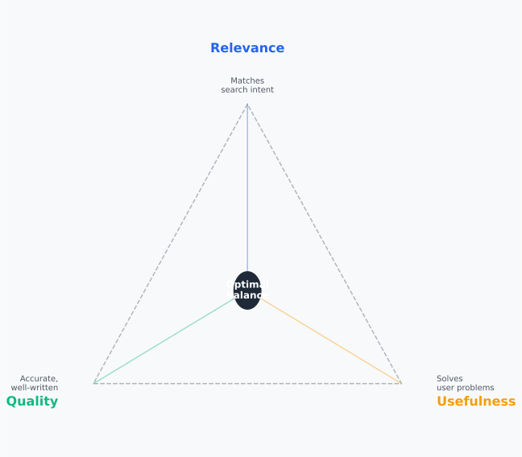
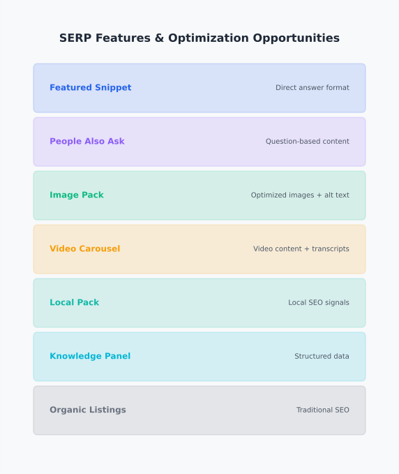

# Day 5, Chapter 1 — Content Optimization, Freshness & SERP Features

Many people think content optimization means stuffing keywords, manipulating text, or gaming algorithms. They've tried optimization before—maybe they added keywords everywhere, wrote awkward sentences to include search terms, or copied content structure from top-ranking pages. **The results? Poor user experience, algorithmic penalties, or rankings that never materialized.**

This misconception creates real problems. When people believe optimization means manipulation, they create content that serves search engines at the expense of users. When they believe optimization means following formulas, they create generic content that doesn't stand out. When they believe optimization is optional, they create great content that search engines never find. **All of these approaches fail.**

Content optimization isn't about manipulation or formulas—it's about balance. **Effective content optimization balances relevance, usefulness, and search intent**, enhancing content discoverability for search engines while maintaining genuine value for users. This chapter will show you how to optimize content strategically, understanding when to update content versus leaving it stable, and how to prepare content for modern visibility opportunities like featured snippets.

By the end, you'll understand **how to optimize content strategically** (the trade-off system between optimization and over-optimization) and **why content freshness matters** (strategic updates maintain visibility over time). You'll leave with practical frameworks for optimizing existing content and understanding when to update versus replace content.

---

> **Explore This:** Find a piece of content you think is "over-optimized" (keyword-stuffed, unnatural language, clearly written for search engines). Compare it to content that feels natural but still ranks well. What differences do you notice? Which approach seems more sustainable? Notice how the natural content serves users while still being discoverable.

---

## What SEO-Optimized Content Really Means

SEO-optimized content in 2025 means something very different from what it meant in 2010. Back then, optimization often meant keyword stuffing, link manipulation, and gaming algorithms. Today, **optimization means making content discoverable and valuable to both users and search engines**.

Think about what search engines actually do: they try to connect people with content that solves their problems. Google's entire mission centers on organizing information and making it accessible—they succeed when users find valuable content. **When your content genuinely solves problems and does so in a way search engines can understand, visibility follows naturally.**

SEO-optimized content balances three essential dimensions: **relevance** (matches search intent), **quality** (accurate, well-written, trustworthy), and **usefulness** (solves user problems). All three dimensions are necessary—content that's relevant but not useful fails. Content that's useful but not relevant to search queries fails. Content that's relevant and useful but low quality fails.

Consider two approaches to creating content about "best coffee makers."

The first approach focuses on keyword optimization: the content mentions "best coffee maker" dozens of times, includes keyword variations everywhere, and structures sentences awkwardly to include search terms. The content technically matches the query, but it doesn't genuinely help users choose a coffee maker. **Result: high keyword density, poor user experience, low engagement.**

The second approach focuses on genuine optimization: the content provides real comparisons, explains what makes coffee makers good, and helps users make informed decisions. Keywords appear naturally where they make sense. The content matches search intent because it genuinely serves the user's need. **Result: natural keyword usage, strong user experience, better engagement.**

Which approach works today? **The second one.** Search engines have evolved to prioritize user satisfaction, and content that aligns with that priority succeeds. **Content that tries to game the system fails.**

---

**Content Optimization Balance**

*Three dimensions work together: relevance, quality, and usefulness*

Notice how all three dimensions converge—when content balances relevance (matches search intent), quality (accurate and trustworthy), and usefulness (solves problems), it achieves optimal optimization. This isn't about maximizing one dimension at the expense of others—it's about balancing all three. Effective optimization serves both users and search engines by aligning these dimensions.

> Think about content you've seen that excelled in one dimension but failed overall. Highly relevant but not useful? Very useful but not relevant to search queries? Notice how all three dimensions are necessary.

---

> **Explore This:** Analyze a piece of content you know well—maybe a blog post, product page, or resource page. Identify how it balances the three dimensions: relevance (does it match search intent?), quality (is it accurate and well-written?), and usefulness (does it solve user problems?). Which dimension seems strongest? Which could be improved? How might improving the weakest dimension affect the overall optimization?

---

A technology blog learned this lesson when they optimized content for keywords without considering user value. They created articles that matched search queries perfectly—high keyword relevance—but didn't provide genuine value. The content was technically optimized but practically useless. **High bounce rates. Low engagement. Poor rankings.**

After analyzing their content and understanding the three dimensions, they shifted focus: every piece of content had to be genuinely useful first, then optimized for relevance and quality. Keywords appeared naturally where they supported user value. The content matched search intent because it genuinely served users. **Engagement improved. Rankings improved. Traffic quality improved.** The optimization didn't change—the balance did.

This balance principle applies across content types. A product page optimized for keywords but lacking useful information fails—users can't make informed decisions. A blog post optimized for relevance but containing inaccurate information fails—users can't trust the content. A resource page optimized for usefulness but not relevant to search queries fails—users never find it. **All three dimensions are necessary.**

---

## The Relevance, Quality, and Usefulness Balance

Why do all three dimensions matter? Because each serves a different function, and content that lacks any dimension fails in different ways.

**Relevance** ensures search engines can match content to queries. When someone searches "how to choose a coffee maker," content about coffee maker comparisons is relevant. Content about coffee brewing techniques might be useful but isn't relevant to that specific query. **Relevance without usefulness fails**—content matches the query but doesn't help users, leading to poor engagement and rankings.

**Quality** ensures accuracy and trustworthiness. Content about coffee makers that contains incorrect information, poor writing, or untrustworthy sources fails regardless of relevance. Users don't trust it. Search engines don't rank it. **Quality without relevance fails**—content is accurate and well-written but doesn't match what users are searching for.

**Usefulness** ensures user satisfaction. Content about coffee makers that matches queries and is accurate but doesn't help users make decisions fails—it's relevant and high-quality but not useful. **Usefulness without quality fails**—content helps users but contains errors or poor information.

The trade-off isn't between dimensions—it's between optimization and over-optimization. **Over-optimizing for relevance** leads to keyword stuffing. **Over-optimizing for quality** leads to content that's well-written but doesn't match search queries. **Over-optimizing for usefulness** leads to content that helps users but search engines can't understand or rank. **The optimal point balances all three**, not maximizing any single dimension.

A content marketing team experienced this trade-off when they focused exclusively on relevance. They optimized every piece of content for keyword matching, ensuring keywords appeared frequently and naturally. The content was highly relevant to search queries. **But it wasn't useful**—it matched queries without solving problems. **Result: high relevance scores, low user engagement, poor rankings despite optimization.**

They shifted to balancing all three dimensions. Content had to be genuinely useful first (solved real problems), then optimized for relevance (matched search queries), while maintaining quality (accurate and trustworthy). **Engagement improved. Rankings improved. The optimization became effective because it balanced dimensions instead of maximizing one.**

---

**Content Optimization Balance**

*All three dimensions are necessary—optimization balances them, not maximizes one*

This visual reinforces that effective optimization balances relevance, quality, and usefulness. Notice how the optimal point isn't at any extreme—it's in the center where all three dimensions converge. Over-optimizing any single dimension moves away from the optimal point, reducing overall effectiveness.

> Think about content you've seen that over-optimized one dimension. Highly relevant but not useful? Very useful but not relevant? Notice how the imbalance reduces overall effectiveness.

---

> **Explore This:** Think about content you've seen that excelled in one dimension but failed overall. Was it highly relevant but not useful? Very useful but not relevant to search queries? What was missing? How could it be improved by balancing all three dimensions?

---

The balance depends on context. **Evergreen content** might prioritize usefulness and quality over immediate relevance to trending queries. **Time-sensitive content** might prioritize relevance to current queries while maintaining quality and usefulness. **Product pages** might prioritize relevance and usefulness (matching queries and helping users decide) while maintaining quality (accurate specifications). **The optimal balance depends on content type, audience, and goals.**

Understanding this balance prevents common mistakes: keyword stuffing (over-optimizing relevance), creating irrelevant content (under-optimizing relevance), sacrificing accuracy for keyword matching (over-optimizing relevance at expense of quality), or creating great content that never ranks (under-optimizing relevance). **Balance enables effective optimization.**

---

## On-Page Content Optimization Principles

Optimizing content structure, formatting, and keyword placement enhances discoverability without sacrificing user experience. These optimization principles apply to existing content—you can improve content without rewriting everything.

**Content structure optimization** helps search engines understand content hierarchy and relationships. Clear headings (H1, H2, H3) organize content into logical sections. Paragraphs break content into digestible chunks. Lists (bulleted or numbered) highlight key points. **Structure signals content organization to search engines while improving readability for users.**

A blog post about "coffee brewing methods" optimized structure by adding clear headings for each method (pour-over, French press, espresso), using subheadings for key points (equipment needed, step-by-step process, tips), and organizing information into logical sections. The content didn't change—the structure did. **Search engines better understood the content. Users found information faster. Rankings improved.**

**Natural keyword placement** signals relevance without manipulation. Keywords appear where they make sense contextually—in headings, naturally in sentences, in alt text for images. **Natural placement signals relevance to search engines while maintaining readability for users.** Keyword stuffing (repeating keywords unnaturally) hurts both search engine understanding and user experience.

A product page optimized keyword placement by including the primary keyword ("coffee maker") in the H1 heading, naturally in product descriptions, and in image alt text. Keywords appeared where they supported user understanding, not where they maximized keyword density. **Relevance improved. Readability maintained. Rankings improved.**

**Formatting for readability and search engines** improves both user experience and search engine understanding. Short paragraphs (3-4 sentences) improve readability. Bold text highlights key points. Lists organize information. Internal links connect related content. **Formatting serves both users and search engines—readable content is more likely to engage users and satisfy search engines.**

A resource page optimized formatting by breaking long paragraphs into shorter ones, using bold text to highlight key concepts, creating lists for steps or features, and adding internal links to related resources. The content information didn't change—the formatting did. **Readability improved. Engagement improved. Search engines better understood the content structure.**

**Internal linking for context** helps search engines understand content relationships and helps users discover related information. Links to related pages signal topical relationships. Anchor text that describes linked content helps search engines understand connections. **Internal linking improves both discoverability and user navigation.**

These optimization principles work together. Structure organizes content. Keyword placement signals relevance. Formatting improves readability. Internal linking connects content. **Together, they enhance discoverability while maintaining user value.** Optimization isn't about maximizing any single technique—it's about applying principles that serve both users and search engines.

---

> **Explore This:** Take a piece of content you've created or know well. Identify optimization opportunities: structure (are headings clear and logical?), keyword placement (do keywords appear naturally where they support understanding?), formatting (is it readable with short paragraphs, lists, bold text?), internal linking (are related pages connected?). What improvements could you make without changing the core message? How might these improvements affect both user experience and search engine understanding?

---

A content team applied these principles to existing blog posts, improving structure, keyword placement, and formatting without rewriting content. They added clear headings, reorganized paragraphs for readability, naturally incorporated keywords, and added internal links. **The core content didn't change, but optimization improved. Rankings improved. Engagement improved.** Optimization enhanced existing content rather than requiring complete rewrites.

---

## Content Freshness, Updates, and Decay

Content rankings don't stay static forever. Over time, content faces increasing competition, algorithm updates, and evolving user expectations. **Content rankings decline over time**—this is content decay. Understanding why decay happens and how strategic updates maintain visibility is essential for long-term SEO success.

Think about what happens to content over months and years. New content gets published that's more comprehensive, more current, or better optimized. Algorithm updates change ranking factors. User expectations evolve—what satisfied users two years ago might not satisfy them today. **Competition improves. Standards rise. Content that doesn't evolve gets left behind.**

A technology blog published comprehensive guides that ranked well initially. Over two years, competitors published more detailed guides, algorithm updates changed ranking factors, and user expectations evolved. **Rankings declined. Traffic decreased. Content that was excellent two years ago became average today.**

They addressed this through strategic content updates. They refreshed statistics, added new sections covering recent developments, improved formatting based on user feedback, and updated internal links. **The core content remained valuable, but strategic updates maintained relevance. Rankings stabilized. Traffic recovered.** Updates maintained visibility without requiring complete rewrites.

**Strategic updates maintain or restore visibility** by signaling continued relevance and value. Updates show search engines that content remains current and useful. Updates address evolving user expectations. Updates incorporate algorithm changes. **Strategic updates prevent decay by maintaining relevance over time.**

Not all content needs constant updates. **Evergreen content** (timeless topics like "how to choose a coffee maker") might need occasional updates but doesn't require constant refreshing. **Time-sensitive content** (current events, trending topics) might need frequent updates to maintain relevance. **The update frequency depends on content type, competition, and topic evolution.**

---

**Content Decay Timeline**

*Rankings decline over time, but strategic updates can maintain or restore visibility*

Notice how rankings decline naturally over time (content decay), but strategic updates can maintain or restore visibility. The decline isn't inevitable—strategic maintenance prevents it. Updates signal continued relevance to search engines and address evolving user expectations.

> Think about content you've seen that's outdated. How might strategic updates have maintained its relevance? What types of updates would help?

---

> **Explore This:** Find an older piece of content (2+ years old) that ranks well, and compare it to a recently updated version of similar content. What differences do you notice? How might the update have helped maintain visibility? What types of updates do you see—new information, improved formatting, updated statistics? Notice how strategic updates maintain relevance without requiring complete rewrites.

---

**Update versus replace decision framework** helps determine when to refresh existing content versus creating new content. **Update existing content when:** the core topic remains relevant, updates can address gaps or outdated information, the content structure is sound, and the URL already has value (links, rankings, history). **Replace content when:** the topic is fundamentally outdated, the structure is poor and unfixable, the URL has negative signals, or creating new content is more efficient than updating.

A SaaS company used this framework to decide between updating and replacing content. They had blog posts from 2020 about "remote work tools" that had declined in rankings. The core topic remained relevant, but information was outdated. They could update statistics, add new tools, and refresh examples. **Decision: update.** They refreshed the content with current information, added new sections, and improved formatting. **Rankings recovered. Traffic increased.** Strategic updates were more efficient than creating new content.

Another piece of content about "2020 marketing trends" was fundamentally outdated—the topic itself was time-bound. They couldn't update "2020 trends" to be current. **Decision: replace.** They created new content about "current marketing trends" and redirected the old URL. **New content ranked better. Old content was properly archived.** Replacement was more appropriate than updating.

Understanding content decay and strategic updates prevents the "set it and forget it" content strategy. **Content requires maintenance to maintain visibility.** Strategic updates maintain relevance without requiring constant rewrites. The trade-off isn't between updating and not updating—it's between strategic updates that maintain visibility and ignoring content until it decays.

---

## Featured Snippets and SERP Features

Modern search results include more than traditional blue links. Featured snippets, People Also Ask sections, image results, video carousels, and other SERP features provide additional visibility opportunities beyond traditional rankings. **Understanding these features and optimizing content for eligibility expands visibility.**

Featured snippets are selected search results that appear in a special box above organic results, providing direct answers to queries. When someone searches "how to make pour-over coffee," a featured snippet might show step-by-step instructions directly in search results. **Featured snippets provide visibility even without ranking #1 organically**—they appear above organic results, increasing click-through rates.

A cooking blog optimized content for featured snippets by structuring answers clearly, using lists for steps, and formatting content for direct answers. When someone searched "how to make sourdough bread," their content appeared in a featured snippet with step-by-step instructions. **Visibility increased. Click-through rates improved. Traffic from featured snippets exceeded traffic from organic rankings.** Featured snippet optimization expanded visibility beyond traditional rankings.

**Content structure makes snippets eligible.** Featured snippets often come from content with clear answers, structured lists, tables, or definitions. Content optimized for featured snippets uses clear headings for questions, lists for steps, tables for comparisons, and definitions for terms. **Structure signals eligibility to search engines without requiring special markup.**

People Also Ask (PAA) sections show related questions that expand when clicked. Content that answers common questions related to a topic can appear in PAA sections. **PAA optimization expands visibility by appearing in multiple question results**, not just the primary query.

Image results, video carousels, and other SERP features provide additional visibility opportunities. **Optimizing content for multiple SERP features expands overall visibility**—content might not rank #1 organically but still drive significant traffic through featured snippets, PAA sections, or image results.

---

**SERP Features and Content Optimization Opportunities**

*Modern search includes multiple visibility opportunities beyond traditional rankings*

Notice how SERP features (featured snippets, PAA sections, image results, video carousels) provide additional visibility opportunities. Content optimized for these features can appear in multiple places, expanding visibility beyond traditional blue link rankings. This is modern SEO—optimizing for multiple visibility opportunities, not just rankings.

> Think about searches you've performed. How many different types of results appeared? Featured snippets? PAA sections? Images? Videos? Notice how many visibility opportunities exist beyond traditional rankings.

---

> **Explore This:** Search for questions you know the answers to. Find featured snippets and People Also Ask results. Analyze what makes the content eligible for these features. What structure do you notice? What format patterns appear? How does the content answer questions directly? Notice how structure and format make content eligible for enhanced visibility.

---

**Feature optimization doesn't replace traditional optimization**—it complements it. Content still needs to rank organically, but optimizing for SERP features expands visibility beyond rankings. Featured snippet optimization uses clear structure and direct answers. PAA optimization answers related questions. Image optimization uses descriptive alt text and relevant images. **Together, these optimizations expand overall visibility.**

A technology review site optimized content for both organic rankings and SERP features. They structured content with clear headings, lists for comparisons, and direct answers to common questions. Content ranked organically and appeared in featured snippets and PAA sections. **Overall visibility expanded. Traffic from multiple sources increased.** Feature optimization complemented traditional optimization, expanding visibility rather than replacing it.

Understanding SERP features and optimization opportunities prevents focusing exclusively on traditional rankings. **Modern SEO includes optimizing for multiple visibility opportunities.** Featured snippets, PAA sections, and other features provide additional ways to be found. Content optimized for features expands visibility beyond rankings.

---

## Common Misunderstandings About Content Optimization

Several misconceptions about content optimization lead to poor decisions and prevent SEO success. Understanding these misunderstandings prevents costly mistakes.

**Misunderstanding: "Keyword stuffing = optimization"**  
Some people believe optimization means including keywords as frequently as possible, leading to awkward, unnatural content that serves search engines at the expense of users. **Reality: optimization means natural keyword usage where keywords support understanding, not keyword stuffing.** Natural placement signals relevance without manipulation.

**Misunderstanding: "More keywords = better rankings"**  
Some people believe including more keywords or keyword variations automatically improves rankings, leading to content that mentions every possible variation regardless of relevance. **Reality: keyword relevance and natural usage matter more than keyword frequency.** Quality and usefulness matter more than keyword density.

**Misunderstanding: "Optimization is optional"**  
Some people believe great content automatically succeeds without optimization, leading to valuable content that search engines never find. **Reality: optimization is essential for discoverability, but it enhances content rather than replacing quality.** Great content plus optimization succeeds. Great content without optimization often fails to be found.

**Misunderstanding: "All content needs constant updates"**  
Some people believe every piece of content must be updated constantly to maintain rankings, leading to wasted effort on content that doesn't need updates. **Reality: strategic updates maintain visibility, but update frequency depends on content type and competition.** Evergreen content might need occasional updates. Time-sensitive content might need frequent updates.

**Misunderstanding: "SERP features are guaranteed"**  
Some people believe optimizing for featured snippets guarantees snippet visibility, leading to unrealistic expectations and disappointment when snippets don't appear. **Reality: SERP feature optimization makes content eligible, but feature appearance isn't guaranteed.** Optimization increases eligibility but doesn't guarantee selection.

### Why These Misunderstandings Happen

These misunderstandings persist because of **outdated SEO information** (optimization tactics from 2010), **confusion between optimization and manipulation** (not understanding that optimization enhances rather than manipulates), and **misunderstanding of how search engines work** (believing optimization is about gaming algorithms rather than alignment). SEO guidance sometimes oversimplifies optimization or presents outdated tactics as current.

### What Breaks Because of These Misunderstandings

When people believe these misconceptions, they make poor optimization decisions: **they create keyword-stuffed content, they waste effort on constant unnecessary updates, they focus exclusively on rankings while ignoring SERP features, or they skip optimization believing quality alone suffices.** These mistakes prevent SEO success regardless of content quality. **Understanding reality prevents these failures.**

---

## Takeaways

Content optimization is foundational to SEO success. Here are the key points to remember:

1. **SEO-optimized content balances relevance, usefulness, and search intent**—all three dimensions are necessary. Optimization enhances content discoverability while maintaining genuine user value.

2. **Optimization enhances content, doesn't replace quality**—effective optimization balances relevance (matches search intent), quality (accurate and trustworthy), and usefulness (solves problems). All three work together.

3. **Content freshness matters—strategic updates maintain visibility over time**—content rankings decline naturally, but strategic updates can maintain or restore visibility by signaling continued relevance.

4. **SERP features provide additional visibility opportunities beyond traditional rankings**—featured snippets, PAA sections, and other features expand visibility. Content optimized for features can appear in multiple places.

5. **Avoid over-optimization and keyword stuffing—balance is key**—optimization enhances discoverability without sacrificing user experience. Over-optimizing any dimension reduces overall effectiveness.

Effective content optimization creates content that serves both users and search engines—content that solves problems, matches search intent, and remains discoverable over time. This balance enables SEO success while maintaining genuine user value.

---

