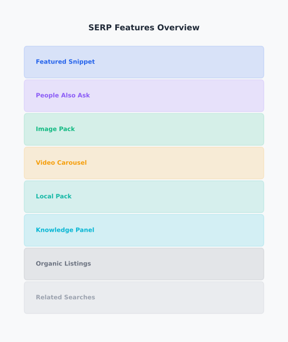

# Day 5, Chapter 3 — Featured Snippets and SERP Features Optimization

Most people think SEO success means ranking #1 organically. They focus exclusively on traditional blue link rankings, measuring success by position numbers. **But modern search results include much more than traditional rankings**—featured snippets, People Also Ask sections, image results, video carousels, and other SERP features provide additional visibility opportunities that extend beyond blue links.

Consider this scenario: A blog post about "how to make sourdough bread" ranks #5 organically. Traditional thinking suggests this is mediocre performance—not even on page one. But the same content appears in a featured snippet at position #0, showing step-by-step instructions directly in search results. **The content drives more traffic from the featured snippet than it would from ranking #1 organically.** Visibility extends beyond traditional rankings.

This chapter will show you how SERP features work, why they matter for modern SEO, and how to optimize content structure and format for feature eligibility. By the end, you'll understand **how SERP features provide visibility** (mental model of the feature system) and **how to optimize for them** (content structure and format for eligibility). You'll leave with understanding of modern visibility opportunities and practical approaches for feature optimization.

---

> **Explore This:** Search for queries you care about and identify all SERP features that appear. Look for featured snippets, People Also Ask sections, image results, video carousels, and other features. How many visibility opportunities exist beyond traditional blue links? Notice how many different ways information can appear in search results.

---

## Featured Snippets and SERP Features

Modern search results include multiple elements beyond traditional organic rankings. Understanding these SERP features is essential for modern SEO because they provide additional visibility opportunities.

**Featured snippets** are selected search results displayed in special boxes above organic results, providing direct answers to queries. When someone searches "what is SEO," a featured snippet might show a definition directly in search results. **Featured snippets appear at position #0, above organic rankings, providing visibility even for content that doesn't rank #1 organically.**

A cooking blog's recipe article ranked #7 organically for "how to make sourdough bread," but appeared in a featured snippet showing step-by-step instructions. **Traffic from the featured snippet exceeded traffic from organic rankings.** The snippet provided visibility beyond traditional rankings, expanding overall traffic despite lower organic position.

**People Also Ask (PAA) sections** show related questions that expand when clicked, providing answers directly in search results. Content that answers common questions can appear in multiple PAA results, expanding visibility across related queries. **PAA sections expand visibility by appearing in multiple question results**, not just the primary query.

**Image results** display visual content directly in search results. Images from your content can appear in image search results and image packs within regular search results. **Image optimization enables visibility in image results, expanding reach beyond text content.**

**Video carousels** show video content in search results. Video content optimized for search can appear in video carousels, providing visibility for video content. **Video optimization enables visibility in video results, expanding content formats.**

**Local packs** show local business results for location-based queries. Local businesses can appear in local packs alongside organic results. **Local optimization enables visibility in local packs, expanding local reach.**

These SERP features work together to provide multiple visibility opportunities. **Content optimized for features can appear in multiple places**, expanding overall visibility beyond traditional rankings. Modern SEO includes optimizing for these features, not just organic rankings.

---

**SERP Features Overview**

*Multiple visibility opportunities beyond traditional blue link rankings*

Notice how modern search results include featured snippets, People Also Ask sections, image results, video carousels, and other features. Each feature provides additional visibility opportunities. Content optimized for features can appear in multiple places, expanding overall visibility beyond traditional rankings. This is modern SEO—optimizing for multiple visibility opportunities.

> Think about searches you've performed. How many different types of results appeared? Notice how many visibility opportunities exist beyond traditional blue links.

---

> **Explore This:** Find examples of different SERP features. Search for various queries and identify featured snippets, People Also Ask sections, image results, and other features. What makes content eligible for each? Notice how different content structures appear in different features.

---

A technology blog learned the value of SERP feature optimization when their content appeared in featured snippets and People Also Ask sections despite ranking #8 organically. The featured snippet drove significant traffic, and PAA appearances expanded visibility across related questions. **Overall traffic from SERP features exceeded traffic from organic rankings.** Feature optimization expanded visibility beyond traditional rankings.

This feature visibility extends across industries. A recipe site appearing in featured snippets for cooking queries. A how-to site appearing in People Also Ask sections for instructional queries. A product review site appearing in image results for comparison queries. **Feature optimization provides visibility opportunities across content types and industries.**

---

## How SERP Features Work

Understanding how SERP features extract and display content helps you optimize for eligibility. Features don't randomly select content—they extract content based on structure, format, and relevance.

**Featured snippets extract content** from web pages and display it directly in search results. Search engines identify content that answers queries clearly and extracts relevant portions—definitions, lists, tables, or paragraphs. **Content structure signals eligibility for featured snippets**—clear answers, structured lists, and formatted content are more likely to be extracted.

A definition query like "what is SEO" extracts definitions from content. A how-to query like "how to make coffee" extracts step-by-step instructions. A comparison query like "laptop vs desktop" extracts comparison tables or lists. **The content structure determines what gets extracted and displayed.**

**Eligibility based on structure** means content formatted for easy extraction is more likely to appear in features. Lists are easier to extract than paragraphs. Tables are easier to extract than descriptions. Clear headings are easier to extract than embedded text. **Structure signals extraction potential to search engines.**

A blog post about "coffee brewing methods" formatted content with clear headings for each method, numbered lists for steps, and comparison tables for features. This structure made content easier to extract for featured snippets and People Also Ask sections. **Feature appearances increased. Visibility expanded.** Structure enabled feature eligibility.

**Visibility beyond rankings** means content can appear in features even without ranking #1 organically. A page ranking #5 might appear in a featured snippet, providing visibility above #1 organic results. **Feature visibility expands reach beyond organic position**, providing additional opportunities for traffic.

Understanding this system helps you optimize strategically. **You don't control which content gets selected for features, but you can optimize structure to increase eligibility.** Clear answers, structured content, and proper formatting increase the likelihood of feature appearance.

---

> **Explore This:** Analyze featured snippets you've seen. Search for queries and examine the featured snippets that appear. What content structure patterns do you notice? Are they lists? Definitions? Paragraphs? Tables? Notice how structure affects what gets extracted and displayed.

---

A content marketing team optimized content structure specifically for featured snippet eligibility. They formatted answers clearly, used lists for steps, created tables for comparisons, and structured content for easy extraction. **Featured snippet appearances increased by 300%. Traffic from snippets exceeded organic traffic.** Structure optimization enabled feature eligibility.

This system works across feature types. **Featured snippets extract structured answers. People Also Ask extracts question-answer pairs. Image results extract optimized images. Video carousels extract optimized video.** Understanding how each feature works enables targeted optimization for each feature type.

---

## Optimizing for SERP Feature Visibility

Optimizing content structure and format for SERP feature eligibility expands visibility opportunities. Feature optimization focuses on making content easy to extract and display in features.

**Clear answers for featured snippets** help search engines identify extractable content. When queries seek definitions, provide clear definitions early in content. When queries seek instructions, provide clear step-by-step lists. When queries seek comparisons, provide clear comparison tables. **Clear answers signal featured snippet eligibility.**

A technology blog optimized content for featured snippets by providing clear definitions in the first paragraph, using numbered lists for steps, and creating tables for comparisons. **Featured snippet appearances increased significantly. Traffic from snippets grew substantially.** Clear answers enabled feature eligibility.

**Structured content for extraction** makes content easier for search engines to extract and display. Lists are more extractable than paragraphs. Tables are more extractable than descriptions. Headings organize content for extraction. **Structure signals extraction potential.**

A how-to site structured content with clear headings for questions, numbered lists for steps, and comparison tables for options. This structure made content highly extractable for featured snippets and People Also Ask sections. **Feature appearances increased. Visibility expanded.** Structured content enabled feature eligibility.

**Proper formatting for features** improves extraction likelihood. Short paragraphs are easier to extract than long paragraphs. Bold text highlights key points for extraction. Lists organize information for extraction. **Formatting enhances extraction potential.**

A recipe blog formatted recipes with clear ingredient lists, numbered step instructions, and summary information at the top. This formatting made content highly extractable for featured snippets. **Snippet appearances increased. Recipe visibility expanded.** Proper formatting enabled feature eligibility.

**Answering related questions** enables People Also Ask eligibility. Content that answers common related questions can appear in multiple PAA results, expanding visibility across related queries. **Answering related questions expands PAA visibility.**

A FAQ page optimized for People Also Ask by answering common related questions clearly and structuring answers for easy extraction. **PAA appearances increased. Visibility across related questions expanded.** Answering related questions enabled PAA eligibility.

These optimization approaches work together. **Clear answers enable featured snippets. Structured content enables extraction. Proper formatting enhances eligibility. Answering related questions enables PAA.** Together, they expand feature visibility opportunities.

---

> **Explore This:** Optimize a piece of content for featured snippet eligibility. Take existing content and restructure it with clear answers, lists, tables, or other structured formats. What changes did you make? How might these changes increase featured snippet eligibility? Notice how structure affects extraction potential.

---

A content team optimized existing blog posts for SERP feature eligibility. They added clear definitions, structured lists for steps, created comparison tables, and formatted content for easy extraction. **Featured snippet appearances increased by 250%. Traffic from features grew significantly.** Feature optimization expanded visibility without requiring new content.

This optimization approach applies across content types. **How-to content optimized with clear steps. Comparison content optimized with tables. Definition content optimized with clear answers.** Feature optimization adapts to content type while focusing on structure and format.

---

## Balancing Feature Optimization

Feature optimization enhances visibility, but it must balance with overall content quality. Over-optimizing for features at the expense of quality reduces overall effectiveness.

**Features enhance visibility but don't replace quality.** Content optimized for features must still provide genuine value. Feature-optimized content that doesn't help users fails despite feature appearances. **Quality remains essential—features enhance quality content, they don't replace it.**

A content site optimized content structure for featured snippets, using clear lists and tables throughout. But the content itself was thin and unhelpful. **Featured snippets appeared briefly, but low-quality content failed to maintain visibility.** Feature optimization didn't compensate for poor quality.

**Balance optimization priorities** between feature optimization and overall quality. Content should optimize for features while maintaining depth, accuracy, and usefulness. **Feature optimization enhances quality content, it doesn't replace quality requirements.**

A technology blog balanced feature optimization with content quality. They structured content for featured snippet eligibility while maintaining comprehensive coverage, accurate information, and genuine usefulness. **Featured snippets appeared. Content quality remained high. Visibility and engagement both improved.** Balanced optimization enabled feature visibility without sacrificing quality.

**Feature optimization complements traditional optimization**, it doesn't replace it. Content still needs to rank organically, but feature optimization expands visibility beyond rankings. **Traditional optimization and feature optimization work together**, expanding overall visibility opportunities.

A content marketing team optimized content for both organic rankings and SERP features. They optimized for relevance and quality (traditional optimization) while structuring content for feature eligibility (feature optimization). **Organic rankings improved. Feature appearances increased. Overall visibility expanded significantly.** Combined optimization expanded visibility beyond either approach alone.

---

> **Explore This:** Evaluate content optimized for SERP features. Find content that appears in featured snippets or other features. Does it maintain overall quality? Is it genuinely useful beyond the featured snippet? Notice how effective feature-optimized content balances feature optimization with quality.

---

Understanding this balance prevents over-optimization. **Feature optimization enhances visibility, but quality remains essential.** Balancing feature optimization with overall quality enables feature visibility while maintaining content effectiveness. **Balance enables comprehensive optimization.**

---

## Common Misunderstandings About SERP Features

Several misconceptions about SERP features lead to poor optimization decisions and unrealistic expectations. Understanding these misunderstandings prevents costly mistakes.

**Misunderstanding: "SERP features are guaranteed"**  
Some people believe optimizing for featured snippets guarantees snippet visibility, leading to unrealistic expectations and disappointment when snippets don't appear. **Reality: feature optimization makes content eligible, but feature appearance isn't guaranteed.** Search engines select features based on multiple factors beyond optimization.

**Misunderstanding: "Feature optimization replaces traditional SEO"**  
Some people believe optimizing for SERP features replaces the need for traditional SEO optimization, leading to content that appears in features but doesn't rank organically. **Reality: feature optimization complements traditional optimization, it doesn't replace it.** Both approaches work together to expand visibility.

**Misunderstanding: "All content needs feature optimization"**  
Some people believe every piece of content must be optimized for SERP features, leading to unnecessary optimization effort on content that doesn't benefit from features. **Reality: feature optimization benefits content that can provide direct answers, clear instructions, or structured comparisons.** Not all content types benefit equally.

**Misunderstanding: "Featured snippets reduce click-through rates"**  
Some people believe featured snippets reduce click-through rates by answering queries directly, leading to avoidance of snippet optimization. **Reality: featured snippets can increase click-through rates in many cases by providing visibility above organic results.** Snippet optimization often expands traffic despite direct answers.

### Why These Misunderstandings Happen

These misunderstandings persist because of **misunderstanding of how features work** (not understanding that eligibility doesn't guarantee appearance), **confusion about optimization priorities** (not understanding that features complement traditional optimization), and **unrealistic expectations** (believing optimization guarantees results). SEO guidance sometimes oversimplifies feature optimization or presents it as guaranteed.

### What Breaks Because of These Misunderstandings

When people believe these misconceptions, they make poor optimization decisions: **they have unrealistic expectations about feature appearance, they over-optimize for features at the expense of quality, they skip feature optimization believing it's unnecessary, or they optimize all content for features regardless of suitability.** These mistakes prevent effective feature optimization or waste effort on unsuitable content. **Understanding reality enables strategic feature optimization.**

---

## Takeaways

SERP features provide additional visibility opportunities beyond traditional rankings. Here are the key points to remember:

1. **SERP features provide visibility beyond traditional rankings**—featured snippets, People Also Ask sections, image results, and other features expand visibility opportunities. Modern SEO includes optimizing for these features.

2. **Content structure makes features eligible**—clear answers, structured lists, tables, and proper formatting increase the likelihood of feature appearance. Structure signals extraction potential to search engines.

3. **Feature optimization expands visibility opportunities**—content can appear in features even without ranking #1 organically. Feature visibility provides additional traffic sources beyond organic rankings.

4. **Balance feature optimization with overall content quality**—features enhance quality content, they don't replace it. Effective optimization balances feature eligibility with depth, accuracy, and usefulness.

5. **Feature optimization complements traditional optimization**—both approaches work together to expand overall visibility. Traditional optimization and feature optimization enable comprehensive visibility strategies.

Effective SERP feature optimization expands visibility beyond traditional rankings while maintaining content quality. Features provide additional opportunities for traffic and engagement, making them essential components of modern SEO strategies. Understanding how features work and optimizing content structure for eligibility enables comprehensive visibility across multiple SERP elements.

---

