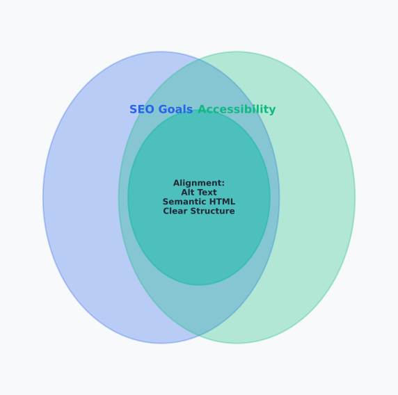

# Day 6, Chapter 2 — Accessibility, Usability, and Common On-Page Mistakes

You've optimized titles, headings, images, and content structure. Your pages are technically optimized for search engines. **But are they accessible? Are they usable?** Many people treat accessibility and usability as separate from SEO—optional extras that don't affect rankings. This misconception causes problems.

Consider this scenario: A content site optimizes all on-page SEO elements perfectly—titles include keywords, headings structure content clearly, images have descriptive alt text. But the site isn't accessible: images lack proper alt text for screen readers, headings aren't structured logically, content isn't navigable by keyboard. **Search engines notice. Users with disabilities can't use the site. Rankings suffer despite perfect technical optimization.**

This chapter will show you why accessibility and usability are SEO factors, how they impact rankings, and how to avoid common on-page SEO mistakes that hurt both users and search engines. By the end, you'll understand **why accessibility and usability matter for SEO** (search engines prioritize accessible, usable pages) and **how to avoid common mistakes** (recognizing errors and using correct approaches). You'll leave with understanding that good SEO serves users well, and avoiding mistakes creates pages that rank better.

---

> **Explore This:** Evaluate pages for accessibility and usability. Can users navigate with keyboard only? Do images have descriptive alt text? Is content readable and understandable? Notice how accessibility and usability affect both user experience and search engine signals.

---

## Why Accessibility Matters for SEO

Accessibility—making content usable by people with disabilities—is both an ethical requirement and an SEO factor. Search engines prioritize accessible content because accessible content serves more users effectively, and search engines succeed when they connect users with usable content.

Think about what accessibility means: content that works for everyone, regardless of ability. Screen reader users can understand images through alt text. Keyboard users can navigate without a mouse. Users with visual impairments can read content with sufficient contrast. **When content is accessible, it serves more users, which search engines reward.**

A news website optimized for accessibility by adding descriptive alt text to all images, ensuring keyboard navigation worked properly, and maintaining sufficient color contrast. The accessibility improvements helped screen reader users, keyboard users, and users with visual impairments. **User engagement improved across all user types. Search engines recognized the improved user experience. Rankings improved.** Accessibility improvements helped all users, which search engines rewarded.

**Accessible content aligns with search engine goals** because search engines prioritize content that serves users well. When content is accessible, it serves more users effectively, which search engines recognize. **Accessibility signals quality and user-focus, which search engines value.**

The same news website that improved accessibility also improved SEO signals. Search engines recognized that accessible content serves users better, signaling quality and user-focus. **SEO signals improved. Rankings improved.** Accessibility improvements aligned with search engine priorities.

**Accessibility requirements overlap with SEO best practices** in many ways. Descriptive alt text serves accessibility while also signaling content relevance to search engines. Clear heading structure serves screen readers while also organizing content for search engines. Keyboard navigation serves accessibility while also improving usability for all users. **Many accessibility practices improve SEO signals, making accessibility and SEO complementary.**

A technology blog improved accessibility by implementing proper heading hierarchy, descriptive alt text, and keyboard navigation. These accessibility improvements also improved SEO signals: heading hierarchy organized content for search engines, alt text signaled image relevance, and keyboard navigation improved usability. **Accessibility and SEO both improved.** Accessibility practices enhanced SEO signals.

---

**Accessibility and SEO Alignment**

*Accessibility practices align with SEO best practices*

Notice how accessibility requirements overlap with SEO best practices—descriptive alt text, clear heading structure, keyboard navigation, and other accessibility practices also improve SEO signals. Accessibility and SEO work together, not separately. When content is accessible, it serves more users and signals quality to search engines.

> Think about accessibility practices you know. How do they align with SEO best practices? Notice how accessibility and SEO complement each other.

---

Understanding this alignment helps you optimize effectively. **You don't choose between accessibility and SEO—you optimize for both simultaneously.** Accessibility practices improve SEO signals while serving users with disabilities. SEO practices improve discoverability while often improving accessibility. **The goals align, making optimization for both more efficient.**

---

## Usability and SEO Alignment

Usability—making content easy to use and understand—directly impacts SEO because search engines prioritize content that provides good user experience. Usable pages engage users, reduce bounce rates, and signal quality—all factors search engines consider when ranking content.

Think about what usability means: content that users can understand, navigate, and use effectively. Clear navigation helps users find information. Readable content helps users understand information. Intuitive design helps users use content efficiently. **When content is usable, users engage more, which search engines reward.**

A SaaS company improved website usability by simplifying navigation, improving content readability, and making design more intuitive. The usability improvements helped all users find and understand information more easily. **User engagement improved. Bounce rates decreased. Time on page increased.** Usability improvements improved user experience, which search engines recognized.

**Usable content signals quality to search engines** through user engagement metrics. When content is usable, users stay longer, engage more, and return more often—engagement metrics that search engines consider. **Usability improvements improve engagement metrics, which signal quality to search engines.**

The same SaaS company that improved usability also improved SEO signals. Improved engagement metrics (longer time on page, lower bounce rates, higher return rates) signaled quality to search engines. **SEO signals improved. Rankings improved.** Usability improvements signaled quality through engagement metrics.

**Usability and SEO goals align** because both prioritize user experience. SEO succeeds when users find valuable content. Usability succeeds when users can use content effectively. **Both goals require prioritizing user needs, making usability and SEO complementary.**

A content marketing team improved usability by organizing content clearly, improving readability, and making navigation intuitive. These usability improvements also improved SEO: clear organization helped search engines understand content structure, improved readability improved engagement metrics, and intuitive navigation improved user experience signals. **Usability and SEO both improved.** Usability practices enhanced SEO signals.

**Usability considerations affect SEO through user signals.** Page speed affects usability and SEO. Mobile usability affects usability and SEO. Content readability affects usability and SEO. **Many usability factors directly impact SEO signals, making usability and SEO interdependent.**

A technology blog improved page speed, mobile usability, and content readability. These usability improvements also improved SEO: faster pages improved user experience signals, mobile usability aligned with mobile-first indexing, and improved readability improved engagement metrics. **Usability and SEO both improved.** Usability improvements enhanced SEO signals.

Understanding this alignment helps you optimize effectively. **You don't choose between usability and SEO—you optimize for both simultaneously.** Usability practices improve user experience while improving SEO signals. SEO practices improve discoverability while often improving usability. **The goals align, making optimization for both more efficient.**

---

## Image Optimization and Accessibility

Images need optimization for both SEO and accessibility—proper optimization serves both goals simultaneously. Alt text serves accessibility needs while also signaling content relevance to search engines, making image optimization a key area where SEO and accessibility align.

**Alt text serves accessibility** by describing images for users who can't see them. Screen reader users rely on alt text to understand image content. Users with slow connections might have images disabled. **Alt text makes content accessible to all users, which is both ethical requirement and good user experience.**

A product page optimized image alt text by providing descriptive text for all product images: "Keurig K-Cup coffee maker showing single-serve brewing system with removable water reservoir and programmable brewing settings." The alt text helped screen reader users understand product images. **Accessibility improved. User experience improved for all users.** Alt text served accessibility needs.

**Alt text also signals content relevance to search engines** by describing image content, which helps search engines understand page topics. When alt text includes relevant keywords naturally, it signals relevance without manipulation. **Alt text serves both accessibility and SEO when done correctly.**

The same product page that optimized alt text for accessibility also improved SEO signals. The descriptive alt text naturally included relevant keywords (coffee maker, brewing system), signaling content relevance to search engines. **SEO signals improved. Rankings improved.** Alt text served both purposes when optimized correctly.

**Image optimization balances file size and quality** by compressing images to reduce file size (improving page speed and accessibility) while maintaining visual quality (maintaining user experience). Large image files slow page loading, hurting both user experience and accessibility. **Balance ensures images load quickly while remaining usable.**

A blog optimized images by compressing files to reduce size while maintaining visual quality. Images loaded quickly, improving page speed, accessibility, and user experience. **Page speed improved. Accessibility improved. User experience improved. SEO signals improved.** Image optimization balanced speed with quality, serving multiple goals.

**Image file names can signal relevance** when descriptive names naturally include relevant keywords. But file names should be descriptive and accessible, not keyword-stuffed. **Descriptive file names balance SEO signals with clarity and accessibility.**

A content site optimized image file names by using descriptive names that naturally included relevant keywords: "best-coffee-maker-comparison-chart.jpg" instead of "img123.jpg" or overly keyword-stuffed names. Descriptive names signaled relevance while remaining clear and accessible. **SEO signals improved. File organization improved. Accessibility improved.** Descriptive names served multiple purposes.

---

> **Explore This:** Evaluate images on pages you know. Do they have alt text? Is the alt text descriptive and helpful? Does it serve both accessibility and SEO? Notice how image optimization affects both user experience and search engine understanding.

---

A marketing agency optimized images across client websites by adding descriptive alt text, compressing files for speed, and using descriptive file names. The optimization improved both accessibility and SEO signals. **Accessibility compliance improved. Rankings improved. User experience improved.** Image optimization served multiple purposes effectively.

This optimization principle applies across all image types. Product images optimize with descriptive alt text that serves accessibility and SEO. Blog images optimize with context-appropriate alt text that describes image content. Infographic images optimize with comprehensive alt text descriptions. **All image types benefit from optimization that serves both accessibility and SEO.**

---

## Common On-Page SEO Mistakes

Several common on-page SEO mistakes prevent success by harming user experience, reducing accessibility, or signaling poor quality to search engines. Understanding these mistakes helps you avoid them and optimize effectively.

**Keyword stuffing in titles and headings** reduces readability while not improving rankings. Titles and headings that include keywords unnaturally or repeatedly harm user experience and don't help search engines understand content better. **Natural keyword placement works better than stuffing.**

A content site stuffed keywords into titles and headings: "Best Coffee Maker Coffee Maker Coffee Maker Review Guide." The keyword stuffing made titles awkward and unreadable. **User experience suffered. Search engines recognized manipulation. Rankings didn't improve.** Natural keyword placement would have been more effective.

**Missing or generic alt text** reduces accessibility and misses SEO opportunities. Images without alt text aren't accessible to screen reader users. Generic alt text like "image" doesn't help users or search engines understand image content. **Descriptive alt text serves both accessibility and SEO.**

A product page used generic alt text for all images: "image," "photo," "picture." The generic alt text didn't help screen reader users understand product images and didn't signal content relevance to search engines. **Accessibility suffered. SEO signals were missed.** Descriptive alt text would have served both purposes.

**Poor heading hierarchy** reduces readability and confuses search engines. Heading structures that skip levels (H1 to H3 without H2) or use headings incorrectly (multiple H1s, headings for styling) harm both user experience and SEO signals. **Proper heading hierarchy serves both users and search engines.**

A blog post used headings incorrectly: multiple H1s throughout content, headings used for styling instead of structure, skipped heading levels. The poor hierarchy made content hard to navigate and confused search engines about content structure. **User experience suffered. SEO signals suffered.** Proper heading hierarchy would have served both purposes.

**Duplicate titles and meta descriptions** confuse search engines and reduce click-through rates. When multiple pages use the same titles or descriptions, search engines can't distinguish pages, and users see duplicate information in search results. **Unique titles and descriptions improve both rankings and click-through rates.**

A content site used the same title tag across multiple pages: "Our Blog" appeared on every blog post. The duplicate titles confused search engines about page differences and reduced click-through rates from search results. **SEO signals suffered. Click-through rates suffered.** Unique titles would have improved both.

**Ignoring mobile usability** reduces accessibility and hurts rankings. Content that isn't mobile-friendly excludes mobile users and fails mobile-first indexing requirements. **Mobile usability is essential for both accessibility and SEO.**

A website wasn't mobile-friendly: text was too small, buttons were too close together, content didn't adapt to mobile screens. The mobile usability issues excluded mobile users and failed mobile-first indexing. **Accessibility suffered. Rankings suffered.** Mobile usability improvements would have served both purposes.

### Why These Mistakes Happen

These mistakes persist because of **mechanical optimization thinking** (believing optimization is formulaic), **misunderstanding of SEO requirements** (not understanding that SEO serves users), **lack of accessibility awareness** (not understanding accessibility requirements), and **confusion about optimization balance** (not understanding that optimization serves multiple purposes).

### What Breaks Because of These Mistakes

When people make these mistakes, they harm user experience, reduce accessibility, and prevent SEO success: **keyword stuffing reduces readability, missing alt text reduces accessibility, poor heading hierarchy reduces usability, duplicate titles reduce click-through rates, and ignoring mobile usability excludes users and fails indexing requirements.** These mistakes prevent success regardless of other optimization efforts. **Understanding and avoiding these mistakes enables effective optimization.**

---

## Takeaways

Accessibility and usability are essential for SEO success. Here are the key points to remember:

1. **Accessibility is an SEO factor**—search engines prioritize accessible content because accessible content serves more users effectively. Accessibility practices often align with SEO best practices.

2. **Usability impacts SEO**—usable content engages users, reduces bounce rates, and signals quality to search engines. Usability improvements improve engagement metrics, which signal quality.

3. **Image optimization serves both accessibility and SEO**—descriptive alt text serves accessibility needs while signaling content relevance to search engines. Proper image optimization serves multiple purposes.

4. **Avoid common on-page SEO mistakes**—keyword stuffing, missing alt text, poor heading hierarchy, duplicate titles, and ignoring mobile usability all prevent SEO success while harming user experience.

5. **Optimization serves multiple purposes**—effective optimization serves users, accessibility, and search engines simultaneously. You don't choose between these goals—you optimize for all of them together.

Effective on-page SEO creates pages that are accessible, usable, and optimized for search engines. Accessibility and usability improvements often enhance SEO signals while serving users better. Avoiding common mistakes prevents problems while enabling success. When pages are accessible, usable, and optimized, they serve users well and rank better.

---

