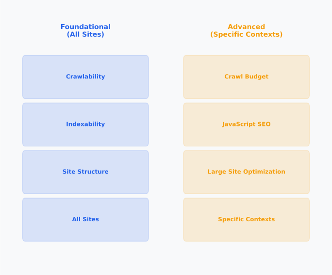
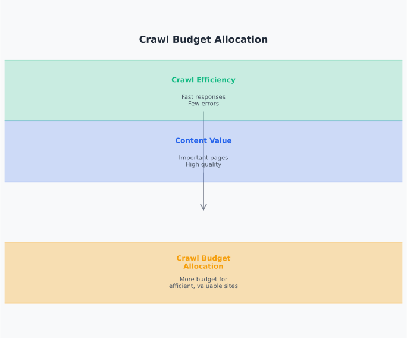
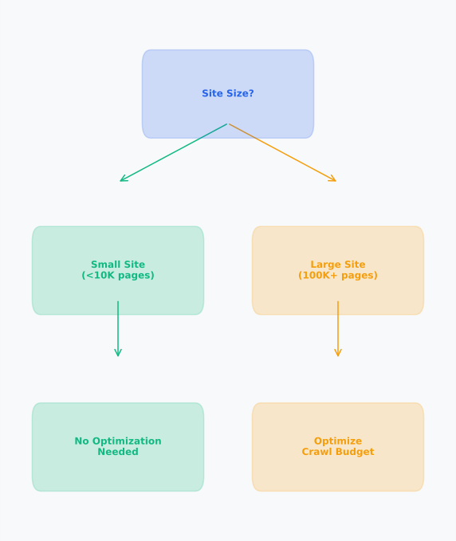

# Day 11, Chapter 1 — Advanced Technical SEO: Crawl Budget Optimization

Many people think crawl budget is always important or that all sites need crawl optimization—they worry about crawl budget even for small sites or don't understand when it matters. This misunderstanding wastes effort. **Crawl budget matters for large sites where search engines can't crawl all pages efficiently, but it's not a concern for smaller sites where search engines can crawl all pages.** Understanding when crawl budget matters prevents unnecessary optimization.

Consider this scenario: A small blog site with 50 pages worries about crawl budget, spending time optimizing crawl efficiency. But search engines can easily crawl all 50 pages, making crawl budget optimization unnecessary. **Meanwhile, a large e-commerce site with 100,000 pages doesn't optimize crawl budget, and important new products aren't discovered because crawl budget is wasted on low-value pages.** Understanding when crawl budget matters enables appropriate optimization.

This chapter will show you when crawl budget matters and how to optimize for large sites. By the end, you'll understand **when crawl budget matters** (decision framework: large sites vs. small sites) and **how to optimize for large sites** (optimization techniques and strategies). You'll leave with practical frameworks for determining crawl budget relevance and optimizing when needed.

---

> **Explore This:** Evaluate websites for crawl budget relevance. Are they large enough for crawl budget to matter? What would indicate crawl budget optimization is needed? Notice how site size determines crawl budget relevance.

---

## What Qualifies as "Advanced" Technical SEO

Advanced technical SEO addresses issues that matter for specific site types or scales, not foundational issues that affect all sites. Understanding what qualifies as advanced helps you focus on foundational technical SEO first, then address advanced topics when relevant.

**Advanced technical SEO is contextual** because it addresses issues that matter for specific situations. Crawl budget optimization matters for large sites but not small sites. JavaScript SEO matters for JavaScript-heavy sites but not static sites. **Advanced topics are relevant when site characteristics create specific challenges**, making them context-dependent.

Think about advanced topics like specialized tools: you need them for specific situations, but basic tools work for most tasks. **Advanced technical SEO works similarly**—it's needed for specific site characteristics, but foundational technical SEO works for most sites.

A small business website focuses on foundational technical SEO: proper robots.txt, sitemaps, status codes, crawlability, indexability. These foundational elements address most technical SEO needs. **Foundational technical SEO is sufficient for most sites.** Focusing on foundations ensures comprehensive coverage.

**Advanced topics extend foundations** by addressing specific challenges that foundational technical SEO doesn't cover. Crawl budget optimization extends crawlability for large sites. JavaScript SEO extends indexability for JavaScript-heavy sites. **Advanced topics build on foundations**, making foundational technical SEO prerequisite for advanced topics.

A large e-commerce site has foundational technical SEO in place (robots.txt, sitemaps, proper status codes) but also needs crawl budget optimization because site size creates crawl efficiency challenges. **Advanced topics address specific challenges beyond foundations.** Building on foundations ensures comprehensive technical SEO.

**Understand when advanced topics matter** to avoid unnecessary optimization or missing necessary optimization. Crawl budget matters for large sites. JavaScript SEO matters for JavaScript-heavy sites. **Context determines relevance**, making understanding context essential for advanced technical SEO.

The same large e-commerce site that needs crawl budget optimization may not need advanced JavaScript SEO if the site uses server-side rendering. **Understanding context determines which advanced topics matter.** Contextual understanding enables appropriate optimization focus.

---

**Foundational vs Advanced Technical SEO**

*Advanced topics address specific challenges that foundations don't cover*

Notice how foundational technical SEO addresses core issues (crawlability, indexability) that affect all sites, while advanced topics (crawl budget, JavaScript SEO) address specific challenges (large sites, JavaScript-heavy sites) that don't affect all sites. Understanding this distinction helps you focus on foundations first, then address advanced topics when relevant.

> Think about technical SEO topics. Which are foundational? Which are advanced? When do advanced topics matter? Notice how context determines relevance of advanced topics.

---

This understanding applies across all technical SEO work. Foundational technical SEO ensures basic access and discovery. Advanced technical SEO optimizes for specific challenges. **All technical SEO work benefits from understanding what's foundational versus advanced**, enabling appropriate focus and resource allocation.

---

## Crawl Budget Concepts

Crawl budget is how search engines allocate crawl resources—the time and resources available for crawling a website. Understanding crawl budget helps you optimize crawl efficiency for large sites where crawl resources are limited.

**Search engines allocate crawl resources** based on site characteristics, crawl efficiency, and available resources. Sites that crawl efficiently and have valuable content receive more crawl budget. Sites that waste crawl budget or have less valuable content receive less crawl budget. **Crawl budget allocation depends on efficiency and value**, making crawl efficiency important for large sites.

Think about crawl budget like time allocation: you have limited time, so you prioritize important tasks. Search engines have limited crawl resources, so they prioritize valuable pages. **Crawl budget allocation prioritizes valuable content**, making efficient crawling important.

A large e-commerce site receives crawl budget from search engines based on site size, crawl efficiency, and content value. The site can use crawl budget efficiently by focusing crawling on valuable pages, or waste it by crawling low-value pages. **Efficient crawl budget use ensures important pages are discovered.** Understanding crawl budget enables optimization.

**Crawl efficiency determines budget allocation** because search engines allocate more budget to sites that crawl efficiently. Efficient crawling (fast responses, few errors, valuable content) increases crawl budget. Inefficient crawling (slow responses, many errors, low-value content) decreases crawl budget. **Crawl efficiency affects budget allocation**, making efficiency optimization important.

The same large e-commerce site that understands crawl budget also optimizes crawl efficiency: ensures fast server responses, minimizes crawl errors, focuses crawling on valuable pages. Efficient crawling increases crawl budget allocation. **Crawl efficiency optimization increases budget allocation.** Efficiency optimization enables greater crawl coverage.

**Large sites face crawl budget limitations** because search engines can't crawl all pages on very large sites. With limited crawl budget, important pages might not be discovered if budget is wasted on low-value pages. **Crawl budget optimization focuses budget on valuable pages**, ensuring important content is discovered.

A content site with 50,000 pages faces crawl budget limitations: search engines can't crawl all pages, so crawl budget must be focused on valuable pages. Optimizing crawl budget ensures important content is discovered. **Crawl budget optimization focuses discovery on valuable content.** Understanding limitations enables strategic optimization.

---

**How Search Engines Allocate Crawl Budget**

*Crawl efficiency and content value determine budget allocation*

Notice how crawl budget allocation depends on crawl efficiency (fast responses, few errors) and content value (important pages). Efficient crawling and valuable content increase budget allocation. Understanding crawl budget concepts helps you optimize efficiency and focus budget on valuable pages.

> Think about crawl budget. How do search engines allocate it? What affects allocation? How can you optimize crawl efficiency? Notice how understanding crawl budget enables strategic optimization.

---

> **Explore This:** Analyze crawl budget for websites. How might search engines allocate crawl budget? What factors affect allocation? How could crawl efficiency be optimized? Notice how crawl budget concepts enable optimization decisions.

---

Understanding crawl budget concepts enables strategic optimization. **You can optimize crawl efficiency to increase budget allocation and focus budget on valuable pages**, ensuring important content is discovered even on large sites where crawl resources are limited.

A technical SEO specialist helped large sites understand crawl budget, enabling strategic optimization that focused crawl budget on valuable pages. **Understanding crawl budget enabled strategic optimization that ensured important pages were discovered.** Concept understanding enabled effective optimization.

This crawl budget understanding applies to large site optimization. E-commerce sites optimize crawl budget for product discovery. Content sites optimize crawl budget for important article discovery. SaaS sites optimize crawl budget for resource discovery. **All large sites benefit from crawl budget understanding that enables strategic optimization.**

---

## When Crawl Budget Matters

Crawl budget matters for large sites where search engines can't crawl all pages efficiently, but it's not a concern for smaller sites where search engines can crawl all pages. A decision framework helps determine when crawl budget optimization is relevant.

**Small sites don't need crawl budget optimization** because search engines can crawl all pages easily. Sites with fewer than 10,000 pages typically don't face crawl budget limitations, making crawl budget optimization unnecessary. **Focus on foundational technical SEO instead of crawl budget optimization** for small sites.

Think about small sites like small libraries: librarians can catalog all books easily, so there's no need to prioritize which books to catalog first. Search engines can crawl all pages on small sites easily, so there's no need to prioritize which pages to crawl. **Crawl budget optimization isn't needed for small sites.**

A small business website with 200 pages doesn't need crawl budget optimization: search engines can crawl all 200 pages easily, so crawl budget isn't a limitation. The site should focus on foundational technical SEO (robots.txt, sitemaps, proper status codes). **Crawl budget optimization isn't relevant for small sites.** Focusing on foundations is more appropriate.

**Large sites need crawl budget optimization** because search engines can't crawl all pages efficiently. Sites with more than 100,000 pages typically face crawl budget limitations, making crawl budget optimization necessary. **Focus on crawl budget optimization for large sites** to ensure important pages are discovered.

The same decision framework that identifies small sites also identifies large sites: a large e-commerce site with 500,000 products needs crawl budget optimization because search engines can't crawl all pages. **Crawl budget optimization is relevant for large sites.** Understanding when it matters enables appropriate optimization.

**Decision criteria determine relevance** by evaluating site size, crawl patterns, and discovery needs. Sites with many pages (100,000+), low crawl frequency for important pages, or discovery problems need crawl budget optimization. Sites with few pages, adequate crawl frequency, or no discovery problems don't need it. **Criteria-based decisions determine relevance.**

A content site evaluates crawl budget relevance: has 150,000 pages (large site), notices some important pages aren't being crawled frequently (crawl frequency problem), has discovery issues for new content (discovery problem). Decision: crawl budget optimization is relevant. **Criteria-based evaluation determined relevance.** Decision framework enabled appropriate optimization focus.

---

**When Crawl Budget Matters: Decision Framework**

*Site size and crawl patterns determine crawl budget relevance*

Notice how the decision framework evaluates site size (small vs large), crawl patterns (adequate vs inadequate), and discovery needs (no problems vs problems) to determine when crawl budget optimization is relevant. Understanding this framework prevents unnecessary optimization for small sites and ensures optimization for large sites that need it.

> Evaluate sites for crawl budget relevance. What criteria would you use? When would crawl budget optimization be relevant? Notice how decision frameworks prevent unnecessary optimization and ensure optimization when needed.

---

> **Explore This:** Apply decision framework to evaluate sites. Check site size, crawl patterns, discovery needs. When would crawl budget optimization be relevant? How does the framework prevent unnecessary optimization? Notice how decision frameworks enable appropriate optimization focus.

---

Understanding when crawl budget matters enables appropriate optimization. **You can avoid unnecessary crawl budget optimization for small sites while ensuring optimization for large sites that need it**, focusing effort where it matters most for SEO success.

A technical SEO agency used decision frameworks to evaluate crawl budget relevance for all clients, ensuring optimization focus was appropriate for site size and needs. **Decision frameworks enabled appropriate optimization focus that prevented unnecessary work and ensured optimization when needed.** Framework-based decisions enabled efficient optimization.

This decision framework applies across all site evaluation. Content sites evaluate crawl budget relevance. E-commerce sites evaluate crawl budget relevance. SaaS sites evaluate crawl budget relevance. **All site types benefit from decision frameworks that determine when crawl budget optimization is relevant.**

---

## Crawl Budget Optimization for Large Sites

Crawl budget optimization for large sites focuses crawl resources on valuable pages by improving crawl efficiency and directing crawling away from low-value pages. Optimization techniques ensure important pages are discovered even when crawl resources are limited.

**Focus crawl budget on valuable pages** by ensuring important pages receive crawl priority. Include valuable pages in sitemaps, link to valuable pages from high-authority pages, use proper internal linking to direct crawl budget, and ensure valuable pages are easily discoverable. **Directing crawl budget to valuable pages ensures important content is discovered.**

Think about crawl budget optimization like prioritizing important tasks: you focus limited time on high-priority tasks. Search engines focus limited crawl budget on valuable pages when crawl patterns direct budget effectively. **Crawl budget optimization prioritizes valuable content**, ensuring important pages are discovered.

A large e-commerce site optimizes crawl budget by focusing on valuable product pages: includes valuable products in sitemaps, links to valuable products from category pages, uses internal linking to direct crawl budget to valuable products. Valuable products receive crawl priority. **Crawl budget optimization ensures valuable products are discovered.** Directing budget to valuable pages enables discovery.

**Reduce crawl budget waste** by preventing crawling of low-value pages. Block low-value pages in robots.txt (filtered views, sorted views, duplicate content), use noindex for pages that shouldn't be indexed, implement proper canonicalization to prevent duplicate crawling, and optimize URL parameters to prevent parameter variation crawling. **Reducing waste frees budget for valuable pages.**

The same large e-commerce site that focuses crawl budget on valuable pages also reduces waste: blocks filtered views and sorted views in robots.txt, uses noindex for duplicate content versions, implements proper canonicalization. Waste reduction frees crawl budget for valuable pages. **Waste reduction increases budget available for valuable pages.** Comprehensive optimization maximizes crawl efficiency.

**Improve crawl efficiency** by ensuring fast server responses, minimizing crawl errors, and optimizing crawl patterns. Fast server responses allow more pages to be crawled per budget unit. Fewer crawl errors prevent budget waste on retries. Efficient crawl patterns enable discovery of valuable pages quickly. **Crawl efficiency improvements maximize crawl coverage.**

A content site improves crawl efficiency: optimizes server response times (faster responses), fixes crawl errors (fewer retries), optimizes site structure for efficient crawling (better crawl patterns). Efficiency improvements increase crawl coverage. **Crawl efficiency improvements maximize discovery of valuable pages.** Efficiency optimization enables greater crawl coverage.

**Monitor crawl patterns** to ensure crawl budget is being used effectively. Use search console to monitor crawl stats, analyze which pages are being crawled frequently, identify pages that aren't being crawled, and adjust optimization based on crawl patterns. **Monitoring enables ongoing optimization** that maintains crawl budget efficiency.

The same content site that improves crawl efficiency also monitors crawl patterns: tracks crawl stats in search console, analyzes crawl frequency for important pages, identifies pages that need more crawling, adjusts optimization based on patterns. **Monitoring enables continuous crawl budget optimization.** Ongoing monitoring maintains efficiency.

---

> **Explore This:** Plan crawl budget optimization for a large site. How would you focus crawl budget on valuable pages? How would you reduce waste? How would you improve efficiency? Notice how comprehensive optimization maximizes crawl budget effectiveness.

---

Crawl budget optimization enables large sites to maximize discovery of valuable pages even when crawl resources are limited. **Focusing crawl budget on valuable pages, reducing waste, improving efficiency, and monitoring patterns all enable effective crawl budget optimization** that ensures important content is discovered and indexed.

A technical SEO specialist helped large sites optimize crawl budget comprehensively, focusing budget on valuable pages while reducing waste and improving efficiency. **Comprehensive crawl budget optimization ensured important pages were discovered and indexed effectively.** Optimization techniques enabled effective crawl budget management.

This crawl budget optimization applies across all large site types. Large e-commerce sites optimize for product discovery. Large content sites optimize for article discovery. Large SaaS sites optimize for resource discovery. **All large sites benefit from crawl budget optimization that maximizes discovery of valuable content.**

---

## Large-Site Crawling Challenges

Large sites face unique crawling challenges that require specific management strategies. Understanding these challenges helps you address them effectively and maintain crawl efficiency as sites grow.

**Scale creates crawling challenges** because very large sites have more pages than search engines can efficiently crawl. Managing crawl efficiency becomes critical as sites grow beyond 100,000 pages. **Scale management ensures crawl efficiency is maintained** as sites grow.

Think about scale challenges like managing a large organization: coordination becomes more complex as size increases. Crawl management becomes more complex as site size increases. **Scale creates complexity** that requires strategic management.

A large e-commerce site faces scale challenges: 500,000 product pages create crawling complexity. Managing crawl efficiency requires strategic sitemap organization, efficient internal linking, and careful robots.txt configuration. **Scale challenges require strategic management.** Understanding scale challenges enables effective management.

**Dynamic content creates crawling challenges** because constantly changing content requires frequent re-crawling. Managing crawl frequency for dynamic content ensures fresh content is discovered without wasting crawl budget. **Dynamic content management balances freshness with efficiency**, ensuring important updates are discovered.

The same large e-commerce site that faces scale challenges also has dynamic content: product prices and availability change frequently. Managing crawl frequency for dynamic products ensures updates are discovered efficiently. **Dynamic content challenges require frequency management.** Understanding dynamic content enables effective management.

**Parameter variations create crawling challenges** because different URL parameters create many URL variations that might be crawled separately. Managing parameters prevents crawl budget waste on duplicate variations. **Parameter management prevents crawl budget waste**, ensuring budget focuses on unique content.

A content site with parameter variations faces crawling challenges: sort parameters and filter parameters create many URL variations. Managing parameters (using robots.txt, URL parameters settings, canonical tags) prevents waste on duplicate variations. **Parameter management prevents crawl budget waste.** Understanding parameter challenges enables effective management.

**Site structure complexity creates crawling challenges** because complex site structures make efficient crawling more difficult. Managing site structure ensures crawl paths lead to valuable content efficiently. **Structure management enables efficient crawling**, ensuring crawl budget reaches valuable pages.

The same content site that manages parameters also manages site structure: organizes content hierarchically, uses clear internal linking patterns, ensures crawl paths lead to valuable content efficiently. **Structure management enables efficient crawling.** Understanding structure challenges enables effective management.

---

> **Explore This:** Identify large-site crawling challenges. What challenges do large sites face? How could these challenges be managed? Notice how understanding challenges enables effective management strategies.

---

Understanding large-site crawling challenges enables strategic management. **You can address scale challenges, dynamic content challenges, parameter challenges, and structure challenges** through specific management strategies that maintain crawl efficiency as sites grow.

A technical SEO agency helped large sites manage crawling challenges strategically, addressing scale, dynamic content, parameters, and structure through specific management strategies. **Strategic challenge management maintained crawl efficiency as sites grew.** Challenge understanding enabled effective management.

This challenge management applies across all large site types. Large e-commerce sites manage product scale and dynamic pricing. Large content sites manage article scale and frequent updates. Large SaaS sites manage resource scale and dynamic features. **All large sites benefit from challenge management that maintains crawl efficiency.**

---

## Common Misunderstandings About Crawl Budget

Several misconceptions about crawl budget lead to unnecessary optimization or missed optimization opportunities. Understanding these misunderstandings prevents crawl budget mistakes.

**Misunderstanding: "Crawl budget always matters"**  
Some people believe crawl budget is always important, leading to unnecessary optimization for small sites. **Reality: crawl budget matters for large sites (100,000+ pages) but not for smaller sites where search engines can crawl all pages easily.** Understanding when crawl budget matters prevents unnecessary optimization.

**Misunderstanding: "All sites need crawl budget optimization"**  
Some people believe every site needs crawl budget optimization, leading to wasted effort on small sites. **Reality: only large sites need crawl budget optimization—small sites should focus on foundational technical SEO instead.** Understanding site size requirements prevents unnecessary optimization.

**Misunderstanding: "More crawling is always better"**  
Some people believe maximizing crawling always improves SEO, leading to inefficient crawling patterns. **Reality: efficient crawling that focuses on valuable pages works better than maximum crawling that wastes budget on low-value pages.** Understanding efficiency enables strategic optimization.

### Why These Misunderstandings Happen

These misunderstandings persist because of **misunderstanding of crawl budget relevance** (not understanding when crawl budget matters), **lack of decision frameworks** (not knowing how to determine relevance), and **overgeneralization** (believing all sites have the same technical SEO needs).

### What Breaks Because of These Misunderstandings

When people believe these misconceptions, they make poor optimization decisions: **they optimize crawl budget unnecessarily for small sites, they miss crawl budget optimization for large sites that need it, or they maximize crawling inefficiently instead of optimizing for efficiency.** These mistakes waste effort or miss necessary optimization. **Understanding reality enables appropriate crawl budget optimization.**

---

## Takeaways

Crawl budget optimization is relevant for large sites, not all sites. Here are the key points to remember:

1. **Crawl budget matters for large sites (100,000+ pages), not small sites**—small sites don't need crawl budget optimization because search engines can crawl all pages easily. Decision frameworks determine when crawl budget optimization is relevant.

2. **Crawl budget concepts enable optimization**—understanding how search engines allocate crawl resources and how crawl efficiency affects allocation enables strategic optimization that focuses budget on valuable pages.

3. **Crawl budget optimization focuses budget on valuable pages**—directing crawl budget to valuable pages, reducing waste on low-value pages, improving crawl efficiency, and monitoring crawl patterns all enable effective optimization.

4. **Large sites face unique crawling challenges**—scale, dynamic content, parameter variations, and site structure complexity create challenges that require specific management strategies to maintain crawl efficiency.

5. **Avoid crawl budget misunderstandings**—crawl budget doesn't always matter, not all sites need optimization, and efficient crawling works better than maximum crawling. Understanding reality enables appropriate optimization.

Crawl budget optimization enables large sites to maximize discovery of valuable pages even when crawl resources are limited. Understanding when crawl budget matters, crawl budget concepts, optimization techniques, large-site challenges, and common misunderstandings all enable strategic crawl budget optimization that ensures important content is discovered and indexed. When crawl budget optimization is appropriate and implemented effectively, large sites can maintain crawl efficiency and ensure valuable pages are discovered despite limited crawl resources.

---

