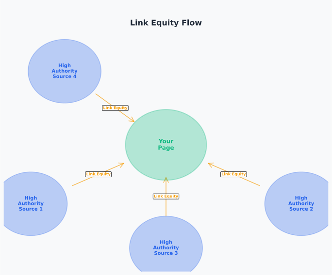

# Day 12, Chapter 1 — Link Building Fundamentals & Authority Development

Many people think link-building means buying links, submitting to directories, or using manipulative tactics to get as many links as possible. They've tried link-building before—maybe they purchased link packages, submitted to hundreds of directories, or used automated tools to create links. **The results? Manual penalties, algorithmic drops, or links that provide no value.**

This misconception creates real problems. When people believe link-building means buying links, they waste money on links that violate guidelines. When they believe link-building means quantity over quality, they chase links that provide no SEO value. When they believe link-building is optional, they miss opportunities to build authority. **All of these approaches fail.**

Link-building isn't about manipulation or quantity—it's about earning valuable, relevant links that signal authority and trust. **Links remain fundamental to SEO authority and rankings, but link quality and relevance matter more than quantity.** This chapter will show you how to build links ethically, evaluate link quality effectively, and prioritize link-building efforts based on value rather than volume.

By the end, you'll understand **how links build authority and trust** (link equity flows from authoritative sources to influence rankings) and **why link quality matters more than quantity** (search engines evaluate links based on source authority, relevance, and context). You'll leave with practical frameworks for evaluating links and building ethical link-building strategies.

---

> **Explore This:** Find a website with many links but poor rankings, and compare it to a website with fewer but high-quality links that ranks well. What differences do you notice in the link profiles? Which approach seems more sustainable? Notice how quality links from authoritative, relevant sources signal trust better than large volumes of low-quality links.

---

## Why Links Still Matter in SEO

Links remain one of the most important ranking factors in modern SEO. Search engines use links as signals of authority and trust—when authoritative, relevant websites link to your content, they're essentially voting for your credibility. **Links signal that other websites trust your content enough to reference it.**

Think about what links represent: when a reputable website links to your content, they're endorsing it. They're saying "this content is valuable enough to share with our audience." Search engines interpret these endorsements as signals of quality and authority. **High-quality links from authoritative sources signal trust and authority, which influences rankings.**

Link equity—the value passed through links—flows from authoritative sources to linked pages. When a high-authority website links to your content, some of that authority transfers to your page. When multiple high-authority websites link to your content, the authority signal strengthens. **Link equity flows from authoritative sources, building domain authority and page authority over time.**

A technology blog learned this when they focused exclusively on content quality but ignored link-building. They created excellent, comprehensive guides that provided genuine value. **But other websites weren't linking to their content.** Without links, search engines had difficulty recognizing the content's authority and value. Rankings stagnated despite high-quality content.

After implementing ethical link-building—earning links through quality content, building relationships, and legitimate outreach—they saw authority improve. High-quality links from relevant, authoritative websites signaled trust to search engines. **Domain authority increased. Rankings improved. Traffic grew.** Links enabled search engines to recognize content quality.

**Links aren't the only ranking factor, but they're fundamental.** Modern ranking systems consider hundreds of factors, but links remain a core signal of authority and trust. Content quality matters. Technical SEO matters. User experience matters. **But without links, even excellent content struggles to establish authority and rank competitively.**

---

**Link Equity Flow**

*Authority flows from authoritative sources through links to linked pages*

Notice how link equity flows from authoritative sources (high-authority websites) through links to linked pages, transferring authority and trust. Links from multiple authoritative sources strengthen the authority signal, building domain and page authority over time. This is why quality links matter—they signal authority and trust to search engines.

> Think about websites you trust. How did you first discover them? Through links from other trusted sources? Notice how links from authoritative sources signal credibility.

---

> **Explore This:** Analyze a website you know well—check its backlink profile using free tools or sample data. Identify high-quality links (from authoritative, relevant sources) versus low-quality links (from irrelevant or low-authority sources). What patterns do you notice? How might the quality of links affect the website's authority and rankings?

---

## Link Equity and Authority Concepts

Understanding how link equity works helps prioritize link-building efforts. **Link equity flows from authoritative sources through links**, transferring authority value to linked pages. The amount of equity transferred depends on the source's authority, the link's relevance, and the link's context.

**Source authority** determines how much equity a link can transfer. Links from high-authority websites (established, trusted sites with strong domain authority) transfer more equity than links from low-authority websites. A link from a major industry publication transfers more authority than a link from a new blog with minimal authority. **Source authority is fundamental—links from authoritative sources are more valuable.**

**Relevance** determines whether the equity transfer is meaningful. A link from an authoritative website about a different topic transfers less value than a link from a relevant, authoritative source. A technology website linking to your coffee blog provides less value than a food blog linking to your coffee blog, even if both have similar authority. **Relevance matters—links from relevant, authoritative sources provide more value.**

**Link context** affects equity transfer. Links within editorial content (articles, guides, resources) typically transfer more equity than links in footers, sidebars, or paid sections. Links with descriptive, natural anchor text provide more context than generic "click here" links. **Context matters—editorial links in relevant content transfer more equity.**

A SaaS company applied this understanding when prioritizing link-building. They identified authoritative, relevant sources in their industry—major publications, established blogs, industry resources. **They focused on earning links from these sources rather than chasing volume.** They built relationships, created valuable content, and conducted legitimate outreach. **Result: fewer links, but higher quality. Domain authority increased significantly. Rankings improved dramatically.**

Link equity accumulates over time. **Each high-quality link adds authority**, building domain authority and page authority gradually. A few high-quality links from authoritative, relevant sources provide more value than hundreds of low-quality links. **Quality over quantity—this principle guides effective link-building.**

---

**Link Quality Evaluation Framework**

*Source authority, relevance, and context determine link value*

Notice how link value is determined by multiple factors: source authority (how authoritative the linking site is), relevance (how relevant the link is to your content), and context (where and how the link appears). High-quality links excel in all three dimensions—authority, relevance, and context. Low-quality links fail in one or more dimensions.

> Think about links you've seen. Which ones seemed valuable? Which ones seemed worthless? What made the difference?

---

> **Explore This:** Identify three potential link opportunities for a topic you know well. Evaluate each opportunity using the framework: source authority (is the site authoritative?), relevance (is it relevant to your content?), and context (would the link appear in editorial content?). Which opportunity seems most valuable? Why? Notice how the framework helps prioritize link-building efforts.

---

## Types of Links and Anchor Text

Understanding different link types helps evaluate link opportunities and build diverse link profiles. **Different link types serve different purposes and provide different value**, depending on context and relevance.

**Editorial links** are links within editorial content—articles, blog posts, guides, resources. These links are earned naturally when content is referenced or cited. Editorial links typically transfer the most equity because they're in relevant, valuable content. **Editorial links are the most valuable—they signal genuine endorsement and relevance.**

**Citation links** are links that cite sources, references, or data. When websites cite your research, data, or content, they create citation links. Citation links signal authority and expertise—your content is being used as a source. **Citation links are highly valuable—they signal expertise and authority.**

**Resource links** are links in resource pages, directories, or curated lists. These links appear in "best resources" pages, tool lists, or directory pages. Resource links can be valuable when they're in relevant, curated lists from authoritative sources. **Resource links are valuable when they're in relevant, curated contexts from authoritative sources.**

**Directory links** are links from directory listings. Traditional directory links (DMOZ-style directories) provide minimal value today, but niche directories in relevant industries can provide some value when they're authoritative and relevant. **Directory links provide limited value—focus on niche, authoritative directories if pursued at all.**

**Anchor text** (the clickable text in a link) affects link value and SEO impact. **Natural anchor text distribution** includes brand names, partial match keywords, generic phrases ("learn more," "click here"), and exact match keywords in appropriate contexts. Over-optimizing anchor text (using exact match keywords excessively) can trigger penalties. **Natural anchor text distribution signals organic, editorial linking patterns.**

A content marketing agency learned this when they built links with over-optimized anchor text. They used exact match keywords ("SEO services," "link building") in most links, creating unnatural patterns. **Search engines detected the manipulation. Rankings dropped. Manual penalty risk increased.**

They shifted to natural anchor text distribution. Links included brand names, natural phrases, and keywords where contextually appropriate. The anchor text distribution looked organic and editorial. **Penalty risk decreased. Rankings recovered. Natural patterns signaled legitimate linking.**

**Link diversity matters.** A natural link profile includes various link types (editorial, citations, resources) with diverse anchor text. Over-relying on one link type or anchor text pattern looks manipulative. **Diversity signals organic, legitimate linking.**

---

## White-Hat vs Black-Hat Link Practices

Understanding the difference between ethical and manipulative link-building prevents penalties and builds sustainable SEO authority. **Ethical link-building focuses on earning valuable links through quality content and relationships**, while manipulative practices violate guidelines and lead to penalties.

**White-hat link-building** (ethical practices) includes creating valuable content that earns links naturally, building relationships with relevant websites, conducting legitimate outreach to share valuable content, and earning citations through research, data, or expertise. **White-hat practices build sustainable authority without penalty risk.**

**Black-hat link-building** (manipulative practices) includes purchasing links for SEO purposes, participating in link schemes or link farms, using automated tools to create artificial links, creating fake websites or pages solely for linking, and using excessive exact match anchor text. **Black-hat practices violate guidelines and lead to penalties.**

Google's guidelines are clear: **links should be earned, not bought or manipulated.** Purchased links violate guidelines. Link schemes violate guidelines. Manipulative anchor text violates guidelines. **The principle is simple: earn links through value, not manipulation.**

An e-commerce website learned this the hard way when they purchased link packages. They bought links from various sources, thinking quantity would improve rankings. **The links were low-quality, irrelevant, and clearly purchased.** Search engines detected the manipulation. **Manual penalty received. Rankings dropped to zero. Traffic disappeared.**

Recovery required removing purchased links, submitting a reconsideration request, and rebuilding authority through ethical link-building. It took months to recover. **The shortcut cost them far more than it saved.** Ethical link-building from the start would have been more efficient and sustainable.

**Gray areas exist** in link-building. Sponsored content with disclosure can be legitimate. Guest posting for genuine value can be legitimate. Resource page submissions can be legitimate. **The key is intent and disclosure—if links are earned through value and properly disclosed, they're typically acceptable.**

**The safest approach: focus on earning links through value.** Create content worth linking to. Build relationships with relevant websites. Share valuable resources. **When you focus on value, links follow naturally, and you avoid penalty risk.**

---

**Ethical vs Manipulative Link Practices**

*Ethical practices earn links through value; manipulative practices violate guidelines*

Notice how ethical link-building (earning links through quality content, relationships, and legitimate outreach) builds sustainable authority without penalty risk, while manipulative practices (purchased links, link schemes, automation) violate guidelines and lead to penalties. The principle is clear: earn links through value, not manipulation.

> Think about link-building tactics you've heard of. Which seem ethical? Which seem manipulative? What's the difference?

---

> **Explore This:** Research Google's link guidelines and identify three link-building tactics. Evaluate each: does it earn links through value or manipulate links? Would it violate guidelines? What makes the difference? Notice how focusing on value keeps link-building ethical and sustainable.

---

## Evaluating Link Quality

Evaluating link quality effectively helps prioritize link-building efforts and avoid low-value links. **Link quality is determined by multiple factors: source authority, relevance, context, anchor text, and link placement.** Understanding these factors enables effective link evaluation even with limited tool access.

**Source authority** indicates how authoritative the linking website is. Indicators include domain age, content quality, other high-quality links pointing to the site, and industry recognition. **Authoritative sources provide more valuable links—evaluate source authority when assessing link opportunities.**

**Relevance** indicates how relevant the link is to your content. A link from a relevant website in your industry provides more value than a link from an unrelated site, even if both have similar authority. **Relevance matters—links from relevant, authoritative sources provide more value.**

**Link context** indicates where and how the link appears. Links within editorial content (articles, guides) typically provide more value than links in footers, sidebars, or paid sections. Links with descriptive, natural anchor text provide more context. **Context matters—editorial links in relevant content provide more value.**

**Anchor text naturalness** indicates whether anchor text looks organic or manipulative. Natural anchor text includes brand names, partial match keywords, generic phrases, and exact match keywords in appropriate contexts. Over-optimized anchor text (excessive exact match keywords) signals manipulation. **Natural anchor text signals legitimate linking.**

**Link placement** indicates where the link appears on the page. Links in main content areas typically provide more value than links in footers, sidebars, or comment sections. Links in prominent positions (above the fold, in main content) are more valuable. **Placement matters—prominent, contextual links provide more value.**

A marketing agency applied this evaluation framework when prioritizing link-building. They evaluated each link opportunity using the factors: source authority, relevance, context, anchor text, and placement. **They focused on high-quality opportunities that scored well across all factors.** They avoided low-quality opportunities that failed in one or more dimensions. **Result: fewer links built, but higher quality. Domain authority increased. Rankings improved. Link-building became more efficient and effective.**

**Practical evaluation without expensive tools** is possible. You can assess source authority by reviewing the website's content quality, other links, and industry recognition. You can assess relevance by reviewing the website's topics and audience. You can assess context by reviewing where and how the link would appear. **Basic evaluation doesn't require expensive tools—common sense and careful review work.**

**Prioritize link-building efforts based on quality.** High-quality links from authoritative, relevant sources provide more value than large volumes of low-quality links. **Quality over quantity—this principle guides effective link-building strategy.**

---

## Link-Building Strategy Fundamentals

Building an effective link-building strategy requires systematic planning and execution. **Link-building strategy identifies link opportunities, prioritizes targets, conducts outreach, measures success, and builds sustainable link acquisition processes** that align with business goals and SEO objectives.

**Opportunity identification** finds potential link sources. Methods include analyzing competitor link profiles, identifying industry resources and directories, finding websites that link to similar content, and identifying citation opportunities (research, data, expertise). **Systematic opportunity identification ensures comprehensive link-building coverage.**

**Target prioritization** focuses efforts on high-value opportunities. Prioritize based on source authority, relevance, context, and likelihood of success. High-authority, relevant sources with clear value propositions receive priority. **Prioritization ensures efficient resource allocation—focus on opportunities with highest value and highest success probability.**

**Outreach execution** contacts potential link sources. Effective outreach focuses on value: share valuable content, offer expertise, provide useful resources. Outreach is relationship-building, not transactional link requests. **Value-focused outreach builds relationships and earns links naturally.**

**Success measurement** tracks link-building effectiveness. Metrics include number of links acquired, link quality (authority, relevance), domain authority improvement, and ranking improvements. **Measurement ensures link-building delivers value and enables strategy refinement.**

**Sustainable processes** maintain link-building over time. Link-building is ongoing, not one-time. Building relationships, creating valuable content, and conducting outreach should be continuous processes. **Sustainability ensures long-term authority building.**

A content website implemented this strategic approach. They identified link opportunities through competitor analysis and industry research. **They prioritized high-authority, relevant sources.** They conducted value-focused outreach, sharing valuable content and offering expertise. **They measured success through domain authority and ranking improvements.** They built sustainable processes, maintaining ongoing link-building efforts. **Result: steady authority growth. Improved rankings. Sustainable link-building that delivered long-term value.**

**Link-building strategy adapts to context.** Different industries have different link opportunities. Different content types attract different link types. **Context-appropriate strategies deliver better results than generic approaches.**

---

## Common Misunderstandings About Link Building

Several misconceptions prevent effective link-building. Understanding these misunderstandings prevents costly mistakes and guides ethical link-building practices.

**Misunderstanding #1: "More links = better rankings"** leads to chasing quantity over quality. People believe getting as many links as possible improves rankings, so they pursue low-quality links, directory submissions, or purchased links. **What breaks: search engines evaluate links based on quality, not quantity.** Low-quality links provide minimal value and can trigger penalties. **The reality: a few high-quality links from authoritative, relevant sources provide more value than hundreds of low-quality links.** Focus on quality, not quantity.

**Misunderstanding #2: "Any link is a good link"** leads to pursuing irrelevant or low-quality links. People believe any link improves rankings, so they accept links from any source, regardless of relevance or authority. **What breaks: irrelevant or low-quality links provide minimal value and can signal manipulation.** Links from unrelated sources or low-authority websites don't signal authority effectively. **The reality: links from authoritative, relevant sources provide value; irrelevant or low-quality links don't.** Focus on relevant, authoritative sources.

**Misunderstanding #3: "Link-building is dead"** leads to ignoring link-building entirely. People believe links no longer matter, so they focus exclusively on content or technical SEO. **What breaks: links remain fundamental ranking factors.** Without links, even excellent content struggles to establish authority. **The reality: links remain critical—the approach has evolved, not the importance.** Focus on ethical link-building that earns valuable links.

**Misunderstanding #4: "All paid links are bad"** leads to avoiding legitimate sponsored content. People believe any paid link violates guidelines, so they avoid all paid linking opportunities. **What breaks: this oversimplifies complex guidelines.** Sponsored content with proper disclosure can be legitimate. **The reality: disclosure and intent matter—legitimate sponsored content with disclosure is acceptable, but purchased links for SEO purposes violate guidelines.** Focus on value and disclosure.

**Misunderstanding #5: "Exact match anchor text is required"** leads to over-optimizing anchor text. People believe links must use exact match keywords, so they use exact match anchor text excessively. **What breaks: over-optimized anchor text signals manipulation and triggers penalties.** Natural anchor text distribution includes brand names, partial match keywords, and generic phrases. **The reality: natural anchor text distribution is optimal—exact match keywords are fine in context, but over-optimization is risky.** Focus on natural patterns.

Understanding these misunderstandings prevents common mistakes and guides effective, ethical link-building. **Link-building succeeds when it focuses on earning valuable links through quality content and relationships, not manipulating links through shortcuts or tactics.**

---

## Key Takeaways

Link-building remains fundamental to SEO authority and rankings, but **link quality and relevance matter more than quantity**. Understanding link equity, evaluating link quality, and building ethical link-building strategies enables sustainable authority building.

**Links signal authority and trust** to search engines. High-quality links from authoritative, relevant sources transfer link equity and build domain authority. Link-building focuses on earning valuable links through quality content and relationships, not purchasing or manipulating links.

**Link quality is determined by multiple factors**: source authority, relevance, context, anchor text, and placement. Evaluating these factors enables effective link evaluation and prioritization. Quality over quantity—this principle guides effective link-building strategy.

**Ethical link-building practices** earn links through value: creating valuable content, building relationships, conducting legitimate outreach. Manipulative practices (purchased links, link schemes, automation) violate guidelines and lead to penalties. Focus on value, not manipulation.

**Link-building strategy requires systematic planning**: opportunity identification, target prioritization, outreach execution, success measurement, and sustainable processes. Context-appropriate strategies deliver better results than generic approaches.

Understanding these principles enables effective link-building that builds sustainable SEO authority without penalty risk. **Links remain fundamental—build them ethically, evaluate them carefully, and prioritize quality over quantity.**

---

**Next Steps:** In the next chapter, we'll explore E-E-A-T (Experience, Expertise, Authority, Trust) and how trust signals create long-term SEO resilience. You'll learn how to build trust through content quality, authorship transparency, and helpful content principles that align with search engine goals.

