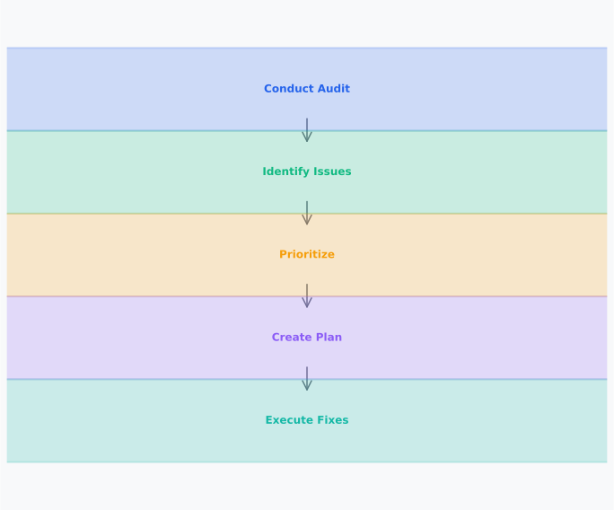

# Day 14, Chapter 1 — Full SEO Audit Framework & Execution

Many people think SEO audits are checklists—run through a list of items, identify problems, report findings. They've tried audits before—maybe they used audit tools that generated long lists of issues, checked off items without understanding causes, or created reports that listed problems without prioritization. **The results? Overwhelming problem lists, confusion about what to fix first, or audits that didn't lead to improvements.**

This misconception creates real problems. When people believe audits are checklists, they list symptoms without identifying root causes. When they believe all problems are equal, they can't prioritize effectively. When they believe audits are just documentation, they don't translate findings into action. **All of these approaches fail.**

SEO audits aren't checklists—they're systematic evaluations that diagnose root causes and create actionable improvement plans. **SEO audits integrate technical, content, on-page, and authority signals to identify root causes rather than surface symptoms**, enabling targeted fixes that address underlying problems efficiently. This chapter will show you how to conduct comprehensive audits, prioritize findings strategically, and translate audit results into effective execution plans.

By the end, you'll understand **how to conduct comprehensive SEO audits** (systematic frameworks that identify root causes) and **why audit sequencing and prioritization matter** (high-impact issues addressed efficiently rather than treating symptoms or pursuing low-value fixes). You'll leave with practical frameworks for conducting audits, prioritizing findings, and creating actionable improvement plans.

---

> **Explore This:** Review an audit report or checklist you've seen before. Identify which findings are symptoms (surface problems) versus root causes (underlying issues). Which problems seem most critical? How would you prioritize fixes? Notice how identifying root causes versus symptoms changes what gets fixed first.

---

## Purpose and Scope of SEO Audits

SEO audits are systematic evaluations that identify problems, opportunities, and improvement areas across technical, content, on-page, and authority signals. Understanding when and why to perform audits helps ensure audits deliver value and guide effective SEO improvements. **Audits diagnose problems, identify opportunities, and create improvement roadmaps.**

**When to perform audits** depends on context. New website audits establish baselines and identify foundational issues. Performance decline audits diagnose problems causing drops. Competitive analysis audits identify opportunities relative to competitors. Regular audits (quarterly, annually) maintain ongoing improvement. **Audit timing depends on goals—baseline establishment, problem diagnosis, or ongoing maintenance.**

**Why audits matter** is that they provide structured problem-solving frameworks. Audits identify root causes rather than symptoms, enabling targeted fixes. Audits prioritize issues based on impact and effort, ensuring efficient resource allocation. Audits create actionable roadmaps, translating findings into implementation plans. **Audits enable strategic SEO improvement rather than ad-hoc fixes.**

A SaaS company learned this when they experienced declining rankings without understanding causes. They tried various fixes—content updates, technical tweaks, link building—without diagnosing root causes. **Nothing worked because they were treating symptoms, not causes.** After conducting a comprehensive audit that identified root causes (technical crawl issues preventing indexation), they addressed underlying problems. **Rankings recovered. Traffic improved. Strategic fixes succeeded where reactive changes failed.**

**Audit scope** varies by goals and context. Full audits evaluate all SEO areas comprehensively. Focused audits target specific areas (technical, content, on-page). Quick audits identify immediate issues. **Audit scope should match goals—comprehensive for baseline establishment, focused for specific problem diagnosis.**

---

**SEO Audit Framework**

*Integrated evaluation across technical, content, on-page, and authority signals*

Notice how SEO audits integrate multiple evaluation areas—technical signals (crawl, indexation), content signals (quality, relevance), on-page signals (optimization, structure), and authority signals (links, trust). Comprehensive audits evaluate all areas to identify root causes and opportunities across the entire SEO ecosystem.

> Think about SEO problems you've encountered. Were they technical? Content-related? On-page? Authority-related? Notice how problems in one area can affect others, and comprehensive audits evaluate all areas.

---

> **Explore This:** Identify a website with SEO problems you know about. Consider what areas might need auditing: technical (crawl, indexation), content (quality, relevance), on-page (optimization, structure), authority (links, trust). Which areas seem most critical? How might problems in one area affect others? Notice how comprehensive audits evaluate all areas to identify root causes.

---

## Audit Types: Technical, Content, On-Page, Off-Page

Understanding different audit types helps structure comprehensive evaluations and focus on specific areas when needed. **Different audit types evaluate different SEO signals**, and comprehensive audits integrate all types to provide complete pictures.

**Technical audits** evaluate crawlability, indexation, site structure, and technical implementation. Technical audits identify crawl issues, indexation problems, site structure issues, and technical implementation errors. **Technical audits are foundational—technical problems prevent other SEO efforts from succeeding.**

**Content audits** evaluate content quality, relevance, duplication, and freshness. Content audits identify quality issues, relevance problems, duplication, and content freshness needs. **Content audits assess value—content quality and relevance determine SEO success.**

**On-page audits** evaluate page-level optimization, structure, and user experience. On-page audits identify optimization gaps, structure problems, and user experience issues. **On-page audits optimize discoverability—proper optimization enables search engines to understand and rank content.**

**Off-page audits** evaluate link profiles, authority signals, and external reputation. Off-page audits identify link quality issues, authority gaps, and reputation problems. **Off-page audits assess authority—link quality and authority signals influence rankings.**

A content website conducted separate audits for each type, identifying issues in each area. **But they didn't understand how issues connected.** Technical crawl issues prevented content from being indexed. Content quality problems reduced link earning potential. On-page optimization gaps prevented search engines from understanding content value. **Issues in all areas were interconnected.**

After integrating audit types and understanding connections, they addressed root causes systematically. Technical fixes enabled content indexation. Content improvements increased link earning. On-page optimization helped search engines understand content value. **Integrated approach addressed interconnected problems effectively.**

**Audit types work together—comprehensive audits integrate all types to identify root causes and opportunities.** Technical problems affect content visibility. Content quality affects link earning. On-page optimization affects search engine understanding. **Integrated audits evaluate all areas to provide complete pictures.**

---

## Audit Sequencing and Prioritization

Understanding how to sequence audits logically and prioritize findings ensures audits focus on high-impact issues and enable efficient resource allocation. **Audit sequencing follows logical order—technical first, then content, then strategy—because technical problems must be fixed before other improvements can succeed.**

**Technical audits first** identify foundational issues that block other improvements. Crawl issues prevent content discovery. Indexation problems prevent content ranking. Technical errors affect all SEO efforts. **Technical issues must be resolved before content or on-page improvements can succeed.**

**Content audits second** evaluate quality and relevance once technical issues are resolved. Content quality determines link earning potential. Content relevance affects rankings. **Content audits identify value and relevance issues that affect SEO success.**

**On-page audits third** optimize discoverability once content is accessible and valuable. On-page optimization enables search engines to understand content. Structure and formatting improve user experience and search engine understanding. **On-page audits optimize content that's already accessible and valuable.**

**Prioritization** focuses on high-impact issues first. Impact prioritization addresses issues with highest traffic potential, ranking impact, or business value. Effort prioritization considers implementation complexity and resource requirements. **Impact-effort prioritization ensures efficient resource allocation—high-impact, low-effort fixes receive priority.**

A corporate website learned this when they prioritized content improvements before fixing technical issues. They focused on content quality and optimization, but technical crawl issues prevented search engines from discovering improved content. **Content improvements had no impact because technical problems blocked them.** After sequencing audits properly—fixing technical issues first, then improving content—they saw improvements. **Technical fixes enabled content improvements to succeed. Sequencing mattered.**

**Prioritization matrices** help organize findings by impact and effort. High-impact, low-effort fixes receive immediate priority. High-impact, high-effort fixes receive strategic planning. Low-impact issues receive lower priority. **Prioritization ensures efficient resource allocation and focused improvement efforts.**

---

**Prioritization Matrix**

*Impact vs effort matrix guides efficient resource allocation*

Notice how prioritization matrices organize audit findings by impact and effort. High-impact, low-effort fixes receive immediate priority. High-impact, high-effort fixes receive strategic planning. Low-impact issues receive lower priority. Prioritization ensures efficient resource allocation and focused improvement efforts.

> Think about problems you've fixed. Which were high-impact but low-effort? High-impact but high-effort? How did prioritization affect what you fixed first?

---

> **Explore This:** List audit findings from a sample audit (real or hypothetical). Prioritize each finding using impact-effort analysis: high impact/low effort (quick wins), high impact/high effort (strategic projects), low impact (lower priority). What would you fix first? Why? Notice how prioritization focuses efforts on highest-value improvements.

---

## Root Cause Analysis vs Symptom Identification

Distinguishing between root causes and symptoms ensures audits identify underlying problems rather than treating surface issues. **Root cause analysis diagnoses underlying problems, while symptom identification only recognizes surface problems**, and effective audits identify root causes to enable targeted fixes.

**Symptoms** are visible problems or indicators. Ranking drops are symptoms. Traffic declines are symptoms. Low engagement is a symptom. **Symptoms indicate problems but don't explain causes.**

**Root causes** are underlying problems that create symptoms. Technical crawl issues cause ranking drops. Content quality problems cause traffic declines. Poor user experience causes low engagement. **Root causes explain why symptoms occur.**

**Root cause analysis** identifies underlying problems through systematic investigation. Technical issues investigation diagnoses crawl, indexation, or structural problems. Content issues investigation diagnoses quality, relevance, or freshness problems. **Root cause analysis identifies what needs to be fixed, not just what's broken.**

A technology blog experienced traffic declines. Surface symptoms included ranking drops and reduced visibility. **But identifying symptoms didn't explain causes.** Root cause analysis identified underlying problems: technical crawl issues preventing content indexation, content quality problems reducing rankings, and link profile issues affecting authority. **Addressing root causes—not just symptoms—enabled effective fixes.**

**Root cause thinking** prevents treating symptoms without fixing causes. Fixing rankings without addressing technical issues fails. Fixing traffic without improving content quality fails. **Root cause thinking ensures fixes address underlying problems, not just visible symptoms.**

---

## Data Sources: GSC, Analytics, Crawlers

Understanding how to use different data sources effectively enables comprehensive audit data collection and accurate problem identification. **Different data sources reveal different issues**, and comprehensive audits use multiple sources to gather complete information.

**Google Search Console** provides search performance data, indexing issues, and search visibility insights. GSC shows which pages are indexed, which queries drive traffic, and what indexing problems exist. **GSC data reveals search engine perspective—how Google sees your website.**

**Google Analytics** provides user behavior data, traffic patterns, and engagement metrics. Analytics shows how users interact with content, what pages perform well, and where engagement issues exist. **Analytics data reveals user perspective—how users interact with your website.**

**Crawlers** provide technical audit data, site structure analysis, and on-page evaluation. Crawlers identify technical issues, structural problems, and optimization gaps. **Crawler data reveals technical perspective—how search engines crawl your website.**

**Integrating data sources** provides comprehensive audit insights. GSC shows search performance. Analytics shows user behavior. Crawlers show technical issues. **Integrated data provides complete pictures—technical, content, and user perspectives combined.**

An e-commerce website used only crawler data for audits, identifying technical issues effectively. **But they missed content quality problems and user engagement issues.** After integrating GSC and Analytics data, they identified additional problems: content quality issues affecting rankings, user engagement problems reducing conversions. **Integrated data revealed comprehensive problems.**

**Data interpretation** is critical—data shows what's happening, but interpretation explains why. Traffic drops in Analytics indicate problems, but root cause analysis explains causes. **Data provides evidence, but analysis provides insights.**

---

## Turning Audit Findings into Action Plans

Translating audit findings into prioritized, actionable execution plans ensures audits lead to implementation rather than documentation. **Action plans specify what to fix, why it matters, how to fix it, and what success looks like**, enabling effective implementation of audit recommendations.

**Actionable recommendations** specify clear actions rather than vague problems. Instead of "content quality is poor," specify "improve product descriptions by adding unique details, user benefits, and specifications." Instead of "technical issues exist," specify "fix crawl errors by correcting robots.txt rules and resolving server errors." **Actionable recommendations enable implementation—clear actions guide fixes.**

**Prioritized implementation** focuses on high-impact issues first. High-impact, low-effort fixes receive immediate implementation. High-impact, high-effort fixes receive strategic planning. **Prioritization ensures efficient resource allocation—high-value improvements receive focus.**

**Success metrics** define what improvement looks like. Technical fixes success: improved crawl rates, increased indexation. Content improvements success: higher rankings, increased traffic. **Success metrics enable measurement—clear goals track improvement.**

A content website created audit reports that listed problems without action plans. **Findings were documented but not implemented.** After creating actionable, prioritized execution plans with success metrics, they implemented fixes systematically. **Rankings improved. Traffic increased. Action plans enabled implementation.**

**Action plan structure** includes problem identification, root cause analysis, recommended fixes, implementation steps, success metrics, and timelines. **Structured action plans guide implementation—clear steps enable systematic fixes.**

---

**Audit-to-Action Flow**

*Systematic process translates audit findings into actionable improvements*

Notice how audit-to-action flow translates findings into implementation: audit identifies problems, analysis diagnoses root causes, action plan specifies fixes, implementation executes improvements, measurement tracks success. Systematic process ensures audits lead to improvements rather than just documentation.

> Think about audits you've conducted. Did findings translate into action? What made action plans effective or ineffective? Notice how structured action plans enable implementation.

---

> **Explore This:** Take audit findings from a sample audit and create an action plan. For each finding, specify: what needs to be fixed, why it matters, how to fix it, and what success looks like. Prioritize findings by impact and effort. Notice how action plans translate findings into implementation.

---

## Common Mistakes in SEO Audits

Several mistakes prevent effective audits from delivering value. Understanding these mistakes prevents audit failures and guides effective audit execution.

**Mistake #1: "Checklist-only audit thinking"** leads to listing problems without understanding causes. People believe audits are checklists, so they run through items without analyzing root causes or prioritizing findings. **What breaks: audit findings don't guide effective fixes.** Checklists list symptoms, not causes. **The reality: audits require strategic thinking—identifying root causes and prioritizing findings enables effective fixes.** Focus on diagnosis and prioritization, not just checklist completion.

**Mistake #2: "Treating all problems as equal"** leads to inefficient resource allocation. People believe all audit findings are equally important, so they try to fix everything at once or can't prioritize effectively. **What breaks: resources are wasted on low-impact fixes while high-impact issues are ignored.** Equal treatment prevents prioritization. **The reality: problems vary in impact and effort—prioritization ensures efficient resource allocation and focused improvement efforts.** Focus on high-impact issues first.

**Mistake #3: "Ignoring root causes"** leads to treating symptoms without fixing underlying problems. People believe fixing visible problems is sufficient, so they address symptoms without identifying root causes. **What breaks: symptoms return because root causes aren't fixed.** Symptom treatment is temporary. **The reality: root cause analysis identifies underlying problems—fixing root causes prevents symptom recurrence.** Focus on root causes, not just symptoms.

**Mistake #4: "Audit without action plans"** leads to documentation without implementation. People believe audits are reports, so they create detailed findings without actionable execution plans. **What breaks: findings don't translate into improvements.** Documentation without implementation fails. **The reality: action plans translate findings into fixes—structured execution plans enable implementation.** Focus on actionable plans, not just documentation.

Understanding these mistakes prevents audit failures and guides effective audit execution. **Audits succeed when they identify root causes, prioritize findings, and create actionable execution plans that enable systematic improvements.**

---

## Key Takeaways

SEO audits are systematic evaluations that identify root causes rather than surface symptoms. **Effective audits integrate technical, content, on-page, and authority signals to create prioritized action plans that enable targeted fixes.**

**Audit sequencing** follows logical order—technical first, then content, then strategy—because technical problems must be fixed before other improvements can succeed. Prioritization focuses on high-impact issues first, ensuring efficient resource allocation.

**Root cause analysis** distinguishes underlying problems from surface symptoms, enabling targeted fixes that address causes rather than treating symptoms. Data sources (GSC, Analytics, crawlers) provide comprehensive audit insights when integrated effectively.

**Action plans** translate audit findings into prioritized, actionable execution plans that specify what to fix, why it matters, how to fix it, and what success looks like. Structured action plans enable systematic implementation of audit recommendations.

Understanding these principles enables effective SEO audits that diagnose problems, prioritize improvements, and create actionable roadmaps for SEO success. **Audits aren't checklists—they're strategic evaluations that identify root causes and create improvement plans.**

---

**Next Steps:** In the next chapter, we'll explore SEO troubleshooting when websites experience performance drops. You'll learn how to systematically diagnose traffic, ranking, and conversion declines, identify root causes, and implement effective fixes.

