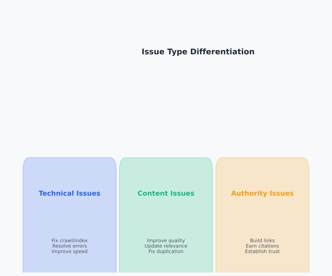
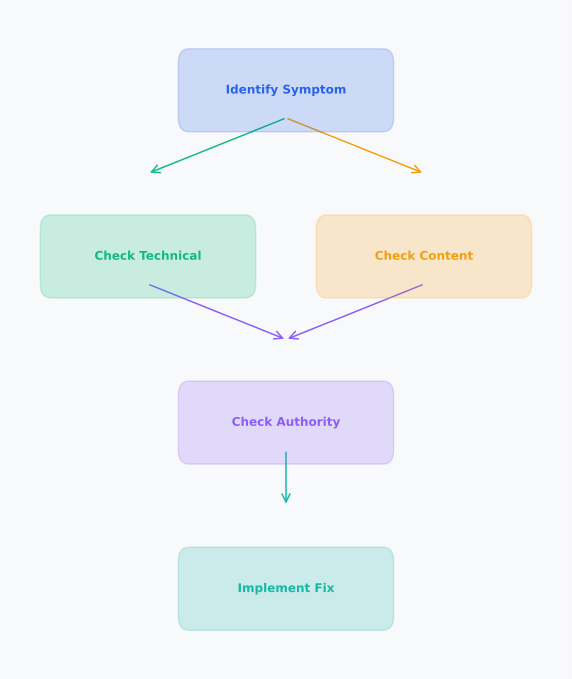

# Day 15, Chapter 1 — SEO Troubleshooting: Traffic, Ranking & Conversion Drops

Many people panic when SEO performance drops—they see traffic decline, rankings fall, or conversions drop, and they make random changes hoping something works. They've tried troubleshooting before—maybe they updated content randomly, changed technical settings without understanding causes, or made multiple changes simultaneously. **The results? Problems worsen, new issues appear, or performance continues declining without understanding why.**

This reactive approach creates real problems. When people panic and make random changes, they don't understand root causes, potentially worsening problems. When they treat symptoms instead of causes, fixes are temporary. When they make changes without data validation, they can't measure what works. **All of these approaches fail.**

SEO troubleshooting isn't about random fixes or panic-driven changes—it's about systematic diagnosis that identifies root causes and implements targeted solutions. **SEO troubleshooting requires systematic diagnosis that distinguishes between technical, content, authority, and algorithmic causes using data-driven frameworks**, enabling confident, data-driven responses that effectively address underlying issues rather than treating symptoms. This chapter will show you how to troubleshoot performance drops systematically, identify root causes through data, and prioritize fixes effectively.

By the end, you'll understand **how to systematically troubleshoot SEO performance drops** (data-driven frameworks that identify root causes) and **why systematic diagnosis matters** (targeted fixes address underlying problems efficiently rather than reactive changes that worsen issues). You'll leave with practical frameworks for diagnosing performance problems, validating hypotheses with data, and implementing effective fixes.

---

> **Explore This:** Think about a time when a website experienced performance problems. What was the initial reaction? Were changes made quickly or systematically? What data was used to understand the problem? Notice how systematic approaches differ from reactive responses, and how data validation changes the troubleshooting process.

---

## Types of SEO Performance Drops

Understanding different types of performance drops helps identify likely causes and guides troubleshooting direction. **Performance drops can be traffic-related, ranking-related, or conversion-related**, and each type indicates different potential causes.

**Traffic drops** indicate reduced website visits from search engines. Traffic drops can be sudden (rapid declines over days or weeks) or gradual (slow declines over months). **Traffic drops are symptoms—they indicate problems but don't explain causes.**

**Ranking drops** indicate reduced search engine result positions for target keywords. Ranking drops can affect specific pages, keyword groups, or entire domains. **Ranking drops are symptoms—they indicate visibility problems but don't explain causes.**

**Conversion drops** indicate reduced goal completions (purchases, leads, sign-ups) from search traffic. Conversion drops can occur even when traffic and rankings remain stable. **Conversion drops are symptoms—they indicate user experience or relevance problems but don't explain causes.**

A SaaS company experienced traffic and ranking drops simultaneously. **They panicked and made multiple changes—content updates, technical tweaks, link building.** But they didn't diagnose root causes. Changes didn't help because they were treating symptoms, not causes. **Performance continued declining.**

After systematic troubleshooting that identified root causes (technical crawl issues preventing indexation of new content), they addressed underlying problems. **Traffic recovered. Rankings improved. Systematic diagnosis enabled effective fixes.**

**Performance drop types often correlate—traffic and ranking drops frequently occur together**, but understanding each type helps identify likely causes and guide troubleshooting direction.

---

**Performance Drop Types**

*Traffic, ranking, and conversion drops indicate different potential causes*

Notice how different performance drop types indicate different potential causes—traffic drops may indicate technical or content issues, ranking drops may indicate content quality or authority problems, conversion drops may indicate relevance or user experience issues. Understanding drop types guides troubleshooting direction.

> Think about performance problems you've seen. Were they traffic-related? Ranking-related? Conversion-related? How did understanding the type help identify causes?

---

> **Explore This:** Analyze a website experiencing performance problems (real or hypothetical). Identify the type of drop: traffic, rankings, conversions, or combinations. What potential causes does each type suggest? How might different drop types indicate different underlying problems? Notice how understanding drop types guides troubleshooting direction.

---

## Diagnosing Sudden vs Gradual Declines

Understanding how different decline patterns indicate different causes helps identify likely problems and guide troubleshooting efficiently. **Sudden drops often indicate technical issues, penalties, or algorithm updates, while gradual declines may indicate content quality issues, competitive changes, or authority erosion.**

**Sudden drops** occur rapidly over days or weeks. Sudden traffic or ranking drops often indicate technical issues (crawl errors, indexation problems), penalties (manual actions, algorithmic penalties), or algorithm updates (core updates, targeted updates). **Sudden drops typically have specific, identifiable causes.**

**Gradual declines** occur slowly over months. Gradual traffic or ranking declines often indicate content quality issues (content decay, quality problems), competitive changes (competitors improving), or authority erosion (link profile issues, trust problems). **Gradual declines typically result from ongoing issues rather than sudden events.**

**Pattern recognition** helps identify likely causes. Sudden drops with technical issues suggest technical problems. Sudden drops with penalty notifications suggest penalties. Gradual declines with content age suggest content decay. **Patterns guide troubleshooting direction—understanding patterns helps identify likely causes.**

A content website experienced gradual traffic declines over six months. **They didn't notice the pattern until declines were significant.** After analyzing decline patterns and identifying content decay (older content becoming less relevant), they implemented strategic content updates. **Traffic recovered. Pattern recognition enabled effective diagnosis.**

**Decline patterns provide diagnostic clues—understanding patterns helps identify likely causes efficiently**, guiding troubleshooting direction and enabling faster problem identification.

---

## Differentiating Technical, Content, and Authority Issues

Understanding how to identify whether performance drops stem from technical, content, or authority issues ensures appropriate fixes for different problem types. **Different issue types require different solutions**, and accurate categorization enables targeted troubleshooting.

**Technical issues** affect crawlability, indexation, or site structure. Technical problems include crawl errors, indexation blocks, site structure issues, or technical implementation errors. **Technical issues prevent search engines from discovering or processing content.**

**Content issues** affect quality, relevance, or freshness. Content problems include quality issues, relevance problems, content decay, or freshness needs. **Content issues affect how search engines evaluate and rank content.**

**Authority issues** affect trust signals, link profiles, or domain authority. Authority problems include link profile issues, trust signal problems, or authority erosion. **Authority issues affect how search engines assess credibility and authority.**

**Issue categorization** helps identify appropriate fixes. Technical issues require technical fixes (resolving crawl errors, fixing indexation problems). Content issues require content improvements (quality enhancements, relevance improvements). Authority issues require authority building (link quality improvements, trust signal enhancements). **Accurate categorization enables targeted fixes.**

An e-commerce website experienced ranking drops. **They initially assumed content problems and focused on content improvements.** After systematic troubleshooting that categorized issues correctly (technical crawl problems preventing product page indexation), they addressed technical problems. **Rankings recovered. Accurate categorization enabled effective fixes.**

**Issue types are often interconnected—technical problems can affect content visibility**, content problems can affect authority building, and authority problems can affect rankings. **Integrated troubleshooting evaluates all issue types to identify root causes.**

---

**Issue Type Differentiation**

*Technical, content, and authority issues require different solutions*

Notice how different issue types require different solutions—technical issues need technical fixes, content issues need content improvements, authority issues need authority building. Accurate issue categorization enables targeted troubleshooting and effective fixes.

> Think about performance problems you've diagnosed. Were they technical? Content-related? Authority-related? How did categorization help identify appropriate fixes?

---

> **Explore This:** Identify a performance drop scenario (real or hypothetical). Categorize potential causes: technical (crawl, indexation), content (quality, relevance), authority (links, trust). Which category seems most likely? What diagnostic steps would confirm the category? Notice how categorization guides troubleshooting direction.

---

## Data Sources for Troubleshooting

Using data sources effectively enables data-driven troubleshooting that validates hypotheses and confirms diagnoses. **Different data sources reveal different insights**, and comprehensive troubleshooting uses multiple sources to validate hypotheses.

**Google Search Console** provides search performance data, indexing issues, and search visibility insights. GSC shows which pages are indexed, which queries drive traffic, and what indexing problems exist. **GSC data validates search engine perspective—how Google sees your website.**

**Google Analytics** provides user behavior data, traffic patterns, and engagement metrics. Analytics shows how users interact with content, what pages perform well, and where engagement issues exist. **Analytics data validates user perspective—how users interact with your website.**

**Server logs** provide crawl data, bot activity, and technical performance insights. Logs show how search engines crawl your website, what errors occur, and where technical problems exist. **Log data validates technical perspective—how search engines crawl your website.**

**Data validation** confirms hypotheses with evidence. Traffic drop hypothesis validated with Analytics data. Indexation problem hypothesis validated with GSC data. Crawl issue hypothesis validated with log data. **Data validation ensures accurate diagnosis—hypotheses confirmed with evidence.**

A technology blog experienced traffic declines and hypothesized content quality problems. **But data validation showed different causes.** Analytics data showed traffic drops across all pages, not just specific content. GSC data showed indexing issues affecting multiple pages. **Data validation revealed technical problems, not content problems.** Accurate diagnosis enabled effective fixes.

**Data integration** provides comprehensive troubleshooting insights. GSC shows search performance. Analytics shows user behavior. Logs show technical issues. **Integrated data provides complete pictures—comprehensive troubleshooting validates hypotheses across multiple data sources.**

---

## Building a Troubleshooting Decision Framework

Systematic troubleshooting frameworks guide diagnosis systematically, preventing panic-driven changes and enabling data-driven fixes. **Troubleshooting frameworks provide structured approaches to identifying root causes and implementing effective solutions.**

**Symptom identification** recognizes performance problems clearly. Identify what's declining (traffic, rankings, conversions), when declines started, and how severe declines are. **Clear symptom identification provides starting points for diagnosis.**

**Hypothesis formation** proposes potential causes based on symptoms and patterns. Form hypotheses about likely causes (technical, content, authority, algorithmic) based on symptom patterns and decline types. **Hypothesis formation guides diagnostic direction.**

**Data validation** confirms or rejects hypotheses using data sources. Use GSC, Analytics, and logs to validate hypotheses—data confirms or rejects proposed causes. **Data validation ensures accurate diagnosis—hypotheses confirmed with evidence.**

**Root cause identification** determines underlying problems causing symptoms. Identify root causes (technical issues, content problems, authority gaps) based on validated hypotheses and data evidence. **Root cause identification enables targeted fixes.**

**Fix prioritization** focuses on high-impact issues first. Prioritize fixes based on impact (traffic potential, ranking impact) and urgency (severity of decline, rate of deterioration). **Prioritization ensures efficient resource allocation.**

A corporate website applied this troubleshooting framework when they experienced sudden ranking drops. **Symptom identification: rankings dropped for service pages.** Hypothesis formation: possible technical issues or penalties. Data validation: GSC showed indexing problems. Root cause identification: technical crawl errors preventing indexation. **Fix prioritization: immediate technical fixes.** Systematic framework enabled efficient diagnosis and effective fixes.

**Troubleshooting frameworks prevent panic-driven changes—systematic approaches ensure accurate diagnosis and effective fixes**, enabling confident responses to performance problems rather than reactive changes that worsen issues.

---

**Troubleshooting Decision Framework**

*Systematic process guides diagnosis from symptoms to fixes*

Notice how troubleshooting frameworks provide systematic approaches: symptom identification recognizes problems, hypothesis formation proposes causes, data validation confirms hypotheses, root cause identification determines underlying problems, fix prioritization focuses on high-impact issues. Systematic frameworks prevent panic-driven changes and enable data-driven fixes.

> Think about troubleshooting you've done. Did you follow a systematic framework or make reactive changes? How did systematic approaches differ from reactive responses?

---

> **Explore This:** Apply the troubleshooting framework to a performance drop scenario (real or hypothetical). Work through each step: symptom identification, hypothesis formation, data validation, root cause identification, fix prioritization. Notice how systematic frameworks guide diagnosis and prevent reactive changes.

---

## Prioritization: Impact and Urgency

Understanding how to prioritize fixes based on impact and urgency ensures critical issues are addressed first while managing resources effectively. **Prioritization balances impact (traffic potential, ranking improvement) and urgency (severity, deterioration rate)** to ensure efficient resource allocation.

**Impact prioritization** focuses on fixes with highest traffic potential, ranking improvement, or business value. High-impact fixes address problems that significantly affect performance or business goals. **Impact prioritization ensures high-value improvements receive focus.**

**Urgency prioritization** focuses on fixes for severe problems or rapid deterioration. Urgent fixes address problems that are severe, worsening quickly, or blocking other improvements. **Urgency prioritization ensures critical problems receive immediate attention.**

**Impact-urgency matrix** organizes fixes by both dimensions. High-impact, urgent fixes receive immediate priority. High-impact, non-urgent fixes receive strategic planning. Low-impact fixes receive lower priority. **Impact-urgency matrix ensures efficient resource allocation—critical, high-value fixes receive focus.**

A publishing website experienced multiple performance problems simultaneously. **They prioritized based on impact-urgency matrix.** High-impact, urgent fixes (technical crawl errors blocking all content) received immediate priority. High-impact, non-urgent fixes (content quality improvements) received strategic planning. **Prioritization ensured critical problems were addressed first while managing resources effectively.**

**Prioritization balances immediate needs and strategic improvements—critical problems receive immediate attention while strategic improvements receive planning**, ensuring efficient resource allocation and focused improvement efforts.

---

## Common Mistakes in SEO Troubleshooting

Several mistakes prevent effective troubleshooting and can worsen performance problems. Understanding these mistakes prevents troubleshooting failures and guides effective problem-solving.

**Mistake #1: "Panic-driven random changes"** leads to making changes without understanding causes. People see performance drops and make random changes hoping something works, potentially worsening problems. **What breaks: random changes don't address root causes and can create new problems.** Panic-driven changes are reactive, not systematic. **The reality: systematic diagnosis identifies root causes—targeted fixes address underlying problems effectively.** Focus on systematic diagnosis, not random changes.

**Mistake #2: "Treating symptoms instead of causes"** leads to temporary fixes that don't solve underlying problems. People address visible symptoms without identifying root causes, so symptoms return or new problems appear. **What breaks: symptom treatment is temporary—root causes remain unaddressed.** Temporary fixes don't solve problems. **The reality: root cause analysis identifies underlying problems—fixing root causes prevents symptom recurrence.** Focus on root causes, not just symptoms.

**Mistake #3: "Ignoring data validation"** leads to diagnoses based on assumptions rather than evidence. People form hypotheses without validating with data, leading to incorrect diagnoses and ineffective fixes. **What breaks: assumptions can be wrong—data validation ensures accurate diagnosis.** Unvalidated hypotheses risk misdiagnosis. **The reality: data validation confirms hypotheses—evidence-based diagnosis enables effective fixes.** Focus on data validation, not assumptions.

**Mistake #4: "Making multiple changes simultaneously"** leads to confusion about what works and potential conflicts between changes. People make multiple fixes at once, unable to identify which changes help or harm. **What breaks: multiple simultaneous changes prevent understanding what works.** Conflicting changes can worsen problems. **The reality: systematic implementation tests changes individually—isolated testing identifies effective fixes.** Focus on systematic implementation, not simultaneous changes.

Understanding these mistakes prevents troubleshooting failures and guides effective problem-solving. **Troubleshooting succeeds when it's systematic, data-driven, and focused on root causes rather than symptoms or panic-driven changes.**

---

## Key Takeaways

SEO troubleshooting requires systematic diagnosis that distinguishes between technical, content, authority, and algorithmic causes. **Effective troubleshooting identifies root causes, validates hypotheses with data, prioritizes fixes by impact and urgency, and avoids reactive changes that can worsen problems.**

**Performance drop types** (traffic, rankings, conversions) and **decline patterns** (sudden vs gradual) provide diagnostic clues that guide troubleshooting direction. Understanding drop types and patterns helps identify likely causes efficiently.

**Issue categorization** (technical, content, authority) ensures appropriate fixes for different problem types. Accurate categorization enables targeted troubleshooting and effective solutions.

**Data validation** confirms hypotheses with evidence from multiple sources (GSC, Analytics, logs). Data-driven troubleshooting ensures accurate diagnosis and effective fixes.

**Troubleshooting frameworks** provide systematic approaches to diagnosis, preventing panic-driven changes and enabling data-driven fixes. Systematic frameworks guide diagnosis from symptoms to root causes to effective solutions.

**Prioritization** balances impact and urgency to ensure critical, high-value fixes receive focus while managing resources effectively.

Understanding these principles enables effective SEO troubleshooting that diagnoses problems accurately and implements fixes efficiently. **Troubleshooting isn't about panic or random changes—it's about systematic, data-driven diagnosis that identifies root causes and implements targeted solutions.**

---

**Next Steps:** In the next chapter, we'll explore Google algorithm updates and penalties, and how to respond effectively with appropriate recovery strategies. You'll learn how to identify update types, distinguish algorithmic impacts from manual actions, and implement recovery with realistic expectations.

