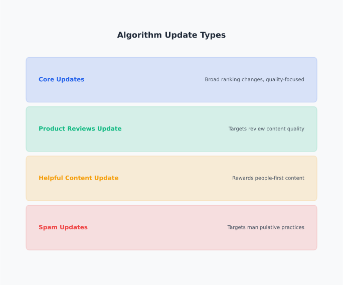
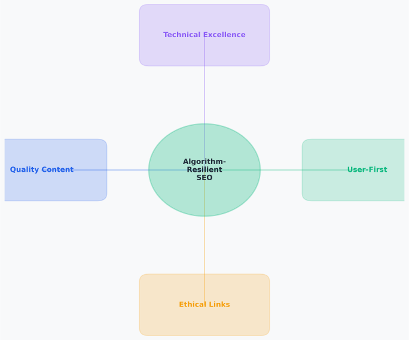

# Day 16, Chapter 1 — Google Algorithm Updates, Penalties & Recovery Frameworks

Many people panic when Google releases algorithm updates—they see rankings drop, traffic decline, and immediately start making changes without understanding what happened. They've experienced update impacts before—maybe they saw rankings drop after a core update, received a manual penalty notification, or noticed gradual declines they couldn't explain. **The results? Reactionary changes that don't help, wasted efforts on wrong fixes, or continued declines despite attempts to recover.**

This reactive approach creates real problems. When people panic about algorithm updates, they make changes without understanding update types or appropriate responses. When they confuse algorithmic impacts with manual actions, they use wrong recovery strategies. When they expect quick recovery, they become frustrated with realistic timelines. **All of these approaches fail.**

Algorithm updates and penalties aren't random—they're Google's way of improving search quality, and understanding update types and appropriate responses enables effective recovery. **Google algorithm updates and penalties require understanding update types (core vs targeted), distinguishing algorithmic impacts from manual actions, and implementing appropriate recovery strategies with realistic expectations** because different update types require different responses, and building algorithm-resilient SEO through quality, trust, and best practices prevents future issues. This chapter will show you how to identify update types, distinguish penalty types, and implement appropriate recovery strategies.

By the end, you'll understand **how to respond effectively to algorithm updates and penalties** (identifying update types and implementing appropriate recovery strategies) and **what realistic recovery looks like** (quality improvements take time, recovery timelines vary, and algorithm-resilient SEO prevents future issues). You'll leave with practical frameworks for identifying update impacts, implementing recovery strategies, and building SEO resilience.

---

> **Explore This:** Research recent Google algorithm updates and identify websites that were affected. How did those websites respond? What recovery strategies did they use? Notice how different update types require different responses, and how recovery timelines vary based on update types and fixes implemented.

---

## Types of Google Algorithm Updates

Understanding different types of algorithm updates helps identify likely causes of ranking changes and guides appropriate response strategies. **Google releases various update types: core updates (broad system changes), targeted updates (specific issue fixes), and feature updates (new capabilities)**, and each type affects websites differently.

**Core updates** are broad ranking system changes that affect many websites across multiple industries. Core updates refine how Google evaluates content quality, relevance, and usefulness. Core updates typically affect many sites, with some improving and others declining. **Core updates require quality improvements for recovery—sites that improve content quality and user value typically recover.**

**Targeted updates** are specific issue fixes that target particular problems (spam, low-quality content, manipulative practices). Targeted updates affect sites with specific issues rather than broad system changes. **Targeted updates require specific problem resolution—sites must address the targeted issues to recover.**

**Feature updates** introduce new SERP features or capabilities without changing core ranking algorithms. Feature updates may affect visibility (new SERP features) but don't change ranking algorithms. **Feature updates require adaptation rather than recovery—sites adapt to new features rather than fixing problems.**

**Update identification** helps determine appropriate responses. Core update impacts require quality improvements. Targeted update impacts require specific issue resolution. Feature updates require feature adaptation. **Understanding update types guides appropriate response strategies.**

A content website experienced ranking drops after a core update. **They initially assumed technical problems and focused on technical fixes.** After identifying the update as a core update requiring quality improvements, they shifted to content quality enhancements. **Rankings recovered. Appropriate response strategy enabled recovery.**

**Update types guide responses—understanding update types ensures appropriate recovery strategies** rather than generic fixes that don't address specific update requirements.

---

**Algorithm Update Types**

*Core, targeted, and feature updates require different responses*

Notice how different update types require different responses—core updates require quality improvements, targeted updates require specific issue resolution, feature updates require feature adaptation. Understanding update types guides appropriate response strategies rather than generic fixes.

> Think about algorithm updates you've experienced or heard about. What type were they? How did websites respond? Notice how update types determine appropriate responses.

---

> **Explore This:** Research Google's algorithm update history and identify recent core updates and targeted updates. How did websites affected by core updates recover? How did websites affected by targeted updates recover? What patterns do you notice in recovery strategies? Notice how update types determine appropriate responses.

---

## Core Updates vs Targeted Updates

Understanding the difference between core updates and targeted updates guides appropriate recovery strategies and prevents misdiagnosis of update impacts. **Core updates require quality improvements for recovery, while targeted updates require specific problem resolution**, and each type requires different response approaches.

**Core updates** are broad ranking system refinements that affect content quality evaluation. Core updates may improve rankings for sites with high-quality, helpful content and reduce rankings for sites with low-quality or unhelpful content. **Core updates require quality improvements—sites must improve content quality, usefulness, and user value to recover.**

**Targeted updates** address specific issues (spam, low-quality content, manipulative practices) through focused algorithm changes. Targeted updates affect sites with specific problems rather than broad system changes. **Targeted updates require specific issue resolution—sites must address the targeted problems to recover.**

**Response differences** guide recovery strategies. Core update recovery focuses on comprehensive quality improvements across content, user experience, and value provision. Targeted update recovery focuses on resolving specific issues (removing spam, fixing low-quality content, addressing manipulative practices). **Appropriate responses match update types—core updates require quality improvements, targeted updates require specific fixes.**

A publishing website experienced ranking drops after a targeted update addressing low-quality content. **They initially assumed core update and focused on general quality improvements.** After identifying the targeted update and specific issues (thin content, duplicate content), they addressed those problems directly. **Rankings recovered. Appropriate response strategy matched update type.**

**Update type identification** ensures appropriate responses—understanding whether impacts are from core or targeted updates guides recovery strategies effectively.

---

## Manual Actions vs Algorithmic Hits

Understanding the difference between manual actions and algorithmic hits guides appropriate recovery processes and prevents confusion about penalty types. **Manual actions require specific fixes and reconsideration requests, while algorithmic hits require quality improvements without reconsideration**, and each type requires different recovery approaches.

**Manual actions** are explicit penalties with Search Console notifications requiring specific fixes and reconsideration requests. Manual actions occur when Google's human reviewers identify guideline violations. Manual actions require addressing violations, submitting reconsideration requests, and waiting for manual review. **Manual actions require reconsideration process—specific fixes and manual review are necessary for recovery.**

**Algorithmic hits** are ranking changes from algorithm updates requiring quality improvements without reconsideration process. Algorithmic hits occur when algorithm updates affect rankings based on content quality or other signals. Algorithmic hits require quality improvements and waiting for algorithm re-evaluation. **Algorithmic hits don't require reconsideration—quality improvements and algorithm re-evaluation enable recovery.**

**Recovery process differences** guide response strategies. Manual action recovery requires fixing violations, submitting reconsideration requests, and waiting for manual review (weeks to months). Algorithmic hit recovery requires quality improvements and waiting for algorithm re-evaluation (weeks to months, variable timelines). **Recovery processes differ—manual actions require reconsideration, algorithmic hits require quality improvements.**

An e-commerce website received a manual action notification for thin content. **They initially assumed algorithmic hit and focused on general quality improvements.** After understanding the manual action required specific fixes (improving thin content) and reconsideration request, they addressed violations and submitted reconsideration. **Manual action removed. Appropriate recovery process enabled resolution.**

**Penalty type identification** ensures appropriate recovery—understanding whether impacts are manual actions or algorithmic hits guides recovery strategies effectively.

---

**Manual Actions vs Algorithmic Hits**

*Different penalty types require different recovery processes*

Notice how manual actions and algorithmic hits require different recovery processes—manual actions require specific fixes and reconsideration requests, while algorithmic hits require quality improvements and algorithm re-evaluation. Understanding penalty types guides appropriate recovery strategies.

> Think about penalties you've heard about. Were they manual actions or algorithmic hits? How did recovery processes differ? Notice how penalty types determine recovery approaches.

---

> **Explore This:** Research examples of manual actions and algorithmic hits. How did recovery processes differ? What were the timelines? What fixes were required? Notice how penalty types determine recovery strategies and timelines.

---

## Recovery Best Practices and Timelines

Understanding realistic recovery timelines and best practices guides appropriate recovery expectations and effective recovery implementation. **Recovery timelines vary based on update types, penalty types, and fixes implemented**, and realistic expectations prevent frustration and guide effective recovery strategies.

**Recovery timelines** depend on update types and fixes. Core update recovery: weeks to months as algorithm re-evaluates improved content. Targeted update recovery: variable, depends on specific issue resolution. Manual action recovery: weeks to months after reconsideration request approval. **Recovery timelines vary—quality improvements take time to show results.**

**Recovery best practices** focus on quality improvements rather than quick fixes. Core update recovery: improve content quality, user value, and helpfulness comprehensively. Targeted update recovery: address specific issues identified by targeted update. Manual action recovery: fix violations completely, then submit reconsideration request. **Quality improvements enable recovery—comprehensive fixes address underlying problems.**

**Realistic expectations** prevent frustration and guide effective strategies. Recovery takes time—algorithm re-evaluation and manual review processes require weeks to months. Quick fixes don't work—quality improvements are necessary for sustainable recovery. **Realistic expectations guide effective recovery—understanding timelines prevents frustration and guides strategies.**

A technology blog experienced core update impact and expected quick recovery after making content improvements. **They became frustrated when recovery took months.** After understanding realistic timelines and continuing quality improvements, they saw gradual recovery over several months. **Realistic expectations enabled effective recovery strategies.**

**Recovery is gradual—quality improvements take time to show results**, and understanding realistic timelines guides effective recovery strategies rather than expecting quick fixes that don't work.

---

## Building Algorithm-Resilient SEO Strategies

Building SEO strategies that focus on quality, trust, and best practices creates resilience to algorithm updates and prevents future impacts. **Algorithm-resilient SEO emphasizes sustainable practices rather than manipulative tactics**, and quality-focused SEO resists algorithm impacts better than shortcut-focused approaches.

**Quality-first content** demonstrates expertise, provides value, and serves users effectively. Quality content resists algorithm impacts because it aligns with search engine goals (helpful, valuable content). **Quality content is algorithm-resilient—it serves users and search engines, resisting update impacts.**

**Trust signal building** demonstrates expertise, authority, and credibility through E-E-A-T implementation. Trust signals build resilience because search engines consistently reward trustworthy, credible content. **Trust signals are algorithm-resilient—they demonstrate credibility regardless of algorithm changes.**

**Best practices adherence** follows search engine guidelines and avoids manipulative tactics. Best practices build resilience because they align with search engine goals and avoid risky tactics. **Best practices are algorithm-resilient—they align with search engine goals, reducing update risk.**

**Resilience building** is ongoing, not one-time. Continuously improve content quality, build trust signals, and follow best practices. Algorithm updates reward quality and penalize manipulation consistently. **Ongoing quality focus builds resilience—sustainable practices resist algorithm impacts.**

A content website built algorithm-resilient SEO by focusing on quality content, trust signals, and best practices. **They experienced minimal impact from algorithm updates** because their SEO aligned with search engine goals. **Quality-first approach built resilience—sustainable practices resisted update impacts.**

**Algorithm-resilient SEO prevents future impacts—quality-focused, best-practices SEO resists algorithm changes** because it aligns with search engine goals consistently across updates.

---

**Algorithm-Resilient SEO**

*Quality, trust, and best practices build resilience to algorithm updates*

Notice how algorithm-resilient SEO focuses on quality content, trust signals, and best practices—all of which align with search engine goals consistently across algorithm updates. Quality-focused SEO resists update impacts better than manipulative or shortcut-focused approaches.

> Think about SEO strategies you've seen. Which seem algorithm-resilient? Which seem vulnerable to updates? Notice how quality-focused approaches resist impacts better than manipulative tactics.

---

> **Explore This:** Evaluate an SEO strategy (yours or one you know about) against algorithm-resilience criteria: quality content (demonstrates expertise, provides value?), trust signals (E-E-A-T implementation?), best practices (follows guidelines, avoids manipulation?). How resilient does the strategy seem? What improvements would increase resilience? Notice how quality-focused approaches resist update impacts.

---

## Common Misunderstandings About Algorithm Updates

Several misconceptions prevent effective response to algorithm updates and penalties. Understanding these misunderstandings prevents mistakes and guides appropriate recovery strategies.

**Misunderstanding #1: "All updates are bad"** leads to fearing all algorithm updates. People believe algorithm updates always hurt rankings, so they panic whenever updates are announced. **What breaks: this oversimplifies complex update ecosystem.** Many sites improve after updates. **The reality: updates improve search quality—sites with quality content often improve, while sites with problems decline.** Focus on quality, not fear.

**Misunderstanding #2: "Quick fixes work"** leads to reactionary changes without addressing root causes. People believe quick fixes can recover from update impacts, so they make rapid changes hoping for fast recovery. **What breaks: quick fixes don't address underlying quality problems.** Quality improvements take time. **The reality: recovery requires quality improvements—comprehensive fixes address root causes, enabling sustainable recovery.** Focus on quality improvements, not quick fixes.

**Misunderstanding #3: "All penalties are the same"** leads to using wrong recovery strategies. People believe all penalties require the same fixes, so they use generic recovery approaches regardless of penalty type. **What breaks: manual actions and algorithmic hits require different recovery processes.** Generic approaches fail. **The reality: penalty types differ—manual actions require reconsideration, algorithmic hits require quality improvements.** Focus on appropriate recovery processes, not generic fixes.

**Misunderstanding #4: "Recovery is guaranteed"** leads to unrealistic expectations and frustration. People believe recovery is automatic after making fixes, so they expect quick results and become frustrated with realistic timelines. **What breaks: recovery timelines vary and aren't guaranteed.** Quality improvements don't guarantee immediate recovery. **The reality: recovery takes time—realistic expectations guide effective recovery strategies rather than frustration.** Focus on realistic timelines, not guarantees.

Understanding these misunderstandings prevents mistakes and guides appropriate recovery strategies. **Effective recovery requires understanding update types, implementing appropriate fixes, and maintaining realistic expectations about timelines and outcomes.**

---

## Key Takeaways

Google algorithm updates and penalties require understanding update types and appropriate response strategies. **Different update types (core vs targeted) require different recovery approaches, and distinguishing manual actions from algorithmic hits guides appropriate recovery processes.**

**Core updates** require comprehensive quality improvements for recovery, while **targeted updates** require specific issue resolution. Understanding update types ensures appropriate response strategies rather than generic fixes.

**Manual actions** require specific fixes and reconsideration requests, while **algorithmic hits** require quality improvements and algorithm re-evaluation. Understanding penalty types guides appropriate recovery processes.

**Recovery timelines** vary based on update types, penalty types, and fixes implemented. Realistic expectations prevent frustration and guide effective recovery strategies—quality improvements take time to show results.

**Algorithm-resilient SEO** focuses on quality content, trust signals, and best practices rather than manipulative tactics. Quality-focused SEO resists algorithm impacts better than shortcut-focused approaches because it aligns with search engine goals consistently.

Understanding these principles enables effective response to algorithm updates and penalties, implementing appropriate recovery strategies with realistic expectations. **Updates aren't random—they're quality improvements, and algorithm-resilient SEO that focuses on quality and best practices resists update impacts.**

---

**Next Steps:** In the next chapter, we'll explore how SEO strategies differ for corporate vs content websites, and why context matters for effective SEO execution. You'll learn how to adapt SEO strategies to different website types and business goals.

