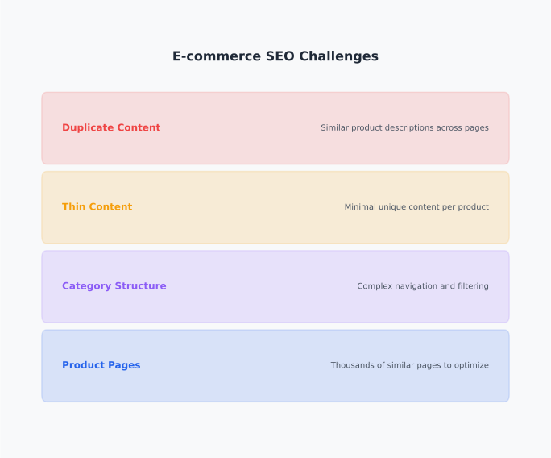
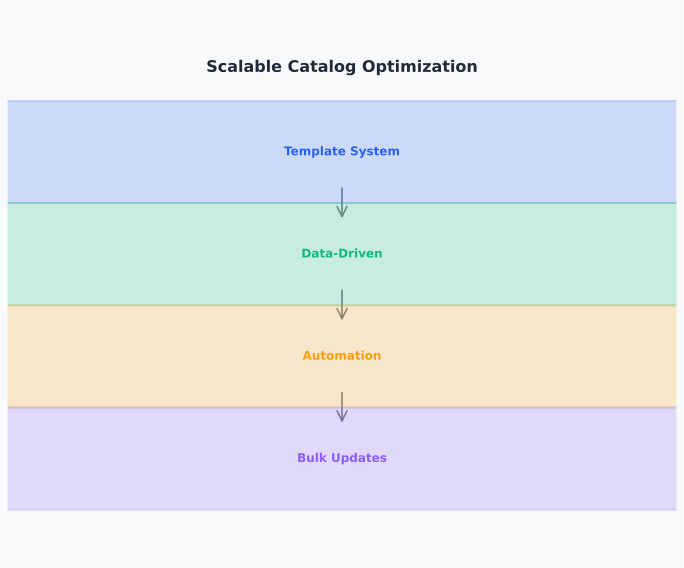

# Day 18, Chapter 1 — Ecommerce SEO: Fundamentals & Scalable Strategies

Many people apply generic SEO tactics to e-commerce sites—they treat product pages like blog posts, optimize manually, or ignore the unique challenges of large product catalogs. They've tried generic approaches before—maybe they optimized each product page individually, ignored faceted navigation issues, or created duplicate content problems. **The results? Ineffective strategies, unscalable processes, or SEO efforts that don't work for e-commerce contexts.**

This generic approach creates real problems. When people apply generic SEO to e-commerce, they ignore unique challenges (large catalogs, duplication, faceted navigation), leading to strategies that don't scale. When they optimize manually, processes break at scale. When they ignore e-commerce-specific issues, problems accumulate. **All of these approaches fail.**

E-commerce SEO requires specialized strategies that address unique challenges at scale—large product catalogs, faceted navigation, duplication management, and scalable optimization processes. **E-commerce SEO requires scalable strategies for large product catalogs, effective optimization of category and product pages, management of faceted navigation and duplication at scale, and clear reporting** that communicates SEO value to business stakeholders. This chapter will show you how to optimize e-commerce sites effectively, manage large catalogs at scale, and address e-commerce-specific SEO challenges.

By the end, you'll understand **how e-commerce SEO differs from other site types** (unique challenges requiring specialized strategies) and **why scalable approaches matter** (large catalogs require systematic processes rather than manual optimization). You'll leave with practical frameworks for e-commerce SEO optimization, faceted navigation management, and scalable catalog optimization.

---

> **Explore This:** Analyze an e-commerce website with a large product catalog. What SEO challenges do you notice? How are category and product pages optimized? How is faceted navigation handled? Notice how e-commerce sites face unique challenges that require specialized SEO strategies.

---

## E-commerce SEO Fundamentals

Understanding e-commerce SEO fundamentals helps create strategies that address unique challenges effectively. **E-commerce sites face unique challenges: large product catalogs requiring scalable optimization, category and product page structures, faceted navigation management, and balance between SEO and conversion optimization** for product pages.

**E-commerce challenges** include large catalogs (thousands of products requiring scalable optimization), faceted navigation (filtering creating multiple URL variations), duplication (similar products creating duplicate content), and conversion optimization (product pages must rank and convert). **E-commerce challenges require specialized strategies—generic SEO doesn't address unique issues.**

**E-commerce priorities** balance SEO and conversion optimization. Product pages must rank for commercial-intent keywords while converting visitors into customers. Category pages must rank for broader commercial queries while guiding users to products. **E-commerce SEO prioritizes both rankings and conversions—optimization serves both goals.**

**Scalable approaches** are essential for large catalogs. Manual optimization doesn't scale to thousands of products. Systematic processes (template-based optimization, automated workflows) enable scalable catalog optimization. **Scalability enables effective e-commerce SEO—systematic processes handle large catalogs efficiently.**

An online retailer with thousands of products initially optimized manually, page by page. **Process didn't scale—optimization was incomplete and inconsistent.** After implementing scalable approaches—template-based product descriptions, automated optimization workflows, systematic category management—catalog optimization became efficient and consistent. **Scalable approaches enabled effective e-commerce SEO.**

**E-commerce SEO fundamentals** address unique challenges with scalable strategies—understanding fundamentals enables effective e-commerce optimization rather than applying generic tactics that don't work.

---

**E-commerce SEO Challenges**

*Large catalogs, faceted navigation, and duplication require specialized strategies*

Notice how e-commerce sites face unique challenges—large product catalogs requiring scalable optimization, faceted navigation creating URL variations, and duplication from similar products. Generic SEO doesn't address these challenges, requiring specialized e-commerce strategies.

> Think about e-commerce sites you've seen. What SEO challenges did they face? How did they handle large catalogs? Notice how e-commerce challenges differ from other site types.

---

> **Explore This:** Identify an e-commerce website's SEO challenges (real or hypothetical). What issues do large catalogs create? How does faceted navigation affect SEO? What duplication problems exist? Notice how e-commerce challenges require specialized strategies rather than generic SEO.

---

## Category vs Product Page Optimization

Understanding how category and product pages require different optimization approaches ensures appropriate strategies for each page type. **Category pages optimize for broader, commercial-intent keywords with filtering and product showcases, while product pages optimize for specific product keywords with unique descriptions, schema, and images.**

**Category page optimization** focuses on broader commercial queries. Category pages target commercial-intent keywords ("best coffee makers," "wireless headphones") rather than specific product queries. Category pages showcase products, guide filtering, and facilitate product discovery. **Category pages serve broader queries—optimization targets commercial-intent keywords effectively.**

**Product page optimization** focuses on specific product queries. Product pages target specific product keywords ("Breville Barista Express coffee maker") rather than broader category queries. Product pages provide detailed product information, unique descriptions, and conversion-focused content. **Product pages serve specific queries—optimization targets product-specific keywords effectively.**

**Optimization differences** guide appropriate strategies. Category pages: broader keyword targeting, product showcases, filtering optimization. Product pages: specific keyword targeting, unique descriptions, schema markup, conversion optimization. **Different page types require different optimization—category pages target broader queries, product pages target specific queries.**

**Content strategy** differs for category vs product pages. Category pages: overview content, product showcases, filtering guides. Product pages: detailed product information, unique descriptions, specifications, reviews. **Content matches page types—category content guides discovery, product content enables purchase decisions.**

A fashion retailer optimized category and product pages appropriately. Category pages targeted broader queries ("women's dresses," "men's shoes") with product showcases and filtering. Product pages targeted specific products ("black midi dress size 8") with unique descriptions and detailed information. **Appropriate optimization for each page type enabled effective e-commerce SEO.**

**Page type optimization** ensures appropriate strategies—category pages target broader queries effectively, product pages target specific queries effectively, enabling comprehensive e-commerce SEO coverage.

---

**Category vs Product Page Optimization**

*Different page types require different optimization approaches*

Notice how category and product pages require different optimization—category pages target broader commercial queries with product showcases, while product pages target specific product queries with detailed information. Understanding page types enables appropriate optimization strategies.

> Think about e-commerce page types. How do category pages differ from product pages in optimization? Which keywords do they target? Notice how page types require different optimization approaches.

---

> **Explore This:** Compare category and product pages on an e-commerce website. What optimization differences do you notice? Which keywords do they target? How does content differ? Notice how page types require different optimization strategies for effective e-commerce SEO.

---

## Faceted Navigation and Duplication Management

Understanding how to manage faceted navigation and duplication at scale addresses critical e-commerce SEO challenges effectively. **Faceted navigation creates multiple URL variations, and duplication from similar products requires systematic management** to prevent SEO problems while maintaining user experience.

**Faceted navigation challenges** include URL variations from filtering (color, size, price filters create multiple URLs), crawl budget waste (search engines crawl duplicate filter combinations), and content duplication (similar filtered views create duplicate content). **Faceted navigation requires systematic management—filtering must work for users without creating SEO problems.**

**Faceted navigation solutions** include canonical tags (canonicalize filtered URLs to main category), robots.txt rules (block low-value filter combinations), and URL parameter handling (configure parameters in Search Console). **Systematic management prevents faceted navigation SEO problems while maintaining user experience.**

**Product duplication challenges** include similar products (variations creating duplicate content), manufacturer descriptions (duplicate product information), and thin content (product pages with minimal unique content). **Product duplication requires systematic management—similar products must have unique content.**

**Product duplication solutions** include unique product descriptions (custom descriptions for each product), schema markup (structured data differentiating products), and content enrichment (adding unique details, specifications, reviews). **Systematic management ensures product pages have unique, valuable content.**

An electronics retailer faced faceted navigation and duplication problems. Filtered URLs created thousands of duplicate pages. Similar products had duplicate manufacturer descriptions. **SEO problems accumulated.** After implementing systematic management—canonical tags for filtered URLs, unique product descriptions, content enrichment—duplication problems decreased. **Systematic management addressed e-commerce SEO challenges effectively.**

**Faceted navigation and duplication management** prevents SEO problems at scale—systematic approaches address e-commerce-specific challenges while maintaining user experience and catalog functionality.

---

## Scalable Catalog Optimization

Understanding how to optimize large product catalogs at scale enables effective e-commerce SEO for thousands of products. **Scalable optimization requires systematic processes rather than manual optimization**, and template-based approaches enable efficient catalog optimization.

**Template-based optimization** creates scalable product page structures. Product page templates define consistent optimization elements (title tags, meta descriptions, heading structures) applied systematically across catalog. Templates ensure consistency and enable efficient optimization. **Templates enable scalability—systematic structures optimize catalog efficiently.**

**Automated workflows** streamline optimization processes. Automated systems apply templates, generate unique content elements, and maintain optimization consistency. Workflows reduce manual effort and enable scalable catalog management. **Automation enables scalability—systematic workflows optimize catalog efficiently.**

**Data-driven optimization** uses product data for SEO. Product attributes (names, descriptions, categories) inform optimization automatically. Data integration enables systematic keyword targeting and content generation. **Data-driven approaches enable scalability—product data informs optimization systematically.**

**Quality control** ensures optimization maintains quality at scale. Automated quality checks verify optimization elements, unique content, and technical requirements. Quality control prevents optimization degradation as catalog scales. **Quality control maintains standards—systematic checks ensure optimization quality at scale.**

A home goods retailer optimized catalog of 10,000+ products using template-based optimization and automated workflows. **Systematic processes enabled efficient catalog optimization.** Templates ensured consistency. Automation reduced manual effort. Data-driven optimization used product attributes effectively. **Scalable approaches enabled effective e-commerce SEO at scale.**

**Scalable catalog optimization** enables effective e-commerce SEO for large catalogs—systematic processes optimize thousands of products efficiently rather than manual optimization that doesn't scale.

---

**Scalable Catalog Optimization**

*Template-based approaches and automation enable efficient catalog optimization*

Notice how scalable optimization uses templates, automation, and data-driven approaches to optimize large catalogs efficiently. Systematic processes enable effective e-commerce SEO at scale rather than manual optimization that doesn't work for large catalogs.

> Think about large e-commerce catalogs. How would you optimize thousands of products? What systematic approaches would work? Notice how scalability enables effective e-commerce SEO.

---

> **Explore This:** Design a scalable optimization approach for a large product catalog (real or hypothetical). What templates would you create? What automation would you use? How would you ensure quality at scale? Notice how systematic approaches enable effective e-commerce SEO for large catalogs.

---

## E-commerce SEO Reporting and Stakeholder Communication

Understanding how to communicate e-commerce SEO value to business stakeholders ensures SEO efforts receive support and resources. **E-commerce SEO reporting must communicate value in business terms** (sales, revenue, conversions) rather than just SEO metrics (rankings, traffic).

**Business-focused reporting** translates SEO metrics into business value. Rankings and traffic translate to sales and revenue. Keyword improvements translate to conversion opportunities. **Business metrics communicate value—SEO metrics translated to business outcomes enable stakeholder support.**

**Conversion-focused reporting** emphasizes e-commerce goals. Product page performance translates to sales. Category page performance translates to product discovery and conversions. **Conversion metrics align with business goals—reporting emphasizes e-commerce outcomes.**

**Stakeholder communication** uses business language rather than SEO terminology. "Increased product page rankings" becomes "more products appearing in search results, driving sales." "Improved category visibility" becomes "more category pages ranking, increasing product discovery." **Business language communicates value—stakeholders understand business impact, not just SEO metrics.**

A fashion retailer reported e-commerce SEO using business metrics—product page rankings translated to sales, category visibility translated to product discovery, keyword improvements translated to conversion opportunities. **Business-focused reporting enabled stakeholder support.** Executives understood SEO value in business terms. **Business communication enabled effective e-commerce SEO support.**

**E-commerce SEO reporting** communicates value effectively—business-focused reporting enables stakeholder support by translating SEO metrics into business outcomes that stakeholders understand and value.

---

## Common Mistakes in E-commerce SEO

Several mistakes prevent effective e-commerce SEO. Understanding these mistakes prevents strategy failures and guides appropriate e-commerce optimization.

**Mistake #1: "Applying generic SEO to e-commerce"** leads to strategies that don't address unique challenges. People believe generic SEO works for e-commerce, so they apply blog or corporate site tactics without considering e-commerce-specific issues. **What breaks: generic tactics don't address large catalogs, faceted navigation, or duplication.** Generic SEO fails on e-commerce sites. **The reality: e-commerce requires specialized strategies—addressing unique challenges enables effective e-commerce SEO.** Focus on e-commerce-specific tactics, not generic approaches.

**Mistake #2: "Manual optimization at scale"** leads to unscalable processes. People optimize product pages manually, one by one, which doesn't scale to large catalogs. **What breaks: manual processes break at scale—thousands of products can't be optimized manually.** Manual optimization is inefficient and inconsistent. **The reality: scalable approaches are essential—template-based optimization and automation enable effective catalog optimization at scale.** Focus on scalable processes, not manual optimization.

**Mistake #3: "Ignoring faceted navigation issues"** leads to SEO problems from filtering. People implement faceted navigation without considering SEO implications, creating duplicate URLs and crawl budget waste. **What breaks: faceted navigation creates SEO problems if not managed systematically.** Duplicate URLs and crawl waste hurt rankings. **The reality: faceted navigation requires systematic management—canonical tags, robots.txt rules, and parameter handling prevent SEO problems.** Focus on systematic management, not ignoring issues.

**Mistake #4: "Duplication from similar products"** leads to thin or duplicate content. People use manufacturer descriptions or minimal unique content for product pages, creating duplication problems. **What breaks: duplicate or thin content doesn't rank effectively.** Similar products with duplicate content compete against each other. **The reality: product pages need unique content—custom descriptions, schema markup, and content enrichment ensure unique, valuable content.** Focus on unique content, not duplicate descriptions.

Understanding these mistakes prevents e-commerce SEO failures and guides appropriate optimization strategies. **Effective e-commerce SEO addresses unique challenges with scalable approaches, manages faceted navigation systematically, and ensures unique product content.**

---

## Key Takeaways

E-commerce SEO requires scalable strategies that address unique challenges at scale. **Large product catalogs, faceted navigation, and duplication require specialized strategies** rather than generic SEO tactics that don't work for e-commerce contexts.

**E-commerce fundamentals** include large catalog optimization, category and product page structures, faceted navigation management, and balance between SEO and conversion optimization. Understanding fundamentals enables effective e-commerce SEO.

**Category vs product page optimization** requires different approaches—category pages target broader commercial queries, product pages target specific product queries. Understanding page types enables appropriate optimization strategies.

**Faceted navigation and duplication management** prevents SEO problems at scale. Systematic approaches (canonical tags, robots.txt rules, unique content) address e-commerce-specific challenges while maintaining user experience.

**Scalable catalog optimization** uses template-based approaches, automation, and data-driven processes to optimize large catalogs efficiently. Systematic processes enable effective e-commerce SEO at scale rather than manual optimization.

**E-commerce SEO reporting** communicates value in business terms (sales, revenue, conversions) rather than just SEO metrics. Business-focused reporting enables stakeholder support by translating SEO metrics into business outcomes.

Understanding these principles enables effective e-commerce SEO that addresses unique challenges with scalable strategies, manages large catalogs efficiently, and communicates value to stakeholders. **E-commerce SEO isn't generic—it requires specialized strategies that address unique challenges at scale.**

---

**Next Steps:** In the next chapter, we'll explore AI and automation in SEO workflows, and how to use these tools responsibly while maintaining content quality and trust. You'll learn how AI assists SEO work effectively and when human oversight is essential.

